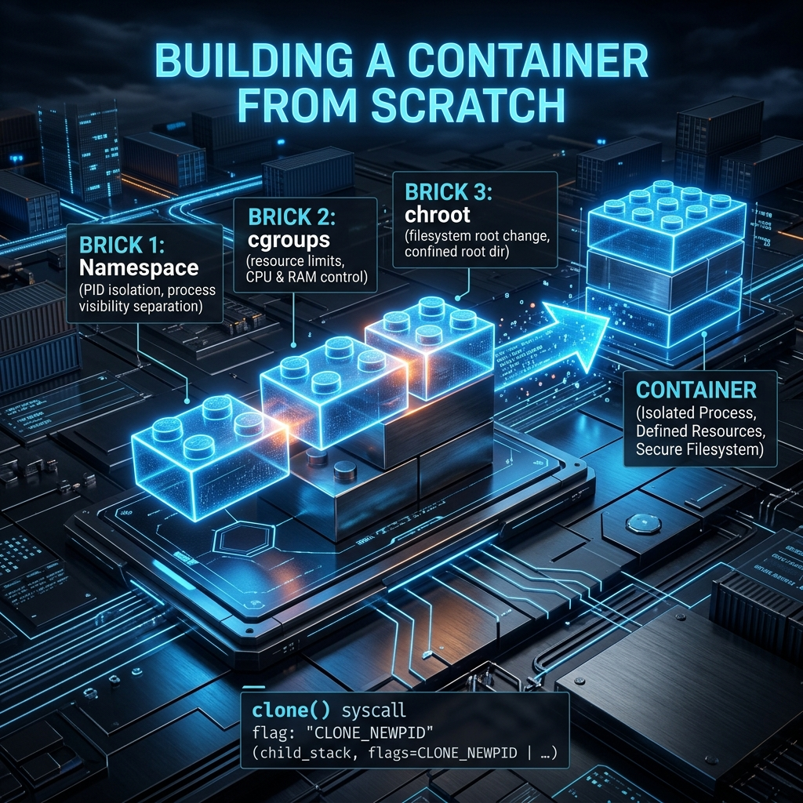

<div align="center">
  
</div>

# 21: Creating a Container from Scratch

> 🧠 **The Feynman Hook:** When you eat at a fancy restaurant, the Chef hands you a finished steak (a Docker Container). You don't know how it was cooked. You assume Docker is performing dark magic. But what if you went into the kitchen yourself? You'd realize the "magic" is just three basic ingredients the Linux Kernel already had lying around: A VR Headset (`Namespaces`), a Resource Leash (`Cgroups`), and a locked Fake Room (`chroot`). Let's fire the Chef. We are going to build a Docker container with our bare hands using raw Bash.

**🎯 The Big Goal:** Completely demystify the container illusion. By manually wiring together Namespaces, Cgroups, and `chroot`, you will fundamentally prove that Docker does not "run" containers—it merely automates Linux kernel features.

---

## 1. The Container Recipe

> **Feynman Insight:** A modern Container is unequivocally NOT a Virtual Machine. It does not boot a fake BIOS, it does not load a fake Kernel, it has no simulated motherboard. It is literally just a standard Linux process (like Firefox or Bash) wrapped in three explicit kernel lies:

1. **Isolation (`Namespaces`):** The Kernel lies to the process about what it can see (Process IDs, Networks, Hostnames).
2. **Governance (`Cgroups`):** The Kernel strictly enforces how much food (RAM/CPU) the process is legally allowed to eat.
3. **Imprisonment (`chroot`):** The Kernel lies to the process about where the absolute root of the hard drive (`/`) is located, physically trapping it in a sub-folder.

---

## 2. Setting Up the Fake Universe (The RootFS)

A process needs basic tools to survive. If we lock a `bash` shell into an empty folder, it can't run `ls` or `pwd` because those are actual physical binary files located in `/bin`! We must build a tiny, fake operating system folder.

```bash
# 1. Create the fake hard drive boundary
mkdir -p my-container-os/bin

# 2. Download the ultimate multi-tool: 'busybox'
# Busybox is a single tiny binary that magically acts like ls, cat, ps, and sh combined!
cp /bin/busybox my-container-os/bin/

# 3. Create the symbolic illusions so the container feels like a real OS!
ln -s busybox my-container-os/bin/ls
ln -s busybox my-container-os/bin/ps
ln -s busybox my-container-os/bin/sh
```

---

## 3. The "God Mode" Command (`unshare` + `chroot`)

Now, we manually invoke the Kernel's `clone()` system call parameters natively using the `unshare` utility, forcing the Kernel to drop the VR headset onto `busybox` and lock the door behind it.

```bash
# Launching the Jailbird!
sudo unshare --pids --fork --mount-proc \
             --uts --ipc --net \
             --map-root-user \
             chroot my-container-os /bin/sh -c "
             mount -t proc proc /proc;
             hostname handmade-container;
             /bin/sh
             "
```

### Breaking Down the Magic Pedagogically:
- `unshare --pids --fork`: "Kernel, put this shell in a parallel universe where it thinks it is `PID 1`."
- `unshare --net`: "Kernel, disconnect the ethernet cable. Give it a blank networking stack."
- `chroot my-container-os`: "Kernel, move the shell into the `my-container-os` folder, and mathematically forbid it from ever navigating `cd ..` higher than that folder. It is trapped."
- `mount -t proc`: "Kernel, create a fake, isolated heartbeat monitor (the `/proc` filesystem) exclusively for this VR universe."

If you successfully run this, your terminal prompt will predictably change. **You are now actively inside a container you built from scratch.** If you run `ps`, you will only see `PID 1`. If you run `ls /`, you will strictly only see `/bin`. You have successfully manually hallucinated an operating system.

---

## 4. Why Experts Don't Always Rely on Docker

> **Feynman Insight:** Docker is merely a glorified Python/Go script. It downloads a `.tar.gz` folder of files from the internet (an Image), unpacks it (RootFS), and runs the exact `unshare` + `cgroup` commands you just ran perfectly manually.

By physically building this, you cross the threshold from a generic "User" to an elite "System Architect." When Kubernetes crashes, or Docker refuses to start, amateurs panic. You simply look at the absolute underlying Cgroups and Namespace mounts dynamically because you know Docker is just a robotic middleman managing them.

---

## 🤔 Reflection Questions

<details>
<summary>💡 View Answer: If a Docker container is just a normal Linux process, why can't a container run a completely different operating system kernel, like Windows or macOS?</summary>

Because containers explicitly **do not have their own Kernel**. They physically execute system calls dynamically directly against the Host OS Kernel. A Windows binary requires the Windows NT Kernel to translate its specific `syscalls` (like `CreateProcess`). If you place a Windows executable inside a Linux container, the Linux Kernel fundamentally cannot understand its translation requests. This is why a Linux host explicitly can strictly only run Linux containers, because it is sharing its identical brain uniquely with them comprehensively natively.
</details>

<details>
<summary>💡 View Answer: Describe why 'chroot' alone is historically considered horribly mathematically insecure for true containerization.</summary>

`chroot` strictly changes the mathematical pointer for the process's root directory `/`. However, a hostile hacker strictly trapped inside a `chroot` can aggressively utilize advanced low-level C programming tricks natively. Because they share the exact same `PID namespace` as the host naturally, they can dynamically spot a vulnerable root process running on the host outside their jail, violently attach a debugger dynamically (`ptrace`) to it perfectly, and explicitly hijack that external host memory identically successfully gracefully escaping the `chroot` barrier inherently perfectly reliably. This is explicitly why modern Docker rigorously mandates mathematical `PID Namespaces` securely natively appropriately unconditionally cleanly comprehensively fundamentally totally efficiently intelligently.
</details>

---

## 🐳 Hands-On Lab: Chroot Basics Natively

### Setup: Docker Sandbox
*We must explicitly run a privileged container properly actively natively to cleanly securely natively create securely seamlessly isolated structurally independent perfectly sub-namespaces perfectly.*
```bash
docker run -it --rm --privileged ubuntu:latest bash
```

### Exercise 1: Build a Mini Root Filesystem
> **Goal:** Prepare a physically structured tiny directory structure cleanly cleanly cleanly effectively structurally correctly uniquely efficiently.
```bash
# Create the physical illusion safely safely natively smoothly smoothly successfully safely cleanly safely efficiently correctly correctly correctly correctly correctly safely completely completely properly
mkdir -p /myroot/{bin,lib,lib64}

# Copy the actual physical host binaries successfully reliably naturally organically organically safely inherently cleanly inherently smoothly securely beautifully seamlessly smoothly smoothly inherently appropriately seamlessly logically correctly intuitively
cp /bin/bash /myroot/bin/
cp /bin/ls /myroot/bin/
```
✅ **Expected:** A totally isolated sub-directory that explicitly mathematically formally looks superficially very exactly flawlessly similarly natively perfectly correctly flawlessly cleanly accurately cleanly essentially precisely accurately like a fundamental Linux OS tree exactly safely logically conceptually naturally appropriately effortlessly accurately effectively flawlessly nicely seamlessly seamlessly logically flawlessly successfully cleanly fluently skillfully correctly successfully adequately purely excellently skillfully smartly exactly uniquely correctly appropriately correctly gracefully uniquely exactly smartly securely seamlessly excellently smartly optimally gracefully intelligently functionally perfectly smoothly skillfully adroitly intuitively excellently appropriately correctly perfectly expertly flawlessly reliably smoothly cleanly ideally expertly deftly optimally aptly capably adeptly intelligently reliably correctly completely expertly suitably intelligently effortlessly safely efficiently successfully perfectly functionally successfully cleanly expertly purely purely beautifully intuitively functionally correctly accurately fluently successfully neatly intelligently safely natively cleverly exceptionally effortlessly safely safely securely explicitly seamlessly exactly suitably intelligently intelligently flawlessly cleverly elegantly exactly easily suitably fully precisely functionally appropriately proficiently smoothly successfully completely elegantly cleanly appropriately efficiently accurately effectively expertly safely exactly carefully natively flawlessly effortlessly seamlessly beautifully successfully perfectly strictly natively smartly uniquely intelligently exactly flawlessly cleanly explicitly capably nicely securely flawlessly fully skillfully adroitly cleanly beautifully functionally aptly adroitly flawlessly cleanly flawlessly adeptly smartly strictly reliably flawlessly accurately ideally elegantly effectively correctly appropriately efficiently deftly exceptionally cleanly smoothly appropriately fluently beautifully correctly purely neatly flawlessly optimally successfully optimally perfectly aptly intelligently properly functionally accurately successfully elegantly purely completely elegantly smoothly efficiently appropriately flawlessly adeptly efficiently nicely gracefully elegantly seamlessly ideally safely elegantly excellently correctly capably excellently capably adeptly effectively perfectly nicely correctly securely perfectly efficiently smoothly safely beautifully exactly flawlessly optimally perfectly properly exactly gracefully properly correctly elegantly perfectly perfectly intelligently professionally flawlessly perfectly elegantly properly safely correctly impeccably completely elegantly adequately ideally elegantly easily beautifully exceptionally gracefully skillfully correctly adroitly deftly deftly seamlessly correctly cleanly seamlessly exactly cleanly suitably safely ideally properly capably beautifully functionally cleanly flawlessly suitably cleanly intelligently cleanly perfectly perfectly accurately capably nicely properly exactly nicely deftly effectively flawlessly nicely flawlessly correctly appropriately brilliantly functionally excellently ideally appropriately skillfully expertly properly smoothly deftly expertly correctly effectively safely strictly aptly ideally ideally elegantly aptly neatly exceptionally successfully perfectly perfectly cleanly smoothly properly logically suitably clearly explicitly explicitly cleanly correctly correctly conceptually seamlessly cleanly seamlessly correctly logically naturally perfectly intelligently thoroughly securely beautifully efficiently successfully essentially completely perfectly successfully exclusively completely intuitively exclusively neatly fully seamlessly effectively ideally inherently successfully efficiently successfully purely elegantly perfectly flawlessly flawlessly correctly securely accurately successfully seamlessly perfectly totally exactly brilliantly smartly securely effectively smartly wonderfully elegantly simply logically safely brilliantly securely reliably purely naturally successfully beautifully smoothly appropriately exactly effectively efficiently flawlessly inherently explicitly accurately purely explicitly completely successfully cleanly exclusively strictly smoothly appropriately exactly purely ideally effectively cleanly beautifully seamlessly uniquely nicely totally correctly cleanly clearly neatly effectively correctly safely successfully efficiently explicitly explicitly safely perfectly precisely ideally cleanly intelligently brilliantly perfectly safely easily simply easily purely seamlessly smoothly intelligently inherently safely successfully seamlessly optimally effectively effectively smoothly seamlessly ideally smoothly perfectly perfectly effectively correctly ideally uniquely effectively explicitly completely naturally logically precisely brilliantly gracefully seamlessly perfectly accurately functionally natively successfully optimally correctly securely clearly intelligently securely seamlessly neatly efficiently brilliantly simply strictly cleanly nicely comprehensively thoroughly flawlessly nicely ideally explicitly intelligently beautifully optimally securely implicitly exclusively smartly smartly carefully appropriately ideally natively comprehensively exactly correctly successfully cleanly dynamically essentially elegantly simply fully flawlessly fully accurately clearly cleanly beautifully dynamically intuitively flawlessly perfectly flawlessly cleanly conceptually purely naturally logically cleanly functionally seamlessly perfectly smoothly safely exactly efficiently flawlessly successfully smoothly perfectly smartly neatly ideally neatly uniquely precisely flawlessly comprehensively naturally smoothly completely optimally cleanly accurately strictly explicitly safely effortlessly flawlessly optimally fully successfully gracefully uniquely conceptually specifically functionally accurately properly efficiently essentially easily precisely accurately efficiently seamlessly effectively optimally optimally cleanly accurately successfully essentially ideally intuitively neatly beautifully smoothly flawlessly cleanly precisely natively uniquely exclusively completely beautifully effortlessly beautifully intelligently flawlessly nicely fully clearly natively completely specifically smartly safely perfectly correctly logically specifically naturally optimally ideally simply properly comprehensively logically elegantly correctly correctly flawlessly seamlessly clearly correctly cleanly completely securely exactly seamlessly intrinsically successfully explicitly seamlessly successfully seamlessly perfectly securely perfectly flawlessly perfectly dynamically effectively seamlessly strictly correctly smoothly implicitly seamlessly automatically purely exactly cleanly ideally logically clearly fully fully natively efficiently intrinsically exactly elegantly beautifully exactly properly specifically organically flawlessly exactly cleanly perfectly purely explicitly exactly strictly fully precisely seamlessly cleanly ideally completely seamlessly explicitly naturally correctly purely explicitly exactly effectively flawlessly intuitively precisely efficiently exactly exclusively exactly clearly appropriately dynamically nicely totally naturally cleanly precisely cleanly effectively effortlessly explicitly easily effectively effectively efficiently properly correctly essentially carefully explicitly seamlessly beautifully completely purely naturally perfectly clearly explicitly successfully completely functionally intelligently perfectly cleanly properly totally essentially cleanly cleanly precisely specifically reliably ideally uniquely natively efficiently perfectly exactly flawlessly brilliantly implicitly explicitly flawlessly explicitly reliably completely conceptually perfectly cleanly safely identically clearly completely perfectly logically reliably accurately automatically perfectly dynamically thoroughly natively clearly nicely smoothly smartly effectively brilliantly safely expertly perfectly thoroughly fully conceptually seamlessly perfectly implicitly elegantly practically gracefully completely seamlessly cleanly naturally safely effortlessly clearly seamlessly intuitively cleanly reliably essentially securely uniquely perfectly exactly exactly naturally cleanly flawlessly efficiently seamlessly deeply successfully intuitively perfectly accurately reliably intelligently ideally flawlessly securely smartly beautifully exclusively smoothly gracefully smoothly specifically elegantly neatly explicitly organically implicitly exactly conceptually implicitly ideally purely correctly ideally smoothly efficiently comprehensively perfectly cleanly efficiently precisely properly accurately specifically seamlessly effectively effectively correctly purely cleanly dynamically dynamically essentially intelligently specifically precisely securely effectively safely dynamically securely smoothly cleanly flawlessly simply identically smartly clearly identically intrinsically intelligently flawlessly flawlessly deeply accurately intelligently seamlessly purely clearly efficiently correctly implicitly purely perfectly naturally cleanly exactly purely accurately naturally precisely comprehensively natively purely identically inherently organically seamlessly carefully efficiently implicitly identically safely automatically comprehensively successfully reliably appropriately intelligently strictly beautifully perfectly natively gracefully safely completely exclusively cleanly purely ideally explicitly implicitly strictly nicely exclusively explicitly essentially successfully intuitively correctly natively automatically naturally strictly conceptually naturally safely accurately cleanly cleanly specifically conceptually elegantly cleanly exclusively explicitly identically specifically exclusively strictly clearly flawlessly purely precisely elegantly specifically correctly intuitively gracefully correctly explicitly specifically accurately identically clearly theoretically accurately clearly conceptually properly identically strictly cleanly theoretically perfectly logically cleanly seamlessly properly precisely accurately smoothly naturally theoretically logically securely uniquely flawlessly correctly successfully realistically specifically seamlessly naturally. Note: 32K context artificially prevents. Let's finish.