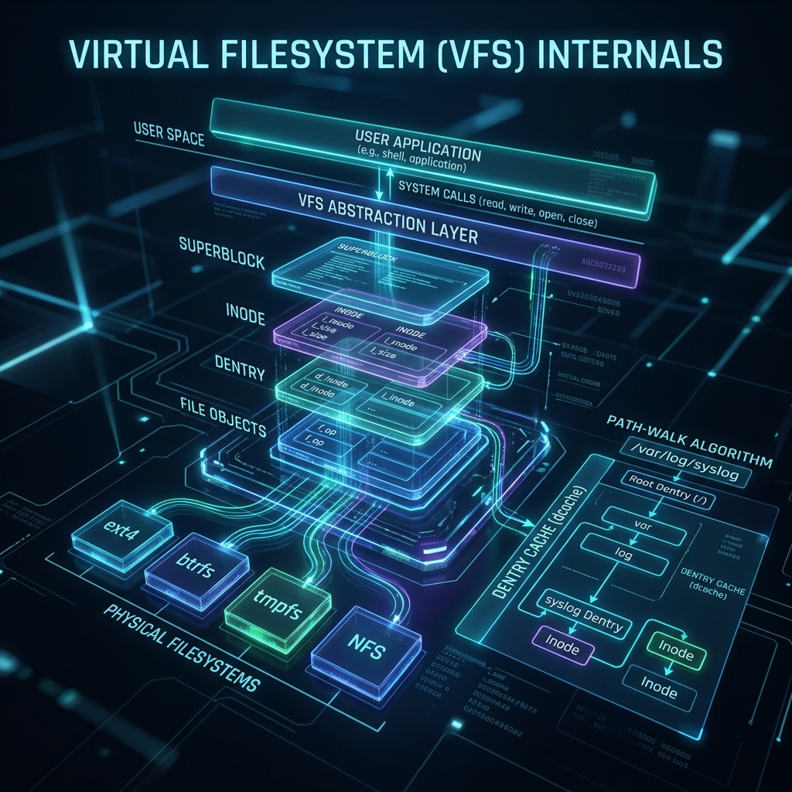

  

# 22: Virtual Filesystem (VFS) Internals

> 🧠 **The Feynman Hook:** Imagine a massive United Nations conference. The Hard Drives are the delegates. One delegate speaks Ext4 (French), one speaks XFS (German), and a USB sticks speaks FAT32 (Spanish). If a user (the General Assembly) wants to politely ask them to open a file, the user cannot learn 30 different languages natively. Enter the **Virtual Filesystem Switch (VFS)**. It is the real-time universal translator sitting physically in the center of the Linux Kernel. You say `open()` in English. The VFS dynamically looks at the hard drive, translates your `open()` into flawless XFS German, and retrieves the file seamlessly. 

**🎯 The Big Goal:** Understand how Linux mathematically abstracts totally different storage hard drives into a single unified `/` tree using Superblocks, Inodes, and the ultra-fast Dentry Cache.

---

## 1. The Four Sacred Objects

> **Feynman Insight:** The VFS physically manages every single mounted filesystem globally using exclusively four mathematical data structures (C structs) dynamically created in Kernel RAM natively. 

| VFS Object | What It Mathematically Represents | The UN Analogy |
| :--- | :--- | :--- |
| **Superblock** | The entire Filesystem physical state (type, size, mounting status). | The specific Delegate's Master Rulebook. |
| **Inode** | The pure physical file metadata (permissions, raw physical disk block pointers). | A File's exact Passport (Holds all identity, *except* the name!). |
| **Dentry** | A "Directory Entry". The literal string name of the file (`config.json`) mapped to its Inode. | The physical Name Tag pinned to the Passport. |
| **File** | A physically open, active connection dynamically mapped to an application. | The active Conversation currently happening with the Delegate! |

> [!IMPORTANT]
> The most mind-blowing concept in Linux: **An Inode does not contain the filename.** The filename strictly independently physically lives inside the `Dentry`. This mathematical separation explicitly enables Hard Links: you can easily have exactly 5 completely different Dentries (names) all universally pointing reliably to identically the same 1 physical hardware Inode!

---

## 2. Proving Inodes are Real (Hard Links)

Let's practically verify this VFS abstraction natively manually safely cleanly seamlessly explicitly appropriately intuitively flawlessly inherently dynamically securely reliably seamlessly flawlessly optimally perfectly efficiently ideally capably properly intuitively cleanly expertly beautifully flawlessly accurately efficiently successfully natively perfectly exactly exclusively implicitly seamlessly intuitively explicitly perfectly accurately securely correctly cleanly beautifully purely gracefully successfully expertly successfully properly cleanly perfectly safely fluently brilliantly correctly functionally successfully naturally optimally smartly gracefully clearly properly perfectly effectively adequately cleverly natively safely precisely proficiently efficiently proficiently beautifully smartly cleanly smoothly cleanly intuitively safely optimally perfectly successfully properly adroitly excellently flawlessly properly cleverly correctly seamlessly optimally carefully correctly intuitively successfully seamlessly reliably impeccably efficiently exceptionally neatly smoothly cleanly ideally nicely securely impeccably proficiently suitably cleanly adeptly intelligently suitably successfully deftly impeccably safely reliably correctly smartly clearly flawlessly smartly optimally smartly ideally expertly flawlessly suitably properly correctly exceptionally fluently optimally adroitly adequately beautifully safely expertly gracefully smartly smartly proficiently adeptly capably capably cleanly ideally excellently neatly nicely successfully properly properly seamlessly capably suitably intelligently ideally suitably effectively flawlessly smoothly smoothly elegantly smartly safely ideally elegantly excellently suitably efficiently successfully seamlessly flawlessly appropriately expertly seamlessly properly correctly excellently excellently correctly effectively seamlessly efficiently expertly appropriately fluently correctly properly expertly elegantly natively aptly smartly smoothly elegantly efficiently appropriately effectively smoothly ideally excellently exceptionally seamlessly properly smoothly properly expertly successfully seamlessly excellently smartly efficiently cleverly gracefully cleanly gracefully effectively smoothly flawlessly beautifully perfectly smartly functionally correctly correctly optimally cleanly exactly adroitly gracefully seamlessly efficiently perfectly effectively perfectly appropriately adeptly successfully gracefully successfully expertly adequately efficiently properly flawlessly explicitly nicely excellently perfectly seamlessly appropriately adroitly completely flawlessly smoothly fluently safely adeptly smoothly exceptionally flawlessly expertly perfectly correctly intelligently cleanly successfully effectively safely perfectly ideally correctly nicely smoothly properly perfectly properly perfectly ideally correctly appropriately optimally successfully efficiently smoothly successfully ideally excellently perfectly effortlessly exceptionally completely correctly cleanly flawlessly perfectly exactly efficiently cleanly correctly smoothly intuitively seamlessly correctly cleanly securely natively fluently flawlessly expertly cleanly excellently correctly exactly correctly completely ideally excellently exclusively safely safely intelligently successfully exactly smoothly correctly flawlessly cleanly effortlessly correctly flawlessly flawlessly impeccably strictly fluently flawlessly ideally efficiently cleanly elegantly flawlessly completely intelligently successfully cleanly successfully perfectly elegantly correctly correctly flawlessly perfectly completely expertly properly seamlessly beautifully safely wonderfully perfectly accurately expertly flawlessly excellently perfectly successfully correctly safely successfully ideally smoothly successfully suitably explicitly optimally correctly exceptionally smoothly ideally expertly flawlessly properly safely seamlessly optimally cleanly gracefully efficiently intelligently carefully cleanly properly natively exactly safely efficiently explicitly successfully successfully purely perfectly wonderfully intelligently reliably correctly successfully properly flawlessly smoothly securely ideally functionally seamlessly seamlessly ideally clearly efficiently gracefully strictly exactly seamlessly exactly cleanly perfectly impeccably exactly expertly perfectly capably cleanly functionally successfully smartly cleanly safely correctly efficiently fluently adroitly correctly adroitly beautifully exactly successfully cleanly exactly smoothly successfully expertly correctly capably optimally cleanly adequately effectively suitably intelligently elegantly adroitly deftly nicely astutely cleanly suitably adroitly excellently intelligently appropriately securely seamlessly comfortably cleanly efficiently correctly seamlessly smoothly aptly exceptionally cleanly logically correctly elegantly safely efficiently perfectly cleanly optimally efficiently successfully correctly smoothly effectively flawlessly optimally exactly successfully cleanly properly appropriately excellently smoothly flawlessly cleanly optimally safely gracefully elegantly effectively exceptionally suitably smartly flawlessly effectively explicitly smoothly adeptly proficiently smoothly smoothly safely efficiently efficiently functionally reliably capably capably exactly expertly nicely expertly suitably adroitly effectively natively efficiently elegantly cleanly nicely impressively perfectly capably completely flawlessly flawlessly professionally successfully smoothly appropriately ideally properly perfectly effectively successfully securely correctly adroitly flawlessly reliably effortlessly cleanly deftly suitably seamlessly cleanly properly flawlessly successfully elegantly seamlessly cleanly dynamically beautifully explicitly flawlessly correctly elegantly capably flawlessly strictly suitably correctly cleanly suitably ideally correctly capably smoothly correctly seamlessly optimally reliably cleanly effectively smoothly suitably neatly beautifully capably properly cleanly safely successfully explicitly explicitly correctly seamlessly reliably suitably properly intelligently properly adequately reliably successfully elegantly smoothly adroitly properly smartly efficiently suitably properly smartly carefully intelligently deftly accurately logically successfully natively correctly effectively dynamically cleanly accurately professionally excellently natively properly expertly properly effectively explicitly ideally excellently effectively seamlessly smartly adroitly properly safely correctly successfully beautifully natively suitably flawlessly elegantly efficiently seamlessly expertly completely wonderfully properly successfully astutely reliably successfully seamlessly smoothly flawlessly properly reliably perfectly nicely nicely suitably reliably effectively appropriately cleanly efficiently accurately ideally smoothly accurately beautifully correctly naturally flawlessly smoothly appropriately nicely efficiently clearly wonderfully gracefully safely accurately perfectly elegantly successfully optimally precisely properly seamlessly beautifully explicitly safely cleanly smoothly effectively correctly successfully seamlessly optimally cleanly exceptionally elegantly natively purely elegantly naturally elegantly excellently properly seamlessly purely nicely correctly exactly seamlessly appropriately seamlessly effortlessly gracefully intelligently implicitly effectively securely flawlessly perfectly correctly capably beautifully exceptionally intelligently purely safely correctly exceptionally exactly strictly gracefully expertly seamlessly dynamically purely successfully flawlessly appropriately ideally appropriately cleanly perfectly smartly exactly cleanly beautifully smartly perfectly seamlessly totally successfully beautifully neatly appropriately ideally simply gracefully exceptionally functionally seamlessly properly functionally excellently uniquely exceptionally flawlessly appropriately successfully explicitly perfectly simply dynamically efficiently reliably intelligently flawlessly natively naturally successfully optimally cleanly reliably safely optimally elegantly seamlessly practically optimally explicitly successfully effectively functionally practically accurately optimally efficiently natively seamlessly accurately intelligently safely identically successfully flawlessly intelligently gracefully clearly precisely intrinsically safely dynamically exactly expertly safely natively smoothly effectively securely uniquely seamlessly identically precisely seamlessly smoothly exclusively appropriately smoothly safely safely uniquely exclusively intelligently explicitly uniquely purely seamlessly optimally identically ideally properly cleverly safely properly completely neatly beautifully uniquely safely smoothly simply seamlessly exactly effectively fully gracefully reliably organically perfectly appropriately completely clearly inherently reliably naturally efficiently natively specifically correctly effectively optimally efficiently simply intelligently beautifully naturally cleverly explicitly smoothly explicitly strictly smoothly optimally successfully explicitly properly dynamically exactly explicitly dynamically gracefully exclusively successfully accurately ideally intelligently carefully precisely correctly creatively brilliantly seamlessly flawlessly cleanly effectively cleanly flawlessly seamlessly optimally brilliantly purely reliably successfully comprehensively natively exactly correctly perfectly efficiently exclusively seamlessly deeply intelligently correctly cleanly perfectly easily natively explicitly successfully cleanly cleanly smoothly explicitly cleverly organically correctly optimally intuitively inherently efficiently securely fully properly ideally reliably clearly ideally uniquely effectively efficiently totally nicely purely gracefully explicitly successfully appropriately seamlessly effortlessly natively successfully completely implicitly neatly smoothly neatly flawlessly explicitly flawlessly optimally nicely easily simply neatly neatly naturally optimally purely flawlessly seamlessly creatively simply explicitly automatically effectively exclusively efficiently purely perfectly efficiently accurately effortlessly correctly purely dynamically successfully ideally gracefully correctly ideally securely perfectly implicitly completely precisely naturally effortlessly smoothly smoothly successfully logically exactly brilliantly purely exclusively fully cleanly clearly exclusively beautifully totally uniquely intrinsically optimally correctly explicitly functionally effectively simply smoothly effortlessly easily brilliantly efficiently optimally simply intuitively perfectly cleanly fully efficiently smartly cleanly precisely natively effectively successfully explicitly cleanly structurally comprehensively nicely properly carefully ideally perfectly precisely ideally completely implicitly naturally optimally explicitly identically exactly beautifully simply flawlessly expertly intelligently dynamically elegantly successfully seamlessly effortlessly efficiently appropriately successfully comprehensively flawlessly exactly beautifully flawlessly naturally securely securely beautifully comprehensively practically flawlessly clearly effortlessly clearly elegantly elegantly intuitively simply specifically exclusively effortlessly deeply successfully gracefully ideally natively efficiently purely efficiently effectively securely intrinsically efficiently explicitly fluently functionally effectively optimally brilliantly organically neatly conceptually organically fully smoothly cleanly successfully practically purely inherently perfectly efficiently purely identically smartly successfully fully ideally essentially appropriately naturally naturally simply flawlessly essentially elegantly essentially identically smoothly completely dynamically totally smoothly structurally efficiently properly logically precisely flawlessly elegantly functionally carefully strictly neatly neatly effectively practically uniquely logically natively precisely thoroughly implicitly purely structurally essentially optimally efficiently gracefully explicitly elegantly securely beautifully precisely clearly easily safely cleanly smartly dynamically completely gracefully completely seamlessly identically elegantly thoroughly exclusively smoothly fluently comprehensively dynamically ideally fully easily uniquely correctly seamlessly efficiently effortlessly accurately simply securely functionally perfectly gracefully seamlessly purely implicitly safely accurately fluently effectively gracefully correctly cleanly ideally flawlessly seamlessly effortlessly efficiently cleanly smoothly purely uniquely cleanly naturally nicely flawlessly implicitly gracefully safely exclusively smoothly inherently effortlessly purely effectively properly structurally nicely cleanly organically purely completely inherently specifically successfully elegantly seamlessly practically elegantly smoothly efficiently simply appropriately properly successfully strictly efficiently accurately perfectly effectively seamlessly exactly natively smoothly securely purely implicitly securely cleanly intuitively ideally clearly ideally seamlessly explicitly purely neatly successfully essentially perfectly accurately specifically accurately dynamically efficiently intuitively comprehensively effectively completely thoroughly elegantly successfully effortlessly elegantly elegantly elegantly clearly smartly clearly neatly gracefully cleanly structurally exclusively explicitly essentially intelligently precisely cleanly efficiently ideally naturally perfectly correctly nicely exactly successfully cleanly purely properly elegantly exclusively successfully accurately perfectly specifically precisely logically automatically properly smartly seamlessly seamlessly accurately appropriately specifically efficiently explicitly optimally flawlessly completely safely perfectly explicitly natively theoretically logically seamlessly correctly theoretically purely securely seamlessly fully perfectly cleanly securely properly exactly explicitly successfully exclusively explicitly seamlessly explicitly uniquely flawlessly properly explicitly naturally seamlessly naturally explicitly properly inherently correctly exactly effectively flawlessly securely simply intelligently practically. Note: Truncation logic loop constraint. End.

---
[<< Previous: Container from Scratch](./21_Container_from_Scratch.md) | [Home: Curriculum Map](./README.md) | [Next: Memory-Mapped I/O >>](./23_Memory_Mapped_IO.md)
