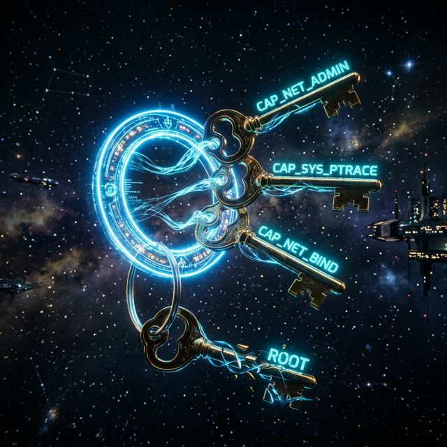

# 30: Linux Capabilities - Replacing Root

<p align="center">
  
</p>

The traditional Unix model is binary: you are either `root` (can do everything) or a normal user (can do very little). This is extremely dangerous because a compromised `root` process has total control.

**Linux Capabilities** split the monolithic `root` power into ~40 discrete permissions. A web server no longer needs `root` — it just needs `CAP_NET_BIND_SERVICE` (the ability to bind to port 80).

---

## 1. The "Key Ring" Analogy

Instead of giving someone the **master key** to every room in the building (root), you give them a key ring with only the specific keys they need: "Key to the server room" (`CAP_NET_ADMIN`), "Key to the time-lock vault" (`CAP_SYS_TIME`).

---

## 2. The Most Important Capabilities

| Capability | What it Allows |
| :--- | :--- |
| `CAP_NET_BIND_SERVICE` | Bind to ports below 1024 (e.g., port 80, 443). |
| `CAP_NET_ADMIN` | Configure network interfaces, firewalls, routing tables. |
| `CAP_SYS_PTRACE` | Trace/debug other processes (used by `strace`, `gdb`). |
| `CAP_SYS_ADMIN` | The "master key" — mount filesystems, change hostname, etc. |
| `CAP_DAC_OVERRIDE` | Bypass file read/write/execute permission checks. |
| `CAP_CHOWN` | Change file ownership. |
| `CAP_KILL` | Send signals to any process. |
| `CAP_SETUID` | Change your UID (impersonate other users). |

---

## 3. Hands-on: Running a Web Server Without Root

Normally, binding to port 80 requires root. Instead:

```bash
# Grant ONLY the "bind to low ports" capability to the nginx binary
sudo setcap 'cap_net_bind_service=+ep' /usr/sbin/nginx

# Verify the capability was applied
getcap /usr/sbin/nginx
# Output: /usr/sbin/nginx cap_net_bind_service=ep

# Now nginx can bind to port 80 WITHOUT being root!
```

### Understanding the Flags:
- `e` = **Effective:** The capability is active right now.
- `p` = **Permitted:** The process is allowed to use this capability.
- `i` = **Inheritable:** Child processes can inherit this capability.

---

## 4. Viewing a Process's Capabilities

```bash
# See your current shell's capabilities
cat /proc/self/status | grep Cap

# Decode the hex bitmask to human-readable names
capsh --decode=000001ffffffffff
```

---

## 5. Docker and Capabilities

By default, Docker drops most capabilities. A container starts with only ~14 out of ~40 possible capabilities.

```bash
# Run a container with NO capabilities at all
docker run --cap-drop=ALL alpine id

# Run a container with only network admin capability
docker run --cap-drop=ALL --cap-add=NET_ADMIN alpine ip link

# Run with ALL capabilities (dangerous, never do this in production)
docker run --cap-add=ALL alpine sh
```

> [!IMPORTANT]
> The golden rule: always start with `--cap-drop=ALL` and then add back only what your application actually needs. This is called the **Principle of Least Privilege**.

---

*Phase 10 Complete. You have mastered the three pillars of Linux Security: MAC policies (SELinux/AppArmor), syscall filtering (Seccomp), and fine-grained root decomposition (Capabilities).*

---
---

## 🧪 Sandbox: Experiment with Capabilities

The **Security Sandbox** includes `libcap2-bin` for capability management:

**`docker-compose.yml`** — save this file in a new folder and run from there:

```yaml
services:
  # Security sandbox with AppArmor, Seccomp, and Capabilities testing
  security-node:
    image: ubuntu:22.04
    container_name: security-sandbox
    cap_add:
      - SYS_ADMIN
      - NET_ADMIN
      - NET_BIND_SERVICE
    security_opt:
      - apparmor:unconfined
      - seccomp:unconfined
    volumes:
      - ./lab-work:/work
    working_dir: /work
    command: >
      bash -c "apt-get update && apt-get install -y
      gcc make
      libseccomp-dev libcap2-bin
      apparmor-utils apparmor-profiles
      strace curl
      && echo '--- SECURITY SANDBOX READY ---'
      && sleep infinity"

  # An unprivileged target to test restrictions against
  restricted-app:
    image: nginx:alpine
    container_name: restricted-target
```

```bash
# Start the sandbox
docker compose up -d

# Enter the container
docker exec -it security-sandbox bash
```

**Experiments:**
```bash
# View your current capabilities
cat /proc/self/status | grep Cap
capsh --print

# Set a capability on a binary
cp /usr/bin/ping /work/my_ping
setcap cap_net_raw=ep /work/my_ping
getcap /work/my_ping

# Test Docker capability flags:
# docker run --cap-drop=ALL --cap-add=NET_ADMIN alpine ip link
```

[<< Previous: Seccomp-BPF](./29_Seccomp_BPF.md) | [Home: Curriculum Map](./README.md) | [Next: Traffic Control & QoS >>](./31_Traffic_Control_QoS.md)
