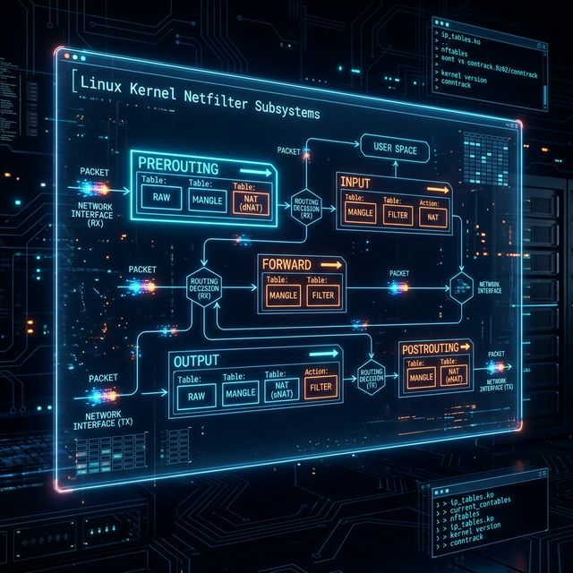

# 33: DPDK & AF_XDP - Kernel-Bypass Networking

<p align="center">
  
</p>

Even XDP still passes through the kernel's NIC driver. For applications that need to process **tens of millions of packets per second** — high-frequency trading, 5G core networks, telecom routers — even the NIC driver is too slow.

**DPDK** (Data Plane Development Kit) removes the kernel from the equation entirely.

---

## 1. The "Private Highway" Analogy

Normal networking: Packets arrive → Kernel receives them → Kernel builds data structures → Kernel delivers to your app. With DPDK, the network card's memory is mapped **directly** into your application's address space. No kernel. No interrupts. No context switches.

---

## 2. How DPDK Works

| Step | Traditional Kernel | DPDK |
| :--- | :--- | :--- |
| 1 | NIC raises interrupt. | NIC writes to shared memory. |
| 2 | Kernel wakes up, builds `sk_buff`. | App **polls** the shared ring buffer. |
| 3 | Kernel copies data to userspace. | App reads directly from NIC memory (zero-copy). |
| 4 | App processes packet. | App processes packet. |

The result: **10-100x** throughput improvement.

---

## 3. AF_XDP: The Compromise

DPDK requires taking the NIC away from the kernel entirely (the OS can no longer use it). **AF_XDP** is a newer approach that provides DPDK-like performance while keeping the kernel in the loop using an XDP program + a shared UMEM ring buffer.

```
NIC → XDP Program (in kernel) → AF_XDP Socket → Your Application
```

Advantages over DPDK:
- No need for special DPDK drivers.
- The kernel still manages the NIC.
- Compatible with standard Linux tools (`ip`, `ethtool`).

---

## 4. When to Use What?

| Technology | Throughput | Use When... |
| :--- | :--- | :--- |
| **iptables** | ~1-5 Mpps | Standard firewall rules. |
| **XDP** | ~20-40 Mpps | DDoS mitigation, simple packet filtering. |
| **AF_XDP** | ~30-50 Mpps | High-performance apps that need kernel compatibility. |
| **DPDK** | ~100+ Mpps | Telecom, HFT, 5G core — maximum throughput. |

---

## 5. Getting Started with AF_XDP

```bash
# Install dependencies
sudo apt install libbpf-dev libxdp-dev

# The key concept: UMEM (User Memory)
# You allocate a chunk of memory and share it with the kernel.
# Packets are written directly into this memory — zero copies.
```

Key data structures:
- **FILL Ring:** "Here are empty buffers the NIC can write into."
- **COMPLETION Ring:** "These buffers have been transmitted, you can reuse them."
- **RX Ring:** "New packets arrived in these buffers."
- **TX Ring:** "Please transmit these buffers."

---

*Phase 11 Complete. You now understand the full spectrum from `iptables` (simple) to DPDK (nuclear). In Phase 12, we master production Linux operations.*

---
---

## 🧪 Sandbox: Explore Kernel-Bypass Concepts

DPDK requires physical NIC access, but you can explore AF_XDP concepts in the **Networking Sandbox**:

```bash
cd sandbox/networking-lab
docker compose up -d
docker exec -it networking-sandbox bash
```

**Explore network interfaces and ring buffers:**
```bash
# View network interface statistics
ip -s link show eth0

# Watch packet counters in real-time
watch -n 1 "cat /proc/net/dev"

# Inspect socket buffer tuning
cat /proc/sys/net/core/rmem_max
cat /proc/sys/net/core/wmem_max
```

[<< Previous: XDP](./32_XDP.md) | [Home: Curriculum Map](./README.md) | [Next: Systemd Internals >>](./34_Systemd_Internals.md)
