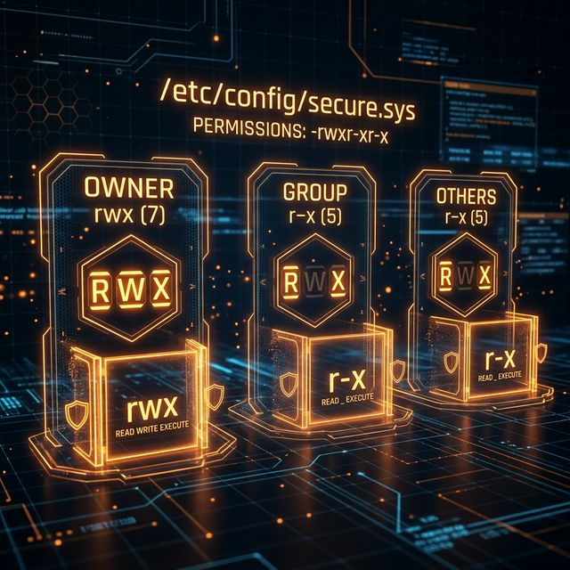

# 39: Permissions

<p align="center">
  
</p>

Linux security starts with file permissions. Every file and directory has an owner, a group, and a permission mask that controls who can read, write, or execute it.

---

## 1. `chmod` — Change File Mode

### Octal Notation

```bash
chmod 755 script.sh       # Owner: rwx, Group: r-x, Others: r-x
chmod 644 config.txt      # Owner: rw-, Group: r--, Others: r--
chmod 700 private/        # Owner: rwx, no access for anyone else
chmod 600 ~/.ssh/id_rsa   # SSH keys MUST be 600 or SSH will refuse them
```

**Octal math:** Read=4, Write=2, Execute=1

| Octal | Permission | Meaning |
| :--- | :--- | :--- |
| `7` | `rwx` | Full access |
| `6` | `rw-` | Read + Write |
| `5` | `r-x` | Read + Execute |
| `4` | `r--` | Read only |
| `0` | `---` | No access |

### Symbolic Notation

```bash
chmod u+x script.sh       # Add execute for owner (User)
chmod g-w file.txt         # Remove write from group
chmod o-rwx secret.txt     # Remove all permissions for others
chmod a+r public.txt       # Add read for all (All = u+g+o)
chmod u=rwx,g=rx,o= dir/  # Explicit set: owner=rwx, group=rx, others=none
```

### Recursive

```bash
chmod -R 755 /var/www/html/  # Apply to directory and all contents
```

---

## 2. `chown` — Change Ownership

Only `root` can change file ownership.

```bash
sudo chown alice file.txt           # Change owner to alice
sudo chown alice:developers file.txt # Change owner AND group
sudo chown :staff file.txt          # Change group only
sudo chown -R www-data:www-data /var/www/  # Recursive ownership
```

---

## 3. `chgrp` — Change Group

```bash
sudo chgrp developers project/     # Change group
sudo chgrp -R staff /shared/       # Recursive
```

---

## 4. `umask` — Default Permission Mask

The `umask` determines the default permissions for newly created files and directories.

```bash
umask                  # Show current mask (e.g., 0022)
umask 0027             # Set: files=640, dirs=750
```

**How it works:**
- Default file permission: `666` (no execute)
- Default directory permission: `777`
- Subtract the umask: `666 - 022 = 644` for files, `777 - 022 = 755` for directories

| umask | New File | New Directory |
| :--- | :--- | :--- |
| `0022` | `644` (rw-r--r--) | `755` (rwxr-xr-x) |
| `0027` | `640` (rw-r-----) | `750` (rwxr-x---) |
| `0077` | `600` (rw-------)  | `700` (rwx------) |

---

## 5. Special Permission Bits

### SUID (Set User ID) — `4xxx`

When set on an executable, it runs as the **file owner** (not the user who executed it).

```bash
chmod u+s /usr/bin/passwd          # passwd runs as root
chmod 4755 special_program         # Octal: SUID + rwxr-xr-x
ls -l /usr/bin/passwd
# -rwsr-xr-x 1 root root ...      # The 's' in owner execute = SUID
```

### SGID (Set Group ID) — `2xxx`

On files: runs as the file's group. On directories: new files inherit the directory's group.

```bash
chmod g+s /shared/projects/        # New files inherit the group
chmod 2775 /shared/projects/
```

### Sticky Bit — `1xxx`

On directories: only the file owner (or root) can delete files. Used on `/tmp`.

```bash
chmod +t /tmp                      # Set sticky bit
chmod 1777 /tmp
ls -ld /tmp
# drwxrwxrwt ...                   # The 't' at the end = sticky bit
```

---

## 6. Viewing Permissions

```bash
ls -l file.txt                     # Standard view
ls -la                             # Include hidden files
stat file.txt                      # Detailed metadata (octal + symbolic)
getfacl file.txt                   # Access Control Lists (if supported)
```

**Reading `ls -l` output:**

```
-rwxr-xr-- 1 alice developers 4096 Mar 26 10:00 deploy.sh
│├──┤├──┤├──┤ │  │      │        │      │          └── Filename
│ │    │   │  │  │      │        │      └── Last modified
│ │    │   │  │  │      │        └── Size in bytes
│ │    │   │  │  │      └── Group
│ │    │   │  │  └── Owner
│ │    │   │  └── Hard link count
│ │    │   └── Others: r-- (read only)
│ │    └── Group: r-x (read + execute)
│ └── Owner: rwx (full access)
└── Type: - (file), d (directory), l (symlink)
```

---

## 7. Quick Reference Table

| Command | Purpose | Example |
| :--- | :--- | :--- |
| `chmod` | Change permissions | `chmod 755 file` |
| `chown` | Change owner | `sudo chown user:group file` |
| `chgrp` | Change group | `sudo chgrp staff dir/` |
| `umask` | Set default mask | `umask 0022` |
| `stat`  | View full metadata | `stat file.txt` |

---

[<< Previous: Text Processing](./38_Text_Processing.md) | [Home: Curriculum Map](./README.md) | [Next: Networking >>](./40_Networking.md)
