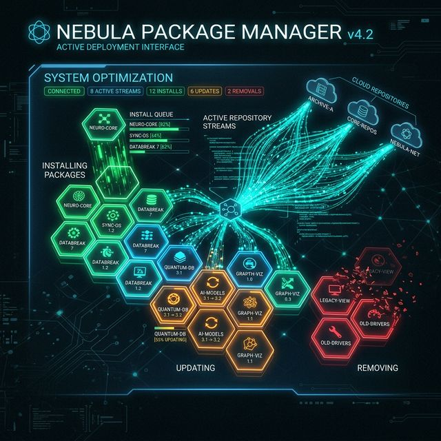

# 42: Package Management

<p align="center">
  
</p>

Every Linux distribution uses a package manager to install, update, and remove software from curated repositories.

---

## 1. APT (Debian, Ubuntu, Mint)

### `apt` — The Modern Interface

```bash
sudo apt update                           # Refresh package index
sudo apt upgrade                          # Upgrade all installed packages
sudo apt full-upgrade                     # Upgrade with dependency resolution
sudo apt install nginx                    # Install a package
sudo apt remove nginx                     # Remove (keep config files)
sudo apt purge nginx                      # Remove + delete config files
sudo apt autoremove                       # Remove unused dependencies
sudo apt search "web server"              # Search for packages
apt show nginx                            # Show package details
apt list --installed                      # List all installed packages
apt list --upgradable                     # List available upgrades
```

### `dpkg` — Low-Level Package Manager

```bash
sudo dpkg -i package.deb                  # Install a .deb file
sudo dpkg -r package-name                 # Remove a package
dpkg -l                                   # List all installed packages
dpkg -L nginx                             # List files installed by a package
dpkg -S /usr/bin/curl                     # Find which package owns a file
dpkg --configure -a                       # Fix broken installations
```

---

## 2. YUM / DNF (RHEL, CentOS, Fedora, Rocky)

### `dnf` — The Modern YUM Replacement

```bash
sudo dnf check-update                     # Check for updates
sudo dnf upgrade                          # Upgrade all packages
sudo dnf install httpd                    # Install
sudo dnf remove httpd                     # Remove
sudo dnf search "web server"              # Search
dnf info httpd                            # Package info
dnf list installed                        # List installed
sudo dnf autoremove                       # Remove unused dependencies
sudo dnf clean all                        # Clear cache
```

### `yum` — Legacy (RHEL 7 and older)

```bash
sudo yum update                           # Same as dnf upgrade
sudo yum install package                  # Install
sudo yum remove package                   # Remove
yum list installed                        # List installed
```

### `rpm` — Low-Level RPM Manager

```bash
sudo rpm -ivh package.rpm                 # Install RPM
sudo rpm -Uvh package.rpm                 # Upgrade RPM
sudo rpm -e package-name                  # Remove
rpm -qa                                   # List all installed RPMs
rpm -qi package-name                      # Package info
rpm -ql package-name                      # List files in package
rpm -qf /usr/bin/curl                     # Find which RPM owns a file
```

---

## 3. Snap (Universal — Ubuntu, Fedora, etc.)

Isolated, self-contained packages.

```bash
sudo snap install code --classic          # Install VS Code
sudo snap remove code                     # Remove
snap list                                 # List installed snaps
snap find "text editor"                   # Search
sudo snap refresh                         # Update all snaps
snap info code                            # Package details
```

---

## 4. Flatpak (Universal — Fedora, Linux Mint, etc.)

```bash
flatpak install flathub org.gimp.GIMP     # Install from Flathub
flatpak uninstall org.gimp.GIMP           # Remove
flatpak list                              # List installed
flatpak update                            # Update all
flatpak search gimp                       # Search
```

---

## 5. Comparison Table

| Feature | APT (Debian) | DNF (RHEL) | Snap | Flatpak |
| :--- | :--- | :--- | :--- | :--- |
| **Package format** | `.deb` | `.rpm` | `.snap` | `.flatpak` |
| **Low-level tool** | `dpkg` | `rpm` | — | — |
| **Config location** | `/etc/apt/` | `/etc/yum.repos.d/` | — | — |
| **Cache clean** | `apt clean` | `dnf clean all` | — | — |
| **Sandboxed** | No | No | Yes | Yes |
| **Auto-update** | Manual | Manual | Automatic | Manual |

---

## 6. Repository Management

### APT Repositories

```bash
# Add a PPA (Ubuntu)
sudo add-apt-repository ppa:deadsnakes/ppa
sudo apt update

# Add a custom repository
echo "deb https://repo.example.com stable main" | sudo tee /etc/apt/sources.list.d/custom.list
sudo apt update
```

### DNF Repositories

```bash
# Add EPEL repository (RHEL/CentOS)
sudo dnf install epel-release

# List enabled repos
dnf repolist

# Add custom repo
sudo dnf config-manager --add-repo https://repo.example.com/custom.repo
```

---

## 7. Quick Reference Table

| Command | Debian/Ubuntu | RHEL/Fedora |
| :--- | :--- | :--- |
| Update index | `apt update` | `dnf check-update` |
| Upgrade all | `apt upgrade` | `dnf upgrade` |
| Install | `apt install pkg` | `dnf install pkg` |
| Remove | `apt remove pkg` | `dnf remove pkg` |
| Search | `apt search term` | `dnf search term` |
| Package info | `apt show pkg` | `dnf info pkg` |
| List installed | `apt list --installed` | `dnf list installed` |
| File owner | `dpkg -S /path` | `rpm -qf /path` |

---

[<< Previous: Archiving](./41_Archiving.md) | [Home: Curriculum Map](./README.md) | [Next: File Management >>](./43_File_Management.md)
