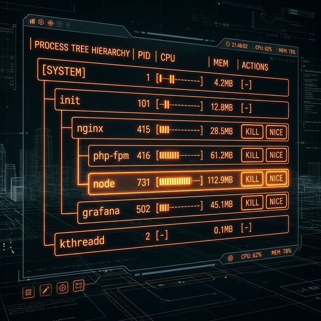

# 46: Process Management

<p align="center">
  
</p>

Every running program is a process. Mastering process management means controlling what runs, how fast, and when it stops.

---

## 1. `ps` — Process Snapshot

```bash
ps                                         # Your terminal's processes
ps aux                                     # ALL processes (BSD syntax)
ps -ef                                     # ALL processes (POSIX syntax)
ps aux | grep nginx                        # Find specific process
ps -u alice                                # Processes owned by alice
ps --sort=-%mem | head -20                 # Top 20 by memory usage
ps --sort=-%cpu | head -20                 # Top 20 by CPU usage
ps -eo pid,ppid,user,%cpu,%mem,cmd --sort=-%cpu  # Custom columns
```

### Understanding `ps aux` Output

```
USER       PID %CPU %MEM    VSZ   RSS TTY      STAT START   TIME COMMAND
root         1  0.0  0.1 171120 10244 ?        Ss   Mar20   0:15 /sbin/init
www-data  1234  5.2  2.1 503200 34124 ?        S    10:00   0:45 nginx: worker
```

| Column | Meaning |
| :--- | :--- |
| `PID` | Process ID |
| `PPID` | Parent process ID |
| `%CPU` | CPU usage percentage |
| `%MEM` | Memory usage percentage |
| `VSZ` | Virtual memory size |
| `RSS` | Resident set size (actual RAM) |
| `STAT` | State (`S`=sleeping, `R`=running, `Z`=zombie, `T`=stopped) |

---

## 2. `top` — Real-Time Process Monitor

```bash
top                                        # Interactive process monitor
```

**Keyboard shortcuts inside `top`:**

| Key | Action |
| :--- | :--- |
| `q` | Quit |
| `k` | Kill a process (enter PID) |
| `r` | Renice a process |
| `M` | Sort by Memory |
| `P` | Sort by CPU |
| `1` | Toggle individual CPU cores |
| `c` | Show full command path |

---

## 3. `htop` — Enhanced Process Monitor

A visually superior alternative to `top`. Install with `sudo apt install htop`.

```bash
htop                                       # Interactive with colors, mouse support
```

Features over `top`: tree view, mouse clicking, horizontal scrolling, instant filtering.

---

## 4. `kill` — Send Signals to Processes

```bash
kill 1234                                  # Send SIGTERM (graceful shutdown)
kill -9 1234                               # Send SIGKILL (force kill, no cleanup)
kill -HUP 1234                             # Send SIGHUP (reload config)
kill -STOP 1234                            # Pause process
kill -CONT 1234                            # Resume paused process
kill -l                                    # List all signal names
```

### `killall` and `pkill`

```bash
killall nginx                              # Kill all processes by name
killall -9 python3                         # Force kill all python3 processes
pkill -f "python script.py"               # Kill by full command line match
pkill -u alice                             # Kill all of alice's processes
```

---

## 5. `nice` / `renice` — Priority Control

Priority ranges from -20 (highest) to 19 (lowest). Default is 0.

```bash
nice -n 10 ./heavy_task.sh                 # Start with lower priority
nice -n -5 ./important.sh                  # Start with higher priority (needs root)
sudo renice -n 5 -p 1234                   # Change priority of running process
renice -n 10 -u alice                      # Renice all of alice's processes
```

---

## 6. `bg`, `fg`, `jobs` — Job Control

```bash
./long_task.sh &                           # Start in background
# Press Ctrl+Z while running               # Suspend current process
bg                                         # Resume suspended process in background
fg                                         # Bring background process to foreground
jobs                                       # List background jobs
fg %2                                      # Bring job #2 to foreground
kill %1                                    # Kill job #1
```

---

## 7. `nohup` — Survive Logout

By default, processes die when you close the terminal. `nohup` prevents this.

```bash
nohup ./server.sh &                        # Run in background, immune to logout
nohup ./server.sh > /dev/null 2>&1 &       # Discard output too
```

### Modern alternative: `disown`

```bash
./server.sh &                              # Start in background
disown %1                                  # Detach from terminal
```

---

## 8. `pgrep` and `pstree`

```bash
pgrep nginx                                # Get PIDs of nginx processes
pgrep -a nginx                             # PIDs + full command
pstree                                     # Show process tree
pstree -p                                  # Include PIDs
pstree alice                               # Tree for specific user
```

---

## 9. Quick Reference Table

| Command | Purpose | Key Flag |
| :--- | :--- | :--- |
| `ps` | Process snapshot | `aux` (all), `-ef` (POSIX) |
| `top` | Real-time monitor | `P` (sort CPU), `M` (sort mem) |
| `htop` | Enhanced monitor | *(interactive)* |
| `kill` | Send signal | `-9` (SIGKILL), `-HUP` (reload) |
| `killall` | Kill by name | `-9` (force) |
| `nice` | Set start priority | `-n N` |
| `renice` | Change priority | `-n N -p PID` |
| `bg/fg` | Job control | `%N` (job number) |
| `nohup` | Survive logout | `&` (background) |

---

[<< Previous: Disk & System Info](./45_Disk_and_System_Info.md) | [Home: Curriculum Map](./README.md) | [Next: System Control >>](./47_System_Control.md)
