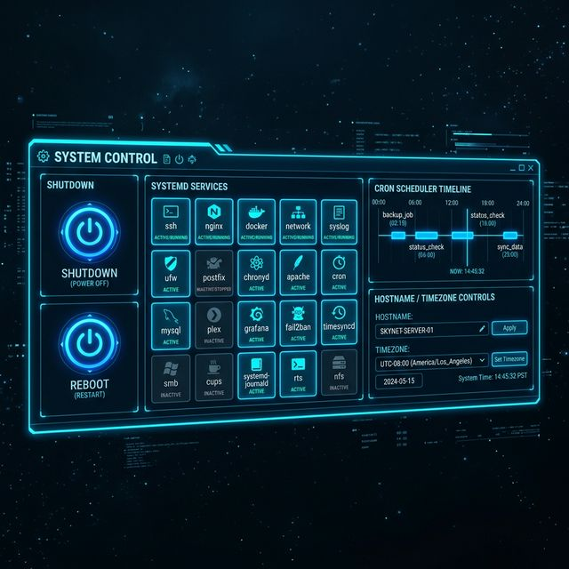

# 47: System Control

<p align="center">
  
</p>

Commands for managing system services, scheduling tasks, and controlling the system lifecycle.

---

## 1. `systemctl` — Service Manager

The primary interface to `systemd`, which manages all services on modern Linux distributions.

### Service Operations

```bash
sudo systemctl start nginx                 # Start a service
sudo systemctl stop nginx                  # Stop a service
sudo systemctl restart nginx               # Restart a service
sudo systemctl reload nginx                # Reload config without restart
sudo systemctl status nginx                # Check service status
sudo systemctl enable nginx                # Start on boot
sudo systemctl disable nginx               # Don't start on boot
sudo systemctl is-active nginx             # Check if currently running
sudo systemctl is-enabled nginx            # Check if enabled on boot
```

### Listing Services

```bash
systemctl list-units --type=service        # All loaded services
systemctl list-units --type=service --state=running  # Running only
systemctl list-unit-files --type=service   # All available services + state
systemctl list-units --failed              # Failed services
```

### Logs (journalctl)

```bash
journalctl -u nginx                        # Logs for specific service
journalctl -u nginx --since "1 hour ago"   # Recent logs
journalctl -u nginx -f                     # Follow (live tail)
journalctl -p err                          # Only errors
journalctl --disk-usage                    # Log disk usage
sudo journalctl --vacuum-size=500M         # Clean old logs
```

---

## 2. `shutdown` — Power Off

```bash
sudo shutdown now                          # Immediate shutdown
sudo shutdown -h now                       # Halt (power off)
sudo shutdown -h +10                       # Shutdown in 10 minutes
sudo shutdown -h 22:00                     # Shutdown at 10 PM
sudo shutdown -c                           # Cancel scheduled shutdown
```

---

## 3. `reboot` — Restart

```bash
sudo reboot                                # Immediate reboot
sudo reboot -f                             # Force (skip shutdown scripts)
sudo systemctl reboot                      # Systemd method
```

---

## 4. `timedatectl` — Time and Timezone

```bash
timedatectl                                # Show current time/date/timezone
timedatectl list-timezones                 # List all timezones
sudo timedatectl set-timezone Europe/Madrid  # Set timezone
sudo timedatectl set-time "2026-03-26 18:00:00"  # Set time manually
sudo timedatectl set-ntp true              # Enable NTP synchronization
```

---

## 5. `hostnamectl` — Hostname Management

```bash
hostnamectl                                # Show hostname and OS info
sudo hostnamectl set-hostname webserver01  # Change hostname
```

---

## 6. `cron` / `crontab` — Task Scheduling

### Managing Crontab

```bash
crontab -e                                 # Edit your crontab
crontab -l                                 # List your cron jobs
crontab -r                                 # Remove all cron jobs
sudo crontab -u alice -e                   # Edit alice's crontab
```

### Crontab Syntax

```
┌────── Minute (0-59)
│ ┌──── Hour (0-23)
│ │ ┌── Day of Month (1-31)
│ │ │ ┌ Month (1-12)
│ │ │ │ ┌ Day of Week (0-7, 0=Sun, 7=Sun)
│ │ │ │ │
* * * * * command
```

### Examples

```bash
# Run every day at 2:30 AM
30 2 * * * /home/user/backup.sh

# Run every 15 minutes
*/15 * * * * /usr/bin/health_check.sh

# Run Mon-Fri at 9 AM
0 9 * * 1-5 /home/user/report.sh

# Run on the 1st of every month
0 0 1 * * /home/user/monthly_cleanup.sh

# Run every Sunday at midnight
0 0 * * 0 /home/user/weekly_backup.sh
```

### System-Wide Cron Directories

```bash
ls /etc/cron.daily/                        # Scripts run daily
ls /etc/cron.weekly/                       # Scripts run weekly
ls /etc/cron.monthly/                      # Scripts run monthly
```

---

## 7. Systemd Timers (Modern Cron Alternative)

```bash
systemctl list-timers                      # List all active timers
systemctl list-timers --all                # Include inactive
```

---

## 8. `loginctl` — Session Management

```bash
loginctl                                   # List active sessions
loginctl list-users                        # List logged-in users
loginctl show-user alice                   # User session details
loginctl terminate-user alice              # Kill all sessions for user
```

---

## 9. Quick Reference Table

| Command | Purpose | Key Usage |
| :--- | :--- | :--- |
| `systemctl` | Service management | `start`, `stop`, `enable`, `status` |
| `journalctl` | Service logs | `-u service`, `-f` (follow) |
| `shutdown` | Power off | `now`, `+10`, `22:00` |
| `reboot` | Restart system | *(immediate)* |
| `timedatectl` | Time/timezone | `set-timezone` |
| `hostnamectl` | Hostname | `set-hostname` |
| `crontab` | Task scheduling | `-e` (edit), `-l` (list) |

---

## 🧪 Hands-On Lab

### Setup: Docker Sandbox

```bash
docker run -it --rm ubuntu:latest bash
```

Install tools:

```bash
apt-get update > /dev/null 2>&1 && apt-get install -y cron systemctl 2>/dev/null
```

---

### Exercise 1: Check Container's System Info
> **Goal:** View hostname and OS details.

```bash
cat /etc/hostname
cat /etc/os-release
```
✅ **Observe:** The container hostname (a random hex string) and Ubuntu version.

---

### Exercise 2: View Current Time and Timezone
> **Goal:** Inspect the system clock.

```bash
date
date +"%Y-%m-%d %H:%M:%S %Z"
cat /etc/timezone 2>/dev/null || echo "Timezone not set"
```
✅ **Expected:** Current date/time. Docker containers usually inherit the host's UTC clock.

---

### Exercise 3: Create a Simple Cron Job
> **Goal:** Schedule a task that runs every minute.

```bash
apt-get install -y cron > /dev/null 2>&1
service cron start 2>/dev/null

# Add a cron job that writes to a log every minute
echo "* * * * * echo \"Cron ran at \$(date)\" >> /tmp/cron.log" | crontab -
crontab -l                          # Verify the job was added
```
✅ **Expected:** Your crontab shows the scheduled job. After ~1 minute: `cat /tmp/cron.log`

---

### Exercise 4: Understand Crontab Syntax
> **Goal:** Write cron expressions for different schedules.

```bash
# Edit crontab and add multiple schedules
crontab -e  # (or use the heredoc below)

cat << 'CRON' | crontab -
# Every day at 2:30 AM
30 2 * * * /root/backup.sh
# Every 15 minutes
*/15 * * * * /root/healthcheck.sh
# Monday to Friday at 9 AM
0 9 * * 1-5 /root/report.sh
# First day of every month
0 0 1 * * /root/cleanup.sh
CRON

crontab -l                          # List all jobs
```
✅ **Expected:** Four cron entries with correct scheduling syntax.

---

### Exercise 5: Remove All Cron Jobs
> **Goal:** Clean up scheduled tasks.

```bash
crontab -l                          # Before: shows jobs
crontab -r                          # Remove all
crontab -l                          # After: "no crontab for root"
```
✅ **Expected:** Crontab is empty after removal.

---

### Exercise 6: Explore System Cron Directories
> **Goal:** Understand system-wide scheduled tasks.

```bash
ls /etc/cron.daily/ 2>/dev/null
ls /etc/cron.weekly/ 2>/dev/null
ls /etc/cron.d/ 2>/dev/null
```
✅ **Observe:** Scripts placed in these directories run automatically at the indicated interval.

---

### Exercise 7: Create a Self-Logging Script
> **Goal:** Build a script that could be run on a schedule.

```bash
cat > /root/monitor.sh << 'SCRIPT'
#!/bin/bash
echo "=== System Report $(date) ==="
echo "Uptime: $(uptime)"
echo "Memory: $(free -h | grep Mem | awk '{print $3"/"$2}')"
echo "Disk: $(df -h / | tail -1 | awk '{print $3"/"$2" ("$5")"}')"
echo "---"
SCRIPT
chmod +x /root/monitor.sh
/root/monitor.sh
```
✅ **Expected:** A clean system report with uptime, memory, and disk usage.

---

### Exercise 8: Shutdown Simulation
> **Goal:** Understand shutdown commands (safe in a container!).

```bash
# In a Docker container, these commands exit the container
# On a real system, they would power off or reboot the machine

# Preview what would happen (don't actually run in production):
echo "sudo shutdown -h +5     → Schedule shutdown in 5 minutes"
echo "sudo shutdown -c         → Cancel scheduled shutdown"
echo "sudo shutdown -r now     → Reboot immediately"
echo "sudo reboot              → Same as shutdown -r now"
```
✅ **Expected:** Understanding of shutdown syntax. In a container, `exit` is the equivalent of shutting down.

---

[<< Previous: Process Management](./46_Process_Management.md) | [Home: Curriculum Map](./README.md) | [Next: Help & Reference >>](./48_Help_and_Reference.md)
