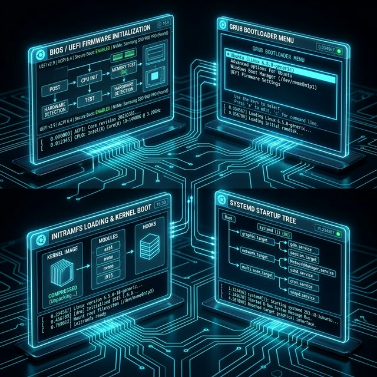

# 49: The Boot Process & GRUB

<p align="center">
  
</p>

When you press the power button, your computer executes one of the most intricate choreographies in computing. Understanding each stage — from firmware to login prompt — is essential for diagnosing boot failures, optimizing startup times, and recovering broken systems.

---

## 1. The Boot Sequence Overview

| Stage | Component | Role |
| :--- | :--- | :--- |
| **1** | BIOS/UEFI Firmware | Hardware initialization, POST, finds bootloader |
| **2** | GRUB2 Bootloader | Presents kernel menu, loads kernel + initramfs |
| **3** | initramfs | Minimal root filesystem in RAM, loads drivers |
| **4** | Kernel Init | Mounts real root filesystem, starts PID 1 |
| **5** | systemd (PID 1) | Starts all services, reaches target (runlevel) |

---

## 2. Stage 1: BIOS vs UEFI

### BIOS (Legacy)
- Reads the **Master Boot Record (MBR)** — first 512 bytes of disk
- MBR contains a tiny bootloader (446 bytes) + partition table (64 bytes)
- Limited to 2TB disks and 4 primary partitions

### UEFI (Modern)
- Reads the **EFI System Partition (ESP)** — a FAT32 partition at `/boot/efi`
- Supports GPT partition table: 128+ partitions, 8ZB disk size
- Has Secure Boot: only signed bootloaders can execute

```bash
# Check if your system uses UEFI or BIOS
[ -d /sys/firmware/efi ] && echo "UEFI" || echo "BIOS/Legacy"

# View the ESP contents
ls /boot/efi/EFI/
```

---

## 3. Stage 2: GRUB2 Bootloader

GRUB2 (GRand Unified Bootloader) is the standard Linux bootloader.

### Key Files:
| File | Purpose |
| :--- | :--- |
| `/boot/grub/grub.cfg` | Main config (auto-generated — **never edit directly**) |
| `/etc/default/grub` | User configuration (edit this!) |
| `/etc/grub.d/` | Scripts that generate `grub.cfg` |

### Common GRUB Configuration:
```bash
# /etc/default/grub
GRUB_DEFAULT=0                    # Boot first entry
GRUB_TIMEOUT=5                    # Wait 5 seconds at menu
GRUB_CMDLINE_LINUX_DEFAULT="quiet splash"   # Kernel parameters
GRUB_CMDLINE_LINUX=""             # Additional parameters

# After editing, regenerate the config:
sudo update-grub                  # Debian/Ubuntu
# OR
sudo grub2-mkconfig -o /boot/grub2/grub.cfg  # RHEL/Fedora
```

### Recovering GRUB:
```bash
# From a live USB — reinstall GRUB to the disk
sudo mount /dev/sda2 /mnt
sudo mount /dev/sda1 /mnt/boot/efi   # If UEFI
sudo grub-install --root-directory=/mnt /dev/sda
```

---

## 4. Stage 3: initramfs

The **initial RAM filesystem** is a compressed archive loaded into memory by GRUB alongside the kernel. It contains:
- Essential kernel modules (disk drivers, filesystem drivers, LVM, RAID)
- `udev` rules for device detection
- The `init` script that sets up the real root

```bash
# List initramfs contents
lsinitramfs /boot/initrd.img-$(uname -r) | head -20

# Rebuild initramfs after driver/module changes
sudo update-initramfs -u          # Debian/Ubuntu
# OR
sudo dracut --force               # RHEL/Fedora
```

> [!IMPORTANT]
> If you install new storage drivers or change your root filesystem type, you **must** rebuild initramfs or the system won't boot.

---

## 5. Stage 4-5: Kernel → systemd

Once the kernel mounts the real root filesystem, it executes **PID 1** — which on modern systems is `systemd`.

```bash
# See the boot target (runlevel equivalent)
systemctl get-default              # e.g., graphical.target

# Change default target
sudo systemctl set-default multi-user.target  # No GUI (server mode)

# View the boot timeline
systemd-analyze                    # Total boot time
systemd-analyze blame              # Slowest services
systemd-analyze critical-chain     # Critical path
```

### systemd Targets (Runlevels):
| Target | Old Runlevel | Description |
| :--- | :--- | :--- |
| `poweroff.target` | 0 | System halt |
| `rescue.target` | 1 | Single-user / recovery |
| `multi-user.target` | 3 | Multi-user, no GUI |
| `graphical.target` | 5 | Multi-user + GUI |
| `reboot.target` | 6 | Reboot |

---

## 6. Kernel Parameters

Kernel parameters are passed via GRUB and control boot behavior:

| Parameter | Effect |
| :--- | :--- |
| `quiet` | Suppress most boot messages |
| `splash` | Show graphical boot screen |
| `single` / `1` | Boot into single-user/rescue mode |
| `init=/bin/bash` | Skip systemd, drop to root shell (recovery!) |
| `nomodeset` | Disable GPU driver (fixes blank screen issues) |
| `rd.break` | Break into initramfs shell before root is mounted |

---

## 🧪 Hands-On Lab

### Setup: Docker Sandbox
```bash
docker run -it --rm ubuntu:latest bash
```

### Exercise 1: Analyze Boot Speed
> **Goal:** See which services slow down your boot.
```bash
# These work on a real system (limited in Docker):
cat /proc/cmdline                 # View kernel boot parameters
```
✅ **Expected:** The kernel command line passed by GRUB/Docker.

### Exercise 2: Explore GRUB Configuration
> **Goal:** Understand the structure of GRUB config files.
```bash
apt-get update > /dev/null 2>&1 && apt-get install -y grub-common > /dev/null 2>&1
ls /etc/grub.d/
cat /etc/grub.d/00_header | head -20
```
✅ **Expected:** Numbered scripts that generate the GRUB configuration in order.

### Exercise 3: Inspect initramfs
> **Goal:** See what's packed into the initial RAM filesystem.
```bash
apt-get install -y initramfs-tools > /dev/null 2>&1
ls /boot/initrd* 2>/dev/null || echo "No initramfs in container (expected)"
# On a real system: lsinitramfs /boot/initrd.img-$(uname -r) | head -20
echo "initramfs contains: drivers, udev rules, init script, and crypto modules"
```
✅ **Expected:** Understanding that initramfs is the bridge between GRUB and the real root filesystem.

---

[<< Previous: Help & Reference](./48_Help_and_Reference.md) | [Home: Curriculum Map](./README.md) | [Next: System Logging >>](./50_System_Logging.md)
