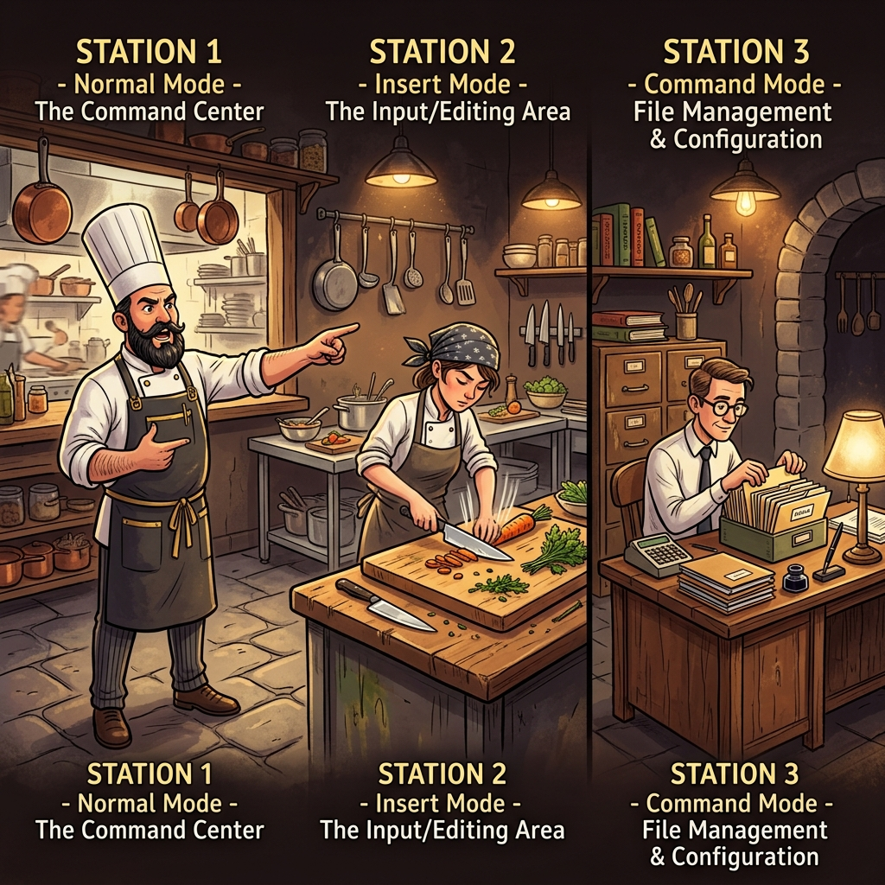
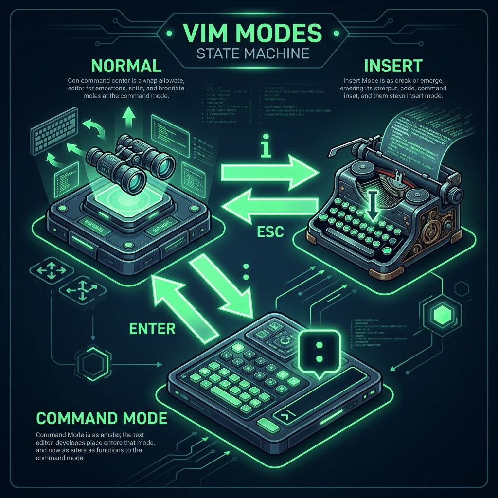
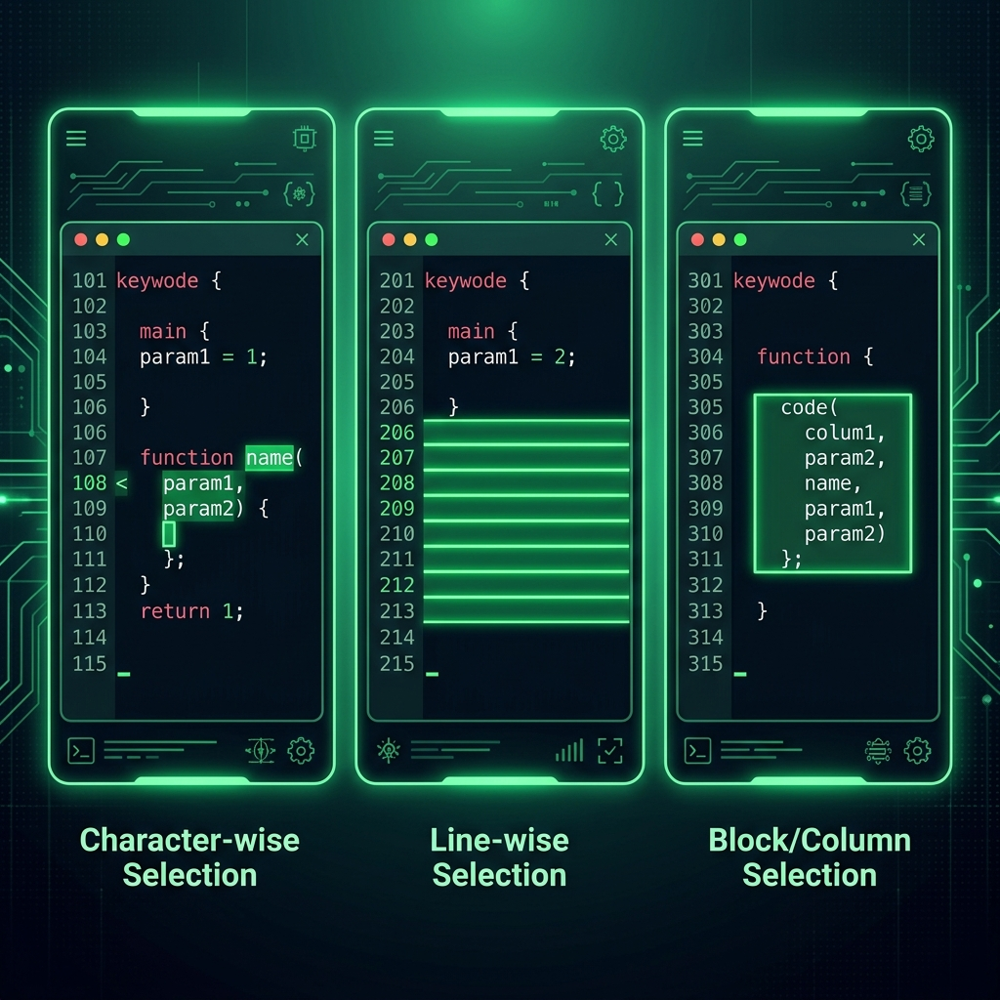
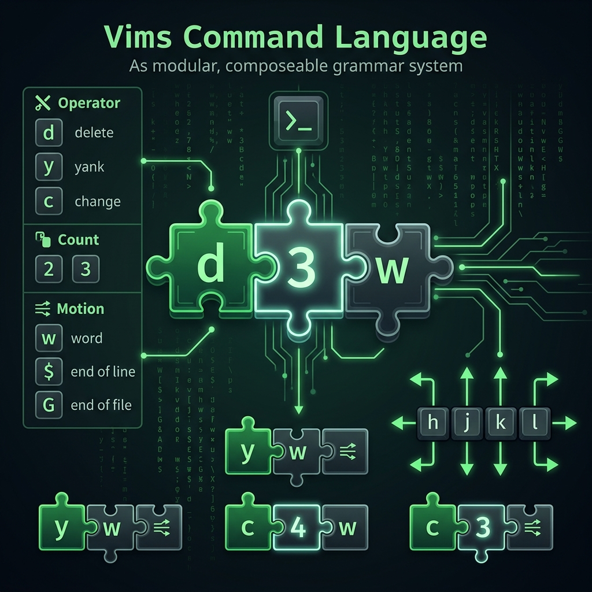

  

# 51: Vim Mastery

> 🧠 **The Feynman Hook: The Restaurant Kitchen**
> Imagine a high-end restaurant kitchen. Most text editors are like a home kitchen where you do everything yourself—chopping, seasoning, and cleaning. Vim is different; it's a professional kitchen with three distinct roles:
> 
> 1.  **Station 1: The Head Chef (Normal Mode)** — The command center. The chef doesn't chop; they point, survey the kitchen, and give high-level orders like "Delete those 3 onions" or "Move that pot to the back."
> 2.  **Station 2: The Line Cook (Insert Mode)** — This is where the actual labor happens. The cook has their head down, chopping and adding ingredients (typing text).
> 3.  **Station 3: The Manager (Command Mode)** — They handle the "business" of the kitchen. They save the recipes (write files), manage the inventory (configuration), and close the shop (quit).
>
> If you try to chop vegetables while acting as the Head Chef, the kitchen collapses. Vim forces you to separate **thinking** from **typing**.

  

**🎯 The Big Goal:** Internalize the modal nature of Vim, master the "command language" (verbs + nouns), and transition from a "typer" to a "text surgeon."

---

## 1. The Pulse of Vim: Modes & Transitions

Vim is a **State Machine**. You spend 90% of your time in **Normal Mode**, treating your keyboard like a control panel rather than a typewriter.

  

1.  **Normal Mode (The Default):** Every key is a shortcut. You start here.
2.  **Insert Mode:** Press `i` to enter. You type text. Press `ESC` to return to Normal Mode. **Never stay here longer than necessary.**
3.  **Command Mode:** Press `:` from Normal Mode. Used for file operations like `:w` (save) and `:q` (quit).
4.  **Visual Mode:** Press `v` or `V` to highlight and select text (Character or Line-wise). Use `Ctrl-v` for Block/Column selection.

  

---

## 2. The Grammar of Editing: Verb + Noun

Vim is not just shortcuts; it's a **Linguistic System**. Commands are composed like sentences: `[Count] + [Operator] + [Motion]`.

  

### Operators (The Verbs)
- `d` : Delete (Cut)
- `y` : Yank (Copy)
- `c` : Change (Delete and Enter Insert Mode)
- `r` : Replace a single character

### Motions (The Nouns)
- `w` : Word
- `$` : End of line
- `0` : Start of line
- `G` : End of file
- `}` : Next paragraph

**Examples of Sentence Construction:**
- `d3w` -> Delete 3 Words.
- `y$`  -> Yank until the end of the line.
- `c}`  -> Change until the end of the paragraph.

---

## 3. Surgical Navigation

Stop using arrow keys. They are too far away from the "home row." Keep your hands still and use your fingers to leap across the file.

### Home Row basics
- `h` (left), `j` (down), `k` (up), `l` (right).

### Structural Jumps
- `w` : Leap forward one word.
- `b` : Leap backward one word.
- `gg` : Jump to the very first line of the file.
- `G` : Jump to the very last line.
- `[Number]G` : Jump to a specific line number (e.g., `51G`).
- `Ctrl-g` : Show your current position in the file.

---

## 4. Search and Destroy

### The Global Search
- `/pattern` : Search forward for a pattern.
- `?pattern` : Search backward for a pattern.
- `n` : Jump to the next match.
- `N` : Jump to the previous match.

### Single-Line Sniping
The "Vim Book" emphasizes `f` and `t` for rapid horizontal movement:
- `fx` : Find the next occurrence of character `x` on the current line.
- `tx` : Move "Until" character `x` (stops one char before).
- `;` : Repeat the last fine/until command.

---

## 5. Cut, Paste, and Undo

In Vim, "Delete" is actually "Cut."
- `x` : Delete the character under the cursor.
- `dd` : Delete the entire line.
- `p` : Paste **after** the cursor or line.
- `P` : Paste **before** the cursor or line.
- `u` : Undo (Vim has multi-level undo).
- `Ctrl-r` : Redo.

---

## 🤔 Reflection Questions

💡 View Answer: Describe why separating 'Thinking' from 'Typing' makes Vim faster for engineers.

Programmers spend 80% of their time reading and navigating and only 20% typing. Standard editors assume you are always in "Typing Mode," meaning every keystroke is literal. Vim assumes you are in "Command Mode" (Head Chef), allowing you to leap 40 lines, delete 3 words, and re-indent a block with 3-4 keystrokes without ever reaching for a mouse. It optimizes for the 80% use case.

💡 View Answer: What is the linguistic benefit of the '[Count] + [Operator] + [Motion]' system?

It makes commands predictable and composable. Instead of memorizing 100 separate shortcuts, you memorize 5 verbs and 10 nouns. You can then mathematically combine them to perform thousands of distinct operations. For example, once you learn 'd' (delete) and '}' (paragraph), you automatically know how to 'y}' (copy paragraph) without being explicitly taught.

---
**References:**
- *The Vim Book* by Steve Oualline.
- *Learning the vi and Vim Editors* by Arnold Robbins.

---
[<< Previous: System Logging](./50_System_Logging.md) | [Home: Curriculum Map](./README.md) | [Next: Storage Management >>](./52_Storage_Management.md)
