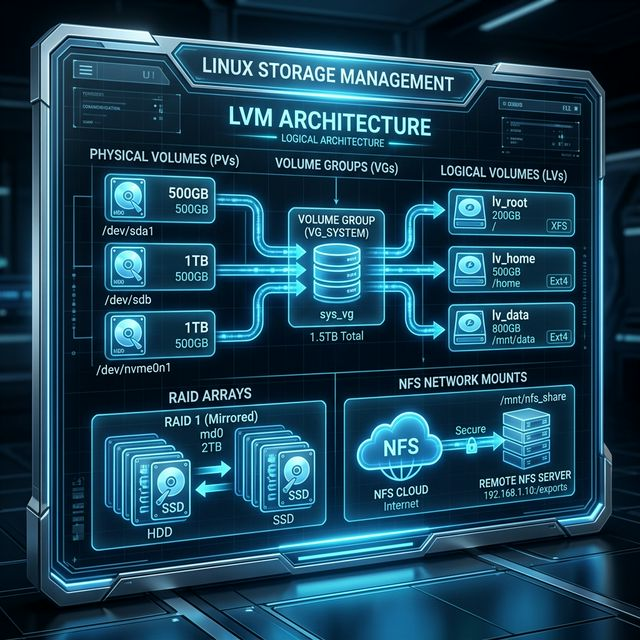

# 52: Storage Management

<p align="center">
  
</p>

From partitioning raw disks to dynamically resizing logical volumes, storage management is a cornerstone of Linux administration. This chapter covers partitioning, LVM, RAID, and network file systems.

---

## 1. Disk Partitioning

### Viewing Disks:
```bash
lsblk                             # Block device tree
sudo fdisk -l                     # Detailed partition tables
sudo blkid                        # Filesystem UUIDs and types
```

### Partitioning with `fdisk` (MBR) and `gdisk` (GPT):
```bash
# Interactive partitioning (MBR)
sudo fdisk /dev/sdb

# GPT partitioning
sudo gdisk /dev/sdb

# Non-interactive partitioning with parted
sudo parted /dev/sdb -- mklabel gpt
sudo parted /dev/sdb -- mkpart primary ext4 1MiB 100%
```

### Creating Filesystems:
```bash
sudo mkfs.ext4 /dev/sdb1          # ext4 (most common)
sudo mkfs.xfs /dev/sdb1           # XFS (RHEL default)
sudo mkfs.btrfs /dev/sdb1         # Btrfs (snapshots, compression)
```

---

## 2. Mounting Filesystems

### Temporary Mount:
```bash
sudo mount /dev/sdb1 /mnt/data
```

### Persistent Mount via `/etc/fstab`:
```
# <device>        <mountpoint>  <type>  <options>        <dump> <fsck>
UUID=abc123...    /mnt/data     ext4    defaults,noatime  0      2
```

```bash
# Apply fstab changes without reboot
sudo mount -a

# View all mounts
mount | column -t
findmnt --real
```

---

## 3. LVM — Logical Volume Manager

LVM adds a flexible abstraction layer between physical disks and filesystems.

### Architecture:
```
Physical Disks → Physical Volumes (PV) → Volume Group (VG) → Logical Volumes (LV) → Filesystems
```

| Layer | Command | Purpose |
| :--- | :--- | :--- |
| **PV** | `pvcreate` | Initialize a disk for LVM |
| **VG** | `vgcreate` | Pool multiple PVs together |
| **LV** | `lvcreate` | Carve usable volumes from the VG |

### Example Workflow:
```bash
# Initialize physical volumes
sudo pvcreate /dev/sdb /dev/sdc

# Create a volume group
sudo vgcreate data_vg /dev/sdb /dev/sdc

# Create a logical volume (50GB)
sudo lvcreate -L 50G -n app_data data_vg

# Create filesystem and mount
sudo mkfs.ext4 /dev/data_vg/app_data
sudo mount /dev/data_vg/app_data /mnt/app

# Extend a logical volume (add 20GB)
sudo lvextend -L +20G /dev/data_vg/app_data
sudo resize2fs /dev/data_vg/app_data     # ext4
# OR: sudo xfs_growfs /mnt/app           # XFS
```

### Inspection Commands:
```bash
sudo pvs                          # Physical volumes summary
sudo vgs                          # Volume groups summary
sudo lvs                          # Logical volumes summary
sudo pvdisplay                    # Detailed PV info
```

---

## 4. RAID (Redundant Array of Independent Disks)

| Level | Min Disks | Redundancy | Speed | Use Case |
| :--- | :--- | :--- | :--- | :--- |
| **RAID 0** | 2 | None | Fast | Scratch/temp storage |
| **RAID 1** | 2 | Mirror | Read fast | OS, databases |
| **RAID 5** | 3 | 1 disk failure | Balanced | File servers |
| **RAID 6** | 4 | 2 disk failures | Balanced | Enterprise storage |
| **RAID 10** | 4 | Mirror + Stripe | Fastest | Production databases |

### Software RAID with `mdadm`:
```bash
# Create a RAID 1 mirror
sudo mdadm --create /dev/md0 --level=1 --raid-devices=2 /dev/sdb /dev/sdc

# Check RAID status
cat /proc/mdstat
sudo mdadm --detail /dev/md0
```

---

## 5. Network File Systems

### NFS (Network File System):
```bash
# Server: export a directory
echo "/srv/shared 192.168.1.0/24(rw,sync,no_subtree_check)" >> /etc/exports
sudo exportfs -ra

# Client: mount the NFS share
sudo mount -t nfs server:/srv/shared /mnt/nfs
```

### SMB/CIFS (Windows Shares):
```bash
# Mount a Windows share
sudo mount -t cifs //server/share /mnt/smb -o username=user,password=pass
```

---

## 🧪 Hands-On Lab

### Setup: Docker Sandbox
```bash
docker run -it --rm ubuntu:latest bash
```

### Exercise 1: Inspect Block Devices
> **Goal:** View disk layout from inside the container.
```bash
cat /proc/partitions
df -hT
```
✅ **Expected:** The overlay filesystem and tmpfs mounts used by Docker.

### Exercise 2: Create and Mount a Loop Device
> **Goal:** Simulate a disk using a file.
```bash
dd if=/dev/zero of=/tmp/disk.img bs=1M count=100
mkfs.ext4 /tmp/disk.img
mkdir /mnt/loop
mount -o loop /tmp/disk.img /mnt/loop
df -h /mnt/loop
echo "Hello LVM!" > /mnt/loop/test.txt
cat /mnt/loop/test.txt
umount /mnt/loop
```
✅ **Expected:** A 100MB "virtual disk" mounted successfully, with a file written to it.

### Exercise 3: Understand UUID-based Mounting
> **Goal:** See how Linux identifies filesystems by UUID.
```bash
blkid /tmp/disk.img
cat /etc/fstab
```
✅ **Expected:** `blkid` shows the UUID of your loop device. `/etc/fstab` uses UUIDs for reliable mounting.

---

[<< Previous: Vim Mastery](./51_Vim_Mastery.md) | [Home: Curriculum Map](./README.md) | [Next: DNS & DHCP >>](./53_DNS_and_DHCP.md)
