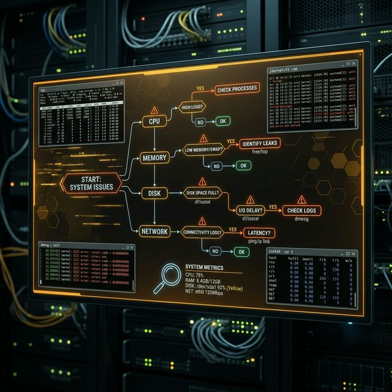

# 60: Troubleshooting Methodology

<p align="center">
  
</p>

When a production server goes down, panic is the enemy. This chapter teaches a systematic troubleshooting methodology — a repeatable diagnostic framework for CPU, memory, disk, network, and boot failures.

---

## 1. The Troubleshooting Framework

```
1. Identify the Problem     → What's broken? When did it start?
2. Establish a Theory       → What could cause this?
3. Test the Theory          → Gather evidence (logs, metrics)
4. Establish a Plan         → What's the fix?
5. Implement & Verify       → Apply and confirm the fix
6. Document                 → Record what happened and why
```

---

## 2. CPU Troubleshooting

### Symptoms: System slow, high load average, unresponsive

```bash
# Quick load check
uptime                             # Load average: 1min, 5min, 15min

# Identify CPU-hungry processes
top -bn1 | head -20                # Batch mode, sorted by CPU
ps aux --sort=-%cpu | head -10     # Top CPU consumers

# CPU usage per core
mpstat -P ALL 1 3                  # Per-core stats, 3 samples

# Is it user-space or kernel?
vmstat 1 5                         # Check 'us' vs 'sy' columns
```

### Common Fixes:
- Kill runaway processes: `kill -9 PID`
- Renice: `renice 10 -p PID`
- Check for infinite loops in application code

---

## 3. Memory Troubleshooting

### Symptoms: OOM killer, swap thrashing, processes killed

```bash
# Memory overview
free -h                            # Total, used, free, swap

# Who's using the most memory?
ps aux --sort=-%mem | head -10

# Check for OOM kills
dmesg | grep -i "out of memory"
journalctl -k | grep -i oom

# Detailed memory map
cat /proc/meminfo | head -15

# Check swap usage
swapon --show
vmstat 1 5                         # Look at 'si' and 'so' (swap in/out)
```

### Common Fixes:
- Identify and restart memory-leaking applications
- Add swap space temporarily: `fallocate -l 2G /swapfile && mkswap /swapfile && swapon /swapfile`
- Tune the OOM killer: `echo -1000 > /proc/PID/oom_score_adj`

---

## 4. Disk / Storage Troubleshooting

### Symptoms: "No space left on device", I/O errors, slow writes

```bash
# Check disk space
df -h                              # Filesystem usage
df -ih                             # Inode usage (can run out separately!)

# Who's using the space?
du -sh /* 2>/dev/null | sort -rh | head -10
du -sh /var/log/*                  # Logs are a common culprit

# Check for deleted but open files (hidden space hog)
lsof +L1

# I/O performance
iostat -xz 1 3                     # Per-device I/O stats
# Look for: %util > 80% or await > 10ms

# Check filesystem health
sudo fsck -n /dev/sda1             # Dry-run check (unmount first!)
```

### Common Fixes:
- Clean logs: `journalctl --vacuum-size=100M`
- Find large files: `find / -xdev -size +100M -exec ls -lh {} \;`
- Restart services holding deleted files

---

## 5. Network Troubleshooting

### The Bottom-Up Approach:
```bash
# Layer 1: Physical — Is the link up?
ip link show eth0                  # Look for "state UP"

# Layer 2: Data Link — Is there an IP?
ip addr show eth0

# Layer 3: Network — Can you reach the gateway?
ip route show                      # Find default gateway
ping -c 3 <gateway-ip>

# Layer 4: Transport — Can you reach the service?
ss -tulnp                          # Is the service listening?
curl -v http://server:port         # Connect test

# DNS: Can you resolve names?
dig example.com
cat /etc/resolv.conf
```

### Useful Network Diagnostics:
```bash
traceroute google.com              # Path to destination
mtr google.com                     # Continuous traceroute
tcpdump -i eth0 port 80            # Capture traffic
netstat -s                         # Protocol statistics
```

---

## 6. Boot Troubleshooting

### Can't Boot At All:
1. **GRUB Rescue:** Boot from live USB → `chroot` → `grub-install`
2. **initramfs drops to shell:** Rebuild with `update-initramfs -u`
3. **Kernel Panic:** Boot older kernel from GRUB menu, fix, rebuild

### System Boots But Services Fail:
```bash
# Check which services failed
systemctl --failed

# View service logs
journalctl -u failing-service --no-pager -n 50

# Check boot timeline
systemd-analyze blame
```

### Emergency/Rescue Mode:
```bash
# From GRUB: edit kernel line, append:
systemd.unit=rescue.target         # Single-user mode
# OR
init=/bin/bash                     # Direct root shell
```

---

## 🧪 Hands-On Lab

### Setup: Docker Sandbox
```bash
docker run -it --rm ubuntu:latest bash
apt-get update > /dev/null 2>&1 && apt-get install -y procps sysstat net-tools > /dev/null 2>&1
```

### Exercise 1: Diagnose Resource Usage
> **Goal:** Build a system health snapshot.
```bash
echo "=== CPU Load ==="
uptime
echo -e "\n=== Memory ==="
free -h
echo -e "\n=== Disk ==="
df -h
echo -e "\n=== Top Processes ==="
ps aux --sort=-%cpu | head -5
```
✅ **Expected:** A quick health dashboard showing load, memory, disk, and top CPU consumers.

### Exercise 2: Find Large Files
> **Goal:** Locate the biggest space consumers.
```bash
du -sh /* 2>/dev/null | sort -rh | head -5
find / -xdev -size +10M -exec ls -lh {} \; 2>/dev/null | head -10
```
✅ **Expected:** `/usr` is likely the largest directory. Individual large files are identified.

### Exercise 3: Network Layer Check
> **Goal:** Systematically verify network connectivity.
```bash
echo "=== Interface ==="
ip addr show eth0 2>/dev/null || ip addr show
echo -e "\n=== Route ==="
ip route show
echo -e "\n=== DNS ==="
cat /etc/resolv.conf
echo -e "\n=== Connectivity ==="
ping -c 1 8.8.8.8 2>/dev/null && echo "Internet: OK" || echo "Internet: FAIL"
```
✅ **Expected:** A systematic bottom-up network diagnostic — interface → routing → DNS → connectivity.

---

[<< Previous: Linux Hardening](./59_Linux_Hardening.md) | [Home: Curriculum Map](./README.md)
