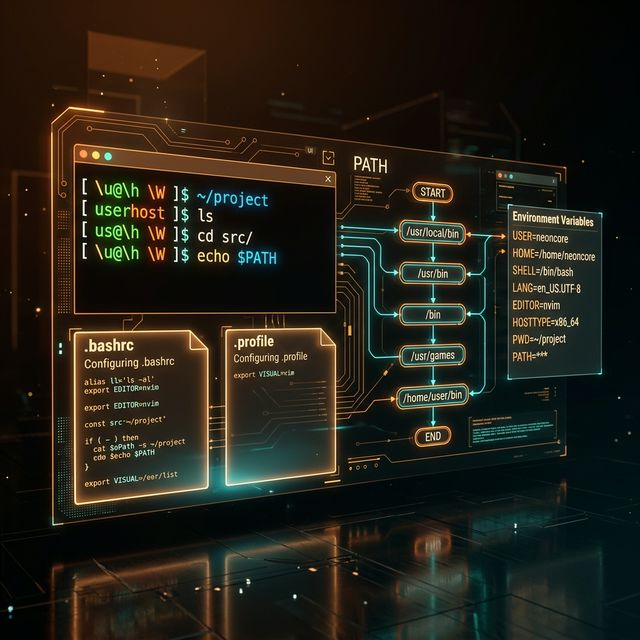

# 64: Shell Environment & Customization

<p align="center">
  
</p>

Your shell is the cockpit of your Linux experience. Customizing it — your prompt, your PATH, your aliases, your startup files — transforms you from a tourist into a resident.

---

## 1. Login vs Non-Login Shells

This distinction determines **which startup files are read**:

| Type | How It's Started | Startup Files |
| :--- | :--- | :--- |
| **Login Shell** | SSH, `su -`, first tty, `bash --login` | `/etc/profile` → `~/.bash_profile` or `~/.profile` |
| **Non-Login Shell** | New terminal tab, `bash`, scripts | `~/.bashrc` |
| **Non-Interactive** | Running a script | Usually reads nothing (unless `BASH_ENV` is set) |

### The Standard Pattern:
```bash
# ~/.bash_profile (or ~/.profile)
# Loaded ONCE at login — set PATH, env vars
export PATH="$HOME/bin:$PATH"
export EDITOR=vim

# Source .bashrc for interactive settings
if [ -f ~/.bashrc ]; then
    source ~/.bashrc
fi
```

```bash
# ~/.bashrc
# Loaded for EVERY interactive shell — aliases, prompt, functions
alias ll='ls -alFh'
alias gs='git status'
export PS1='[\u@\h \W]\$ '
```

---

## 2. Environment Variables

```bash
# View all environment variables
env
printenv

# Set for current session
export MY_VAR="value"

# Set for a single command only
ENV_VAR=value command

# Unset
unset MY_VAR

# Key variables
echo $HOME          # User's home directory
echo $USER          # Current username
echo $SHELL         # Login shell path
echo $PATH          # Command search path
echo $LANG          # Locale/language
echo $TERM          # Terminal type
echo $EDITOR        # Default editor
echo $HISTSIZE      # History buffer size
```

---

## 3. The PATH Variable

PATH is a colon-separated list of directories searched for commands:

```bash
echo $PATH
# /usr/local/sbin:/usr/local/bin:/usr/sbin:/usr/bin:/sbin:/bin

# Add a directory to PATH
export PATH="$HOME/.local/bin:$PATH"    # Prepend (higher priority)
export PATH="$PATH:/opt/myapp/bin"      # Append (lower priority)

# Find which directory provides a command
which python3
type -a python3
```

> [!IMPORTANT]
> Never overwrite PATH entirely (`PATH="/my/dir"`). Always **prepend** or **append** to preserve system paths.

---

## 4. Customizing the Prompt (PS1)

### Escape Sequences:
| Code | Meaning |
| :--- | :--- |
| `\u` | Username |
| `\h` | Hostname (short) |
| `\H` | Hostname (full) |
| `\w` | Working directory (full) |
| `\W` | Working directory (basename) |
| `\d` | Date |
| `\t` | Time (24h) |
| `\n` | Newline |
| `\$` | `$` for users, `#` for root |

### Color Codes:
```bash
# Colored prompt: green user@host, blue directory
export PS1='\[\033[01;32m\]\u@\h\[\033[00m\]:\[\033[01;34m\]\w\[\033[00m\]\$ '

# With git branch (if git is installed)
parse_git_branch() {
    git branch 2>/dev/null | sed -n 's/* \(.*\)/ (\1)/p'
}
export PS1='\[\033[32m\]\u@\h\[\033[00m\]:\[\033[34m\]\w\[\033[33m\]$(parse_git_branch)\[\033[00m\]\$ '
```

---

## 5. Shell Options

```bash
# Set shell options with 'shopt'
shopt -s cdspell          # Autocorrect typos in cd
shopt -s globstar         # ** matches recursively
shopt -s histappend       # Append to history, don't overwrite
shopt -s checkwinsize     # Update LINES/COLUMNS after each command

# Set with 'set'
set -o vi                 # Vi-mode command line editing
set -o emacs              # Emacs-mode (default)
set -o noclobber          # Prevent > from overwriting files (use >| to force)
```

---

## 6. Functions in `.bashrc`

```bash
# Quick directory creation + change
mkcd() {
    mkdir -p "$1" && cd "$1"
}

# Extract any archive
extract() {
    case "$1" in
        *.tar.gz|*.tgz)  tar xzf "$1" ;;
        *.tar.bz2)       tar xjf "$1" ;;
        *.tar.xz)        tar xJf "$1" ;;
        *.zip)           unzip "$1" ;;
        *.gz)            gunzip "$1" ;;
        *.bz2)           bunzip2 "$1" ;;
        *.rar)           unrar x "$1" ;;
        *.7z)            7z x "$1" ;;
        *)               echo "Unknown format: $1" ;;
    esac
}

# Find a process by name
psg() {
    ps aux | grep -v grep | grep "$1"
}
```

---

## 🧪 Hands-On Lab

### Setup: Docker Sandbox
```bash
docker run -it --rm ubuntu:latest bash
```

### Exercise 1: Explore Startup Files
> **Goal:** Understand which files exist and what they contain.
```bash
echo "Login shell files:"
ls -la ~/.bash_profile ~/.profile ~/.bash_login 2>/dev/null || echo "  (none)"
echo "Non-login shell files:"
ls -la ~/.bashrc 2>/dev/null || echo "  (none)"
cat /etc/profile | head -10
```
✅ **Expected:** Understanding of the hierarchy: `/etc/profile` → `~/.profile` → `~/.bashrc`.

### Exercise 2: Customize Your Prompt
> **Goal:** Build a colorful, informative prompt.
```bash
# Default prompt
echo "Default: $PS1"
# Custom prompt
export PS1='\[\033[32m\]lab-user\[\033[00m\]:\[\033[34m\]\w\[\033[00m\]\$ '
echo "Try typing some commands now to see the new prompt!"
ls /etc
```
✅ **Expected:** A green username and blue directory in your prompt.

### Exercise 3: Create Reusable Functions
> **Goal:** Add custom functions that boost productivity.
```bash
mkcd() { mkdir -p "$1" && cd "$1"; }
mkcd /tmp/test-project/src/main
pwd
# Should output: /tmp/test-project/src/main
```
✅ **Expected:** The entire directory tree is created and you're inside the deepest folder.

---

[<< Previous: Advanced Bash](./63_Advanced_Bash.md) | [Home: Curriculum Map](./README.md) | [Next: Cybersecurity Ops >>](./65_Cybersecurity_Bash.md)
