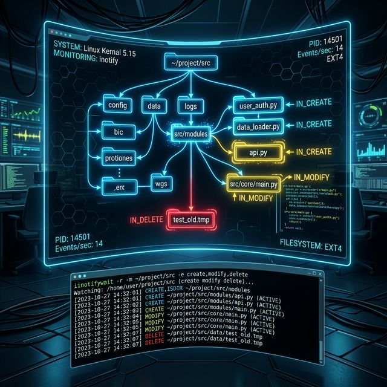

# 67: inotify & File Event Monitoring

<p align="center">
  
</p>

The Linux kernel's **inotify** subsystem lets you watch files and directories for changes in real time — without polling. This is the foundation of build watchers, configuration reloaders, security monitors, and backup triggers.

---

## 1. How inotify Works

```
Application → inotify_init() → creates inotify instance (file descriptor)
            → inotify_add_watch(fd, path, mask) → watches path for events
            → read(fd) → blocks until events arrive → process events
```

| Component | Purpose |
| :--- | :--- |
| **inotify instance** | A file descriptor that receives events |
| **Watch descriptor** | Tracks one path being monitored |
| **Event mask** | Specifies which events to monitor |

---

## 2. Event Types

| Event | Constant | Triggered When |
| :--- | :--- | :--- |
| File created | `IN_CREATE` | New file/dir appears in watched dir |
| File modified | `IN_MODIFY` | File content changes |
| File deleted | `IN_DELETE` | File removed from watched dir |
| File opened | `IN_OPEN` | File is opened |
| File closed | `IN_CLOSE_WRITE` | File opened for writing is closed |
| File moved from | `IN_MOVED_FROM` | File moved out of watched dir |
| File moved to | `IN_MOVED_TO` | File moved into watched dir |
| Metadata changed | `IN_ATTRIB` | Permissions, timestamps, etc. |
| Self deleted | `IN_DELETE_SELF` | Watched file/dir itself is deleted |

---

## 3. `inotifywait` — Command-Line Monitoring

`inotifywait` (from `inotify-tools`) is the command-line interface to inotify:

### Basic Usage:
```bash
# Watch a directory for any change (blocks until one event)
inotifywait /tmp/

# Watch continuously (monitor mode)
inotifywait -m /tmp/

# Watch recursively
inotifywait -mr /etc/

# Watch for specific events only
inotifywait -m -e create,delete,modify /var/log/
```

### Formatted Output:
```bash
# CSV-style output
inotifywait -mr --format '%T %w%f %e' --timefmt '%Y-%m-%d %H:%M:%S' /etc/

# Tab-separated
inotifywait -m --csv -e modify /etc/
```

---

## 4. `inotifywatch` — Event Statistics

```bash
# Collect statistics for 60 seconds
inotifywatch -r -t 60 /var/log/

# Output shows event counts per file/directory
```

---

## 5. Practical Applications

### Auto-Reload Configuration:
```bash
#!/bin/bash
CONFIG="/etc/myapp/config.yml"
inotifywait -m -e modify "$CONFIG" | while read path action file; do
    echo "[$(date)] Config changed, reloading service..."
    systemctl reload myapp
done
```

### Build Watcher:
```bash
#!/bin/bash
inotifywait -mr -e modify --include '\.py$' ./src/ | while read path action file; do
    echo "[$(date)] Changed: $path$file"
    python3 -m pytest tests/ 2>&1 | tail -5
done
```

### Security: Detect Unauthorized Changes:
```bash
#!/bin/bash
CRITICAL="/etc/passwd /etc/shadow /etc/sudoers /usr/sbin/sshd"
inotifywait -m -e modify,attrib $CRITICAL | while read path action file; do
    echo "[SECURITY ALERT] $(date): $action on $path$file" | \
        tee -a /var/log/security_alerts.log
    # Could trigger: send email, lock account, etc.
done
```

### Backup Trigger:
```bash
#!/bin/bash
WATCHED="/home/user/documents/"
BACKUP="/backups/documents/"
inotifywait -mr -e close_write "$WATCHED" | while read path action file; do
    rsync -a "$path$file" "$BACKUP"
    echo "Backed up: $path$file"
done
```

---

## 6. Limitations and Alternatives

| Limitation | Detail |
| :--- | :--- |
| **Max watches** | Default ~8192. Increase: `sysctl fs.inotify.max_user_watches=524288` |
| **Not recursive natively** | API watches one dir; `inotifywait -r` adds watches to all subdirs |
| **Missed events** | If too many events, buffer overflows → `IN_Q_OVERFLOW` |
| **Network filesystems** | inotify does NOT work on NFS, CIFS, or FUSE mounts |

### Alternative: `fanotify`
- **Kernel 2.6.37+** — more robust, filesystem-wide monitoring
- Used by antivirus scanners and containerized security tools
- Requires `CAP_SYS_ADMIN`

---

## 🧪 Hands-On Lab

### Setup: Docker Sandbox
```bash
docker run -it --rm ubuntu:latest bash
apt-get update > /dev/null 2>&1 && apt-get install -y inotify-tools > /dev/null 2>&1
```

### Exercise 1: Watch a Directory
> **Goal:** Monitor a directory for file changes in real time.
```bash
# In terminal 1 (background the watcher):
mkdir -p /tmp/watched
inotifywait -m -e create,modify,delete /tmp/watched &
WATCHER=$!
sleep 1

# Create events:
touch /tmp/watched/file1.txt
echo "hello" > /tmp/watched/file1.txt
rm /tmp/watched/file1.txt

sleep 1
kill $WATCHER 2>/dev/null
```
✅ **Expected:** Three events captured: CREATE, MODIFY, DELETE for `file1.txt`.

### Exercise 2: Formatted Event Log
> **Goal:** Generate a timestamped event log.
```bash
inotifywait -m --format '%T %e %w%f' --timefmt '%H:%M:%S' /tmp/watched &
WATCHER=$!
sleep 1
touch /tmp/watched/test_{1..3}.txt
sleep 1
kill $WATCHER 2>/dev/null
```
✅ **Expected:** Each event shows timestamp, event type, and full file path.

### Exercise 3: Check inotify Limits
> **Goal:** View and understand system limits.
```bash
echo "Max user watches: $(cat /proc/sys/fs/inotify/max_user_watches)"
echo "Max user instances: $(cat /proc/sys/fs/inotify/max_user_instances)"
echo "Max queued events: $(cat /proc/sys/fs/inotify/max_queued_events)"
```
✅ **Expected:** Default values showing the kernel's inotify resource limits.

---

[<< Previous: Reconnaissance & Forensics](./66_Reconnaissance_Forensics.md) | [Home: Curriculum Map](./README.md) | [Next: ACLs & Extended Attributes >>](./68_ACLs_Extended_Attributes.md)
