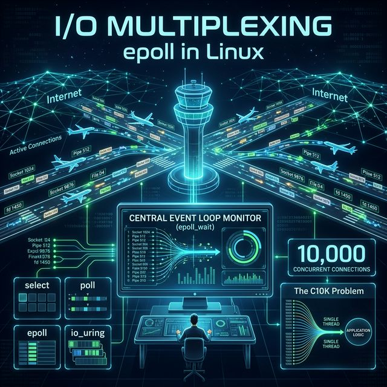
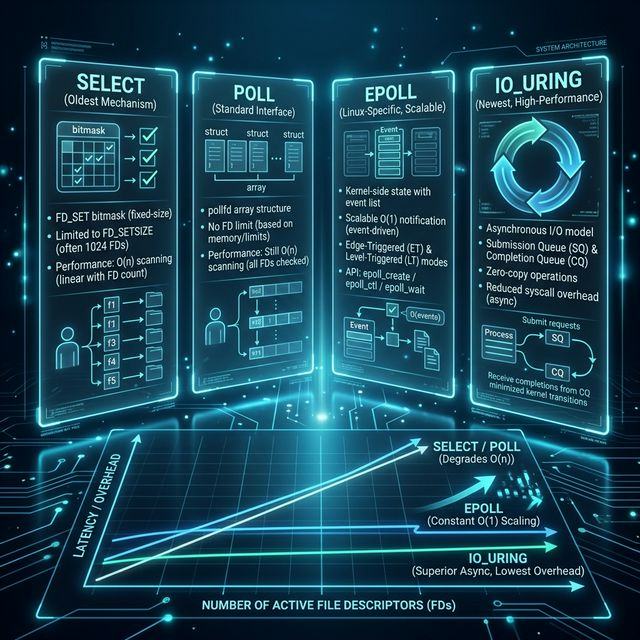
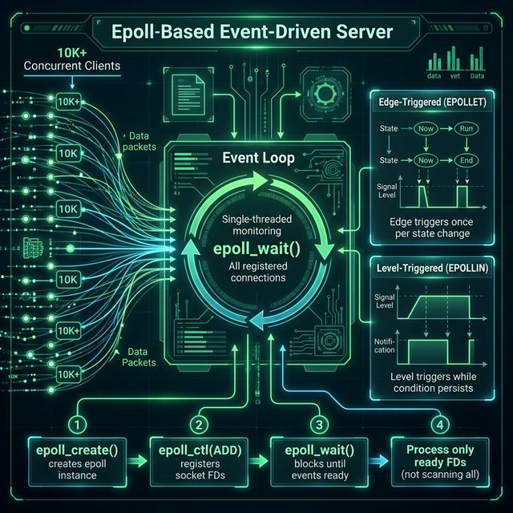

# 69: I/O Multiplexing — select, poll, epoll

<p align="center">
  
</p>

## 🎯 The Big Goal

> **After this chapter, you'll understand how a single thread can monitor thousands of connections simultaneously — the foundation of every high-performance server (Nginx, Redis, Node.js).**

The C10K problem asked: "How do you handle 10,000 simultaneous connections?" The answer isn't 10,000 threads — it's I/O multiplexing.

---

## 1. The Problem: Blocking I/O

Traditional I/O blocks the calling thread:

```c
// Thread is STUCK here until data arrives
ssize_t n = read(client_fd, buf, sizeof(buf));
```

| Approach | How | Problem |
| :--- | :--- | :--- |
| **Thread-per-connection** | Spawn a new thread for each client | 10K threads = massive memory + context switching |
| **Non-blocking I/O + busy wait** | Set `O_NONBLOCK`, poll in a loop | CPU burns 100% spinning |
| **I/O Multiplexing** | One thread watches many FDs, acts only on ready ones | ✅ Efficient and scalable |

> 💡 **The Insight:** Instead of asking "is this one FD ready?", ask "which of my 10,000 FDs are ready right now?"

---

## 2. The Evolution of I/O Multiplexing

<p align="center">
  
</p>

### `select()` — The Original (1983)

```c
fd_set readfds;
FD_ZERO(&readfds);
FD_SET(sockfd, &readfds);

// Block until at least one FD is ready
int ready = select(maxfd + 1, &readfds, NULL, NULL, &timeout);

// Must check EVERY fd
for (int fd = 0; fd <= maxfd; fd++) {
    if (FD_ISSET(fd, &readfds)) {
        // fd is ready — handle it
    }
}
```

| Aspect | Detail |
| :--- | :--- |
| **FD Limit** | `FD_SETSIZE` = 1024 (hardcoded!) |
| **Performance** | O(n) — scans ALL file descriptors each call |
| **State** | Must rebuild `fd_set` before every call |
| **Portability** | POSIX — works everywhere |

### `poll()` — Removing the FD Limit (1986)

```c
struct pollfd fds[10000];
fds[0].fd = sockfd;
fds[0].events = POLLIN;

int ready = poll(fds, nfds, timeout_ms);

for (int i = 0; i < nfds; i++) {
    if (fds[i].revents & POLLIN) {
        // fds[i].fd is ready
    }
}
```

| Aspect | Detail |
| :--- | :--- |
| **FD Limit** | No hardcoded limit (array-based) |
| **Performance** | Still O(n) — kernel scans the whole array |
| **State** | Array persists between calls (no rebuild) |
| **Portability** | POSIX — works everywhere |

### `epoll` — Linux's O(1) Solution (2002)

```c
// 1. Create epoll instance
int epfd = epoll_create1(0);

// 2. Register interest in FDs
struct epoll_event ev;
ev.events = EPOLLIN;
ev.data.fd = sockfd;
epoll_ctl(epfd, EPOLL_CTL_ADD, sockfd, &ev);

// 3. Wait for events (only returns READY fds)
struct epoll_event events[MAX_EVENTS];
int nready = epoll_wait(epfd, events, MAX_EVENTS, timeout_ms);

// 4. Process ONLY the ready FDs
for (int i = 0; i < nready; i++) {
    int fd = events[i].data.fd;
    // handle fd — no scanning!
}
```

| Aspect | Detail |
| :--- | :--- |
| **FD Limit** | System limit only (`/proc/sys/fs/epoll/max_user_watches`) |
| **Performance** | O(1) — kernel notifies only ready FDs |
| **State** | Kernel maintains the interest list |
| **Platform** | Linux-only |

---

## 3. epoll Architecture Deep Dive

<p align="center">
  
</p>

### The Three epoll Syscalls

| Syscall | Purpose |
| :--- | :--- |
| `epoll_create1(flags)` | Create an epoll instance (returns epoll fd) |
| `epoll_ctl(epfd, op, fd, event)` | Add/modify/remove FDs from the interest list |
| `epoll_wait(epfd, events, max, timeout)` | Block until events occur, return only ready FDs |

### Edge-Triggered vs Level-Triggered

| Mode | Behavior | Flag | Use Case |
| :--- | :--- | :--- | :--- |
| **Level-Triggered (LT)** | Fires while data is available | Default | Simpler, forgiving |
| **Edge-Triggered (ET)** | Fires once per new data arrival | `EPOLLET` | Higher performance, must drain buffer |

```c
// Edge-triggered: MUST read all available data
ev.events = EPOLLIN | EPOLLET;  // Edge-triggered mode

// In handler: drain the buffer completely
while (1) {
    n = read(fd, buf, sizeof(buf));
    if (n == -1 && errno == EAGAIN) break;  // No more data
    process(buf, n);
}
```

> ⚠️ **Edge-Triggered Trap:** If you don't read ALL data, you'll never be notified again until new data arrives!

---

## 4. Building an epoll Echo Server

```c
#include <sys/epoll.h>
#include <netinet/in.h>
#include <fcntl.h>

#define MAX_EVENTS 1024
#define PORT 8080

void set_nonblocking(int fd) {
    fcntl(fd, F_SETFL, fcntl(fd, F_GETFL) | O_NONBLOCK);
}

int main() {
    // Create listening socket
    int listenfd = socket(AF_INET, SOCK_STREAM, 0);
    struct sockaddr_in addr = {
        .sin_family = AF_INET,
        .sin_port = htons(PORT),
        .sin_addr.s_addr = INADDR_ANY
    };
    bind(listenfd, (struct sockaddr*)&addr, sizeof(addr));
    listen(listenfd, SOMAXCONN);
    set_nonblocking(listenfd);

    // Create epoll instance
    int epfd = epoll_create1(0);
    struct epoll_event ev = { .events = EPOLLIN, .data.fd = listenfd };
    epoll_ctl(epfd, EPOLL_CTL_ADD, listenfd, &ev);

    struct epoll_event events[MAX_EVENTS];

    // Event loop
    while (1) {
        int n = epoll_wait(epfd, events, MAX_EVENTS, -1);
        for (int i = 0; i < n; i++) {
            if (events[i].data.fd == listenfd) {
                // Accept new connection
                int clientfd = accept(listenfd, NULL, NULL);
                set_nonblocking(clientfd);
                ev.events = EPOLLIN | EPOLLET;
                ev.data.fd = clientfd;
                epoll_ctl(epfd, EPOLL_CTL_ADD, clientfd, &ev);
            } else {
                // Echo data back
                char buf[4096];
                ssize_t count = read(events[i].data.fd, buf, sizeof(buf));
                if (count <= 0) {
                    close(events[i].data.fd);  // Client disconnected
                } else {
                    write(events[i].data.fd, buf, count);
                }
            }
        }
    }
}
```

---

## 5. io_uring — The Future (Linux 5.1+)

`io_uring` takes a fundamentally different approach: **asynchronous I/O without syscall overhead**.

| Feature | epoll | io_uring |
| :--- | :--- | :--- |
| **Model** | Readiness notification | Completion-based async |
| **Syscalls per I/O** | 1 (epoll_wait) + 1 (read/write) | 0 (shared ring buffers) |
| **Batching** | No | Yes (submit many ops at once) |
| **Zero-copy** | No | Yes (registered buffers) |
| **Use cases** | Network servers | Disk I/O + Network (next-gen) |

```c
// io_uring simplified flow
struct io_uring ring;
io_uring_queue_init(256, &ring, 0);

// Submit a read operation
struct io_uring_sqe *sqe = io_uring_get_sqe(&ring);
io_uring_prep_read(sqe, fd, buf, len, 0);
io_uring_submit(&ring);

// Get completion
struct io_uring_cqe *cqe;
io_uring_wait_cqe(&ring, &cqe);
// cqe->res contains bytes read
io_uring_cqe_seen(&ring, cqe);
```

---

## 6. Real-World Usage

| Software | Mechanism | Why |
| :--- | :--- | :--- |
| **Nginx** | `epoll` (Linux), `kqueue` (BSD) | Handles millions of connections |
| **Redis** | `epoll` + single-threaded event loop | All commands are non-blocking |
| **Node.js** | `libuv` → `epoll` on Linux | Event-driven JavaScript runtime |
| **HAProxy** | `epoll` | High-performance load balancer |
| **PostgreSQL** | `epoll` (v17+) | Previously used `select`! |

---

## 🤔 Reflection Questions

1. **Redis is single-threaded but handles 100K+ ops/sec.** How does epoll make this possible? What would happen if Redis used thread-per-connection instead?

2. **Edge-triggered epoll requires you to drain the buffer completely.** What happens if a client sends 1MB of data and your buffer is 4KB? How do you handle partial reads without blocking?

3. **`select()` is limited to 1024 FDs, yet it's still used in some applications.** Under what circumstances is `select()` actually the right choice over `epoll`?

4. **io_uring uses shared memory ring buffers between userspace and kernel.** Why is avoiding syscalls important for performance? How many nanoseconds does a syscall cost vs. a shared-memory read?

5. **Your event loop handles 50,000 connections but one handler takes 100ms to process.** All other connections starve during that time. How would you redesign the server to prevent one slow handler from blocking everything?

---

## 📝 Key Interview Talking Points

- `epoll` is the foundation of every high-performance Linux server
- O(1) vs O(n) scaling is the key difference between `epoll` and `select`/`poll`
- Edge-triggered is faster but requires careful programming (drain the buffer!)
- `io_uring` is the future — async I/O without syscall overhead
- Single-threaded event loops (Redis, Node.js) work because I/O is the bottleneck, not CPU

---

[<< Previous: ACLs & Extended Attributes](./68_ACLs_Extended_Attributes.md) | [Home: Curriculum Map](./README.md) | [Next: Shared Memory & IPC >>](./70_Shared_Memory_IPC.md)
