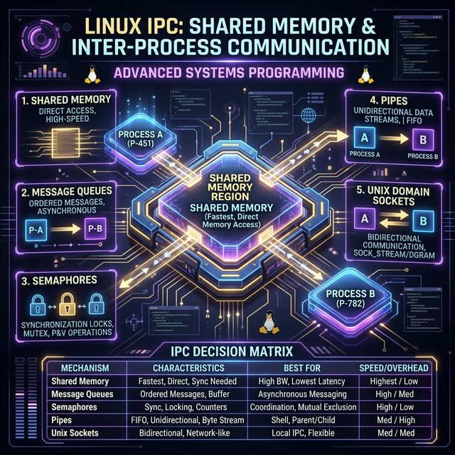

# 70: Shared Memory & Advanced IPC

<p align="center">
  
</p>

## 🎯 The Big Goal

> **After this chapter, you'll understand how Linux processes share data at maximum speed — using shared memory, semaphores, and message queues — the high-performance backbone of databases like PostgreSQL.**

Pipes and sockets copy data through the kernel. Shared memory eliminates the copy entirely.

---

## 1. The IPC Landscape

<p align="center">
  
</p>

| Mechanism | Speed | Direction | Best For |
| :--- | :--- | :--- | :--- |
| **Pipe** | Medium | Unidirectional | Parent→child streams |
| **FIFO (Named Pipe)** | Medium | Unidirectional | Unrelated processes |
| **Unix Domain Socket** | Medium-High | Bidirectional | Docker, X11, DBus |
| **Shared Memory** | ⚡ Fastest | Bidirectional | Databases, multimedia |
| **Message Queue** | Medium | Bidirectional | Async task dispatch |
| **Semaphore** | N/A (sync only) | N/A | Coordinating access |

---

## 2. POSIX Shared Memory

The fastest IPC — both processes read/write the same physical RAM pages:

```c
#include <sys/mman.h>
#include <fcntl.h>

// --- WRITER PROCESS ---
// 1. Create shared memory object
int fd = shm_open("/my_shm", O_CREAT | O_RDWR, 0666);
ftruncate(fd, 4096);  // Set size

// 2. Map into address space
char *ptr = mmap(NULL, 4096, PROT_READ | PROT_WRITE,
                 MAP_SHARED, fd, 0);

// 3. Write data (no syscall needed!)
sprintf(ptr, "Hello from writer process!");

// Cleanup (when completely done)
munmap(ptr, 4096);
shm_unlink("/my_shm");  // Remove the named object
```

```c
// --- READER PROCESS ---
int fd = shm_open("/my_shm", O_RDONLY, 0);
char *ptr = mmap(NULL, 4096, PROT_READ, MAP_SHARED, fd, 0);

printf("Read: %s\n", ptr);  // "Hello from writer process!"

munmap(ptr, 4096);
```

> 💡 **Key Insight:** After `mmap()`, reading/writing shared memory is just pointer arithmetic — no syscalls, no copies, maximum speed.

### Compile and Inspect

```bash
# Compile (link with -lrt for POSIX shared memory)
gcc writer.c -o writer -lrt
gcc reader.c -o reader -lrt

# Inspect active shared memory objects
ls -la /dev/shm/
```

---

## 3. System V Shared Memory (Legacy)

The older API, still used by PostgreSQL internally:

```c
#include <sys/ipc.h>
#include <sys/shm.h>

// Create shared memory segment
key_t key = ftok("/tmp/shmfile", 65);
int shmid = shmget(key, 1024, 0666 | IPC_CREAT);

// Attach to address space
char *str = (char*) shmat(shmid, NULL, 0);

// Use it
sprintf(str, "System V shared memory");

// Detach
shmdt(str);

// Destroy (when all processes done)
shmctl(shmid, IPC_RMID, NULL);
```

| Feature | POSIX (`shm_open`) | System V (`shmget`) |
| :--- | :--- | :--- |
| **Naming** | `/name` string | Numeric key (`ftok`) |
| **API** | File-like (`mmap`) | Attach/detach model |
| **Inspection** | `ls /dev/shm/` | `ipcs -m` |
| **Cleanup** | `shm_unlink()` | `shmctl(IPC_RMID)` |
| **Preference** | ✅ Modern, recommended | Legacy, still common |

---

## 4. POSIX Semaphores — Synchronizing Shared Memory

Shared memory has no built-in synchronization. Two processes writing simultaneously = corruption. Semaphores solve this:

### Named Semaphores (Unrelated Processes)

```c
#include <semaphore.h>

// Create/open a named semaphore (initial value = 1)
sem_t *sem = sem_open("/my_sem", O_CREAT, 0666, 1);

// Critical section
sem_wait(sem);          // P() — decrement (lock)
  // ... access shared memory safely ...
sem_post(sem);          // V() — increment (unlock)

sem_close(sem);
sem_unlink("/my_sem");  // Cleanup
```

### Unnamed Semaphores (Shared Memory)

```c
// Place semaphore IN the shared memory itself
typedef struct {
    sem_t sem;
    int counter;
} shared_data_t;

shared_data_t *data = mmap(/* ... MAP_SHARED ... */);
sem_init(&data->sem, 1, 1);  // 1 = shared between processes

sem_wait(&data->sem);
data->counter++;
sem_post(&data->sem);
```

---

## 5. POSIX Message Queues

When you need structured message passing (not raw bytes):

```c
#include <mqueue.h>

// Sender
struct mq_attr attr = { .mq_maxmsg = 10, .mq_msgsize = 256 };
mqd_t mq = mq_open("/my_queue", O_CREAT | O_WRONLY, 0666, &attr);

mq_send(mq, "Process order #42", 18, 1);  // priority = 1

// Receiver
mqd_t mq = mq_open("/my_queue", O_RDONLY);
char buf[256];
unsigned int priority;
mq_receive(mq, buf, 256, &priority);
printf("Got: %s (priority %u)\n", buf, priority);

mq_close(mq);
mq_unlink("/my_queue");
```

| Feature | Pipes | Message Queues |
| :--- | :--- | :--- |
| **Boundaries** | Byte stream (no boundaries) | Discrete messages |
| **Priority** | FIFO only | Priority-based delivery |
| **Persistence** | Gone when writer exits | Persist until `mq_unlink` |
| **Direction** | One-way | Each end can send/receive |

```bash
# Compile (link with -lrt)
gcc sender.c -o sender -lrt
gcc receiver.c -o receiver -lrt

# Inspect message queues
ls /dev/mqueue/
cat /dev/mqueue/my_queue  # Shows queue attributes
```

---

## 6. Memory-Mapped Files for IPC

`mmap()` a regular file shared between processes — data persists to disk:

```c
// Both processes map the SAME file
int fd = open("/tmp/shared_data.bin", O_RDWR | O_CREAT, 0666);
ftruncate(fd, sizeof(shared_state_t));

shared_state_t *state = mmap(NULL, sizeof(shared_state_t),
    PROT_READ | PROT_WRITE, MAP_SHARED, fd, 0);

// Changes are visible to other processes AND survive restarts
state->request_count++;
msync(state, sizeof(shared_state_t), MS_SYNC);  // Force to disk
```

> 💡 **PostgreSQL Connection:** PostgreSQL uses shared memory for its **shared buffer pool** — all backend processes access the same cached pages without copying.

---

## 7. Inspection Commands

```bash
# POSIX shared memory
ls -la /dev/shm/

# System V IPC (all types)
ipcs            # Show all: shared memory, semaphores, message queues
ipcs -m         # Shared memory only
ipcs -s         # Semaphores only
ipcs -q         # Message queues only

# Remove specific resources
ipcrm -m <shmid>    # Remove shared memory segment
ipcrm -s <semid>    # Remove semaphore set
ipcrm -q <msqid>    # Remove message queue

# POSIX message queues
ls /dev/mqueue/
```

---

## 🤔 Reflection Questions

1. **Shared memory is the fastest IPC, but it requires explicit synchronization.** If two processes increment a counter in shared memory without a semaphore, what exactly happens at the CPU instruction level? Why is `counter++` not atomic?

2. **PostgreSQL uses System V shared memory despite POSIX being "better."** Why do mature projects stick with older APIs? What migration risks exist when switching IPC mechanisms in production databases?

3. **A semaphore initialized to 1 acts like a mutex.** What happens if you initialize it to 3? How does this enable bounded concurrency (e.g., limiting database connection pool size)?

4. **POSIX message queues support priorities, but Kafka doesn't.** When would message priority be critical in IPC? When would it actually cause problems (starvation of low-priority messages)?

5. **`mmap()` with `MAP_SHARED` makes changes visible to other processes immediately.** But what if the system crashes before `msync()`? How does this affect your design for persistent shared state?

---

## 📝 Key Interview Talking Points

- Shared memory is the fastest IPC because it avoids kernel copies entirely
- POSIX shared memory (`shm_open` + `mmap`) is the modern, recommended API
- Shared memory **always** needs synchronization (semaphores, mutexes)
- Message queues provide structured, prioritized message passing
- PostgreSQL, Redis, and Apache all use shared memory internally

---

[<< Previous: I/O Multiplexing](./69_IO_Multiplexing_epoll.md) | [Home: Curriculum Map](./README.md) | [Next: TCP/IP Deep Dive >>](./71_TCP_IP_Deep_Dive.md)
