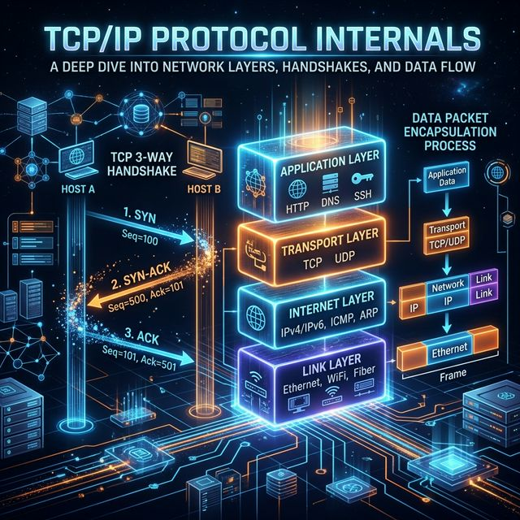
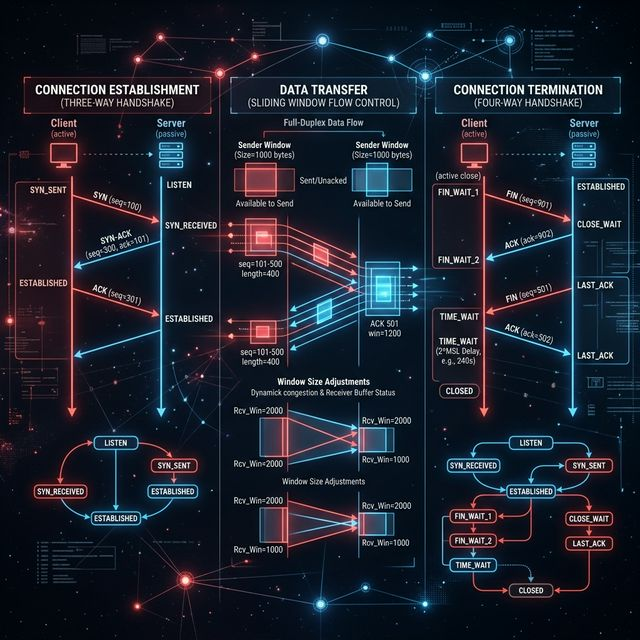
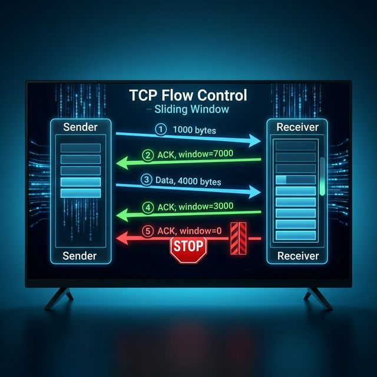
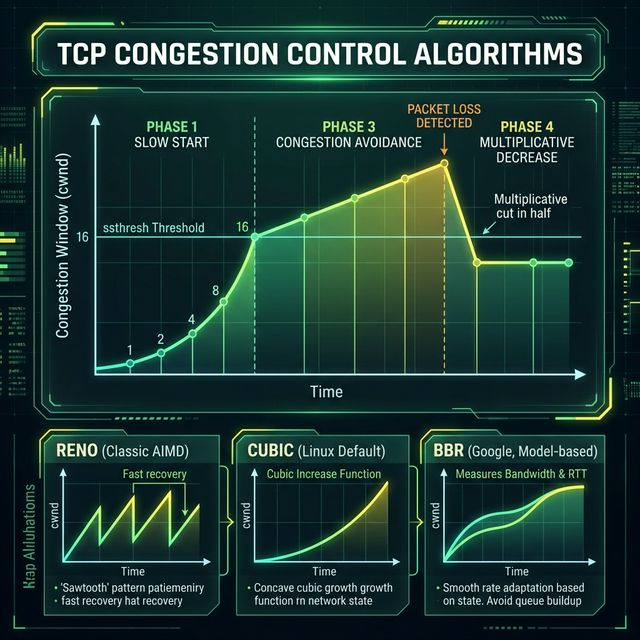

# 71: TCP/IP Protocol Deep Dive

<p align="center">
  
</p>

## 🎯 The Big Goal

> **After this chapter, you'll understand TCP/IP at the packet level — handshakes, flow control, congestion algorithms, and why `TIME_WAIT` exists — the knowledge that separates network engineers from application developers.**

Every byte you send over the internet is governed by these protocols. Understanding them means understanding the internet itself.

---

## 1. The TCP/IP Layer Model

| Layer | Protocols | What It Does | PDU |
| :--- | :--- | :--- | :--- |
| **Application** | HTTP, DNS, SSH, FTP, SMTP | User-facing services | Data |
| **Transport** | TCP, UDP | End-to-end delivery | Segment / Datagram |
| **Internet** | IP, ICMP, ARP | Routing across networks | Packet |
| **Link** | Ethernet, WiFi, PPP | Physical transmission | Frame |

### Data Encapsulation

```
Application:  [       DATA        ]
Transport:    [TCP HDR][   DATA    ]
Internet:     [IP HDR][TCP HDR][DATA]
Link:         [ETH HDR][IP HDR][TCP HDR][DATA][ETH TRAILER]
```

> 💡 **Each layer adds its header.** When receiving, each layer strips its header and passes up.

---

## 2. TCP Connection Lifecycle

<p align="center">
  
</p>

### The 3-Way Handshake (Connection Establishment)

| Step | Direction | Flags | Sequence Numbers |
| :--- | :--- | :--- | :--- |
| 1 | Client → Server | `SYN` | seq=x |
| 2 | Server → Client | `SYN+ACK` | seq=y, ack=x+1 |
| 3 | Client → Server | `ACK` | seq=x+1, ack=y+1 |

```bash
# Watch a handshake in real-time
sudo tcpdump -i any -nn 'tcp[tcpflags] & (tcp-syn|tcp-ack) != 0' port 443

# View connection states
ss -tan | head -20
```

### The 4-Way Termination (Connection Close)

| Step | Direction | Flags | State Change |
| :--- | :--- | :--- | :--- |
| 1 | Client → Server | `FIN` | Client → `FIN_WAIT_1` |
| 2 | Server → Client | `ACK` | Client → `FIN_WAIT_2`, Server → `CLOSE_WAIT` |
| 3 | Server → Client | `FIN` | Server → `LAST_ACK` |
| 4 | Client → Server | `ACK` | Client → `TIME_WAIT` (2×MSL), Server → `CLOSED` |

### Why TIME_WAIT Exists

```bash
# You might see thousands of TIME_WAIT sockets
ss -s
# TCP:   458 (estab 23, closed 312, orphaned 0, timewait 312)
```

| Reason | Explanation |
| :--- | :--- |
| **Reliable termination** | Ensures the final ACK reaches the server |
| **Prevent old packets** | Ensures delayed packets from old connections don't confuse new ones |
| **Duration** | 2 × MSL (Maximum Segment Lifetime) = typically 60 seconds |

```bash
# Reduce TIME_WAIT accumulation (use with caution!)
echo 1 > /proc/sys/net/ipv4/tcp_tw_reuse
```

---

## 3. TCP Flow Control (Sliding Window)

The receiver controls how fast the sender transmits:

<p align="center">
  
</p>

| Concept | Description |
| :--- | :--- |
| **Receive Window (rwnd)** | Advertised by receiver — "I can accept this many more bytes" |
| **Window Scaling** | TCP option allowing windows > 65KB (up to 1GB) |
| **Zero Window** | Receiver is full — sender must stop and probe periodically |

```bash
# View window sizes
ss -ti
# Shows: cwnd, rwnd, rtt, retransmissions per connection
```

---

## 4. TCP Congestion Control

<p align="center">
  
</p>

### The Four Phases

| Phase | Behavior | cwnd Growth |
| :--- | :--- | :--- |
| **Slow Start** | Start small, double each RTT | Exponential (1→2→4→8→16) |
| **Congestion Avoidance** | After ssthresh, grow cautiously | Linear (+1 per RTT) |
| **Fast Retransmit** | 3 duplicate ACKs = retransmit immediately | Don't wait for timeout |
| **Fast Recovery** | Halve cwnd, resume Congestion Avoidance | cwnd = ssthresh = cwnd/2 |

### Linux Congestion Control Algorithms

| Algorithm | Type | How It Works | Used By |
| :--- | :--- | :--- | :--- |
| **Reno** | Loss-based | Classic AIMD (sawtooth pattern) | Legacy |
| **CUBIC** | Loss-based | Cubic function near last max window | Linux default |
| **BBR** | Model-based | Measures bandwidth + RTT, not loss | Google, YouTube |

```bash
# Check current congestion control algorithm
sysctl net.ipv4.tcp_congestion_control
# net.ipv4.tcp_congestion_control = cubic

# Switch to BBR (Linux 4.9+)
sudo sysctl -w net.ipv4.tcp_congestion_control=bbr

# List available algorithms
sysctl net.ipv4.tcp_available_congestion_control
```

> 💡 **BBR Revolution:** Traditional algorithms (Reno, CUBIC) treat packet loss as congestion. BBR models actual bandwidth and RTT, performing better on lossy networks (mobile, long-distance).

---

## 5. UDP — When Speed Beats Reliability

| Feature | TCP | UDP |
| :--- | :--- | :--- |
| **Connection** | 3-way handshake required | Connectionless |
| **Reliability** | Guaranteed delivery + ordering | Best-effort |
| **Overhead** | 20-byte header + options | 8-byte header |
| **Flow Control** | Yes (sliding window) | No |
| **Use Cases** | HTTP, SSH, email, file transfer | DNS, video streaming, gaming, VoIP |

```bash
# See UDP traffic
ss -uan

# DNS uses UDP by default (port 53)
dig google.com    # Uses UDP
dig +tcp google.com  # Force TCP for large responses
```

---

## 6. ICMP — The Network's Error Reporter

| Type | Code | Message | Triggered By |
| :--- | :--- | :--- | :--- |
| 0 | 0 | Echo Reply | Response to ping |
| 3 | 0 | Destination Network Unreachable | No route to network |
| 3 | 1 | Destination Host Unreachable | Host down |
| 3 | 3 | Destination Port Unreachable | No service on port |
| 8 | 0 | Echo Request | `ping` command |
| 11 | 0 | Time Exceeded | TTL reached 0 (`traceroute`) |

```bash
# How traceroute works: send packets with increasing TTL
traceroute google.com
# TTL=1 → first router responds with Time Exceeded
# TTL=2 → second router responds
# ... until destination responds with Echo Reply
```

---

## 7. ARP — Bridging L2 and L3

ARP (Address Resolution Protocol) maps IP addresses to MAC addresses:

```bash
# View ARP cache
ip neigh show
# 192.168.1.1 dev eth0 lladdr aa:bb:cc:dd:ee:ff REACHABLE

# ARP process:
# 1. "Who has 192.168.1.1? Tell 192.168.1.100" (broadcast)
# 2. "192.168.1.1 is at aa:bb:cc:dd:ee:ff" (unicast reply)
# 3. Cache the mapping for future use
```

---

## 🤔 Reflection Questions

1. **TCP's 3-way handshake adds one RTT of latency to every new connection.** For a user 200ms away, that's 200ms before any data flows. How do protocols like QUIC and TCP Fast Open address this? What security trade-offs do they make?

2. **`TIME_WAIT` ties up sockets for 60 seconds after closing.** A busy web server can accumulate 50,000 TIME_WAIT sockets. Is this a problem? When does `tcp_tw_reuse` help, and when is it dangerous?

3. **BBR doesn't use packet loss as a congestion signal.** On a network with 1% random loss (e.g., WiFi), how does BBR behave compared to CUBIC? Why might BBR actually be unfair to other connections?

4. **UDP has no flow control, so a fast sender can overwhelm a slow receiver.** How do applications like video streaming implement their own flow control on top of UDP? What do they gain by not using TCP?

5. **Nagle's algorithm batches small TCP writes to reduce overhead**, but interactive applications (SSH, games) need low latency. How does `TCP_NODELAY` solve this? Why is the interaction between Nagle's algorithm and delayed ACKs particularly problematic?

---

## 📝 Key Interview Talking Points

- Know the 3-way handshake and 4-way teardown cold — draw it from memory
- `TIME_WAIT` is not a bug — it prevents packet confusion across connections
- Flow control (rwnd) is sender↔receiver; congestion control (cwnd) is sender↔network
- BBR is a paradigm shift from loss-based to model-based congestion control
- TCP guarantees ordering AND delivery; UDP guarantees neither (but is faster)

---

[<< Previous: Shared Memory IPC](./70_Shared_Memory_IPC.md) | [Home: Curriculum Map](./README.md) | [Next: Daemon Design >>](./72_Daemon_Design.md)
