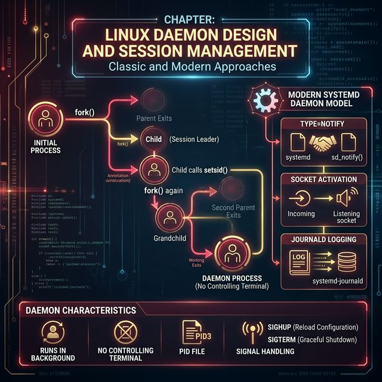
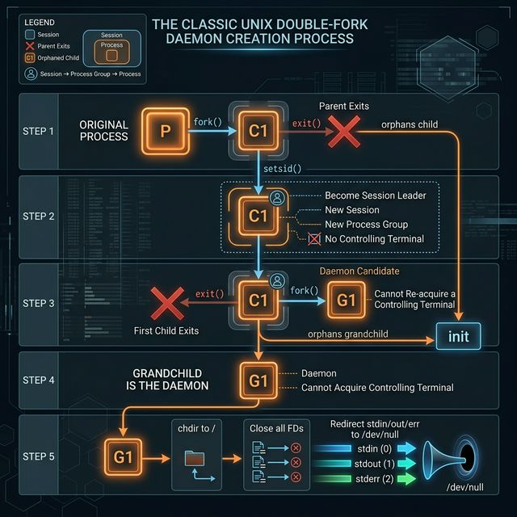

# 72: Daemon Design & Session Management

<p align="center">
  
</p>

## 🎯 The Big Goal

> **After this chapter, you'll understand how background services (daemons) are created, managed, and hardened — from the classic double-fork technique to modern systemd integration.**

Every service running on your Linux server — `sshd`, `nginx`, `PostgreSQL` — is a daemon. Understanding daemon design means understanding how Linux services work at the deepest level.

---

## 1. Sessions, Process Groups, and Controlling Terminals

Before understanding daemons, you must understand the UNIX session model:

| Concept | Description | Example |
| :--- | :--- | :--- |
| **Session** | Collection of process groups, one per login | SSH login creates a session |
| **Process Group** | Group of related processes | `ls | grep foo` = one group |
| **Session Leader** | First process in session (gets controlling terminal) | The login shell |
| **Controlling Terminal** | The terminal attached to the session | `/dev/pts/0` |

```bash
# View session and process group IDs
ps -o pid,ppid,pgid,sid,tty,comm

#   PID   PPID   PGID    SID TT       COMMAND
#  1234   1233   1234   1234 pts/0    bash       ← session leader
#  1280   1234   1280   1234 pts/0    vim        ← same session
#  1295   1234   1295   1234 pts/0    make       ← different process group
```

> 💡 **Why It Matters:** When you close a terminal, `SIGHUP` is sent to the session leader, which kills all processes in the session. Daemons must **escape** their session.

---

## 2. The Classic Double-Fork Daemon

<p align="center">
  
</p>

### The Complete Daemon Creation in C

```c
#include <stdio.h>
#include <stdlib.h>
#include <unistd.h>
#include <sys/stat.h>
#include <fcntl.h>
#include <syslog.h>

void daemonize(void) {
    pid_t pid;

    // Step 1: Fork and let parent exit
    pid = fork();
    if (pid < 0) exit(EXIT_FAILURE);
    if (pid > 0) exit(EXIT_SUCCESS);  // Parent exits → child orphaned

    // Step 2: Create new session (setsid)
    if (setsid() < 0) exit(EXIT_FAILURE);
    // Now: session leader, process group leader, no controlling terminal

    // Step 3: Fork again and let first child exit
    pid = fork();
    if (pid < 0) exit(EXIT_FAILURE);
    if (pid > 0) exit(EXIT_SUCCESS);  // First child exits
    // Grandchild: NOT session leader → can never acquire a terminal

    // Step 4: Set file permissions
    umask(0);

    // Step 5: Change working directory
    chdir("/");

    // Step 6: Close all open file descriptors
    for (int fd = sysconf(_SC_OPEN_MAX); fd >= 0; fd--)
        close(fd);

    // Step 7: Redirect stdin/stdout/stderr to /dev/null
    open("/dev/null", O_RDWR);  // stdin  (fd 0)
    dup(0);                      // stdout (fd 1)
    dup(0);                      // stderr (fd 2)

    // Step 8: Open syslog
    openlog("my_daemon", LOG_PID, LOG_DAEMON);
}

int main(void) {
    daemonize();

    syslog(LOG_INFO, "Daemon started successfully");

    // Main daemon loop
    while (1) {
        syslog(LOG_DEBUG, "Daemon heartbeat");
        sleep(30);
    }

    closelog();
    return EXIT_SUCCESS;
}
```

```bash
# Compile the classic Unix double-fork daemon
gcc my_daemon.c -o my_daemon
```

### Why Each Step Matters

| Step | Why |
| :--- | :--- |
| **First fork** | Ensures the child is not a process group leader (required for `setsid`) |
| **`setsid()`** | Creates new session → detaches from terminal |
| **Second fork** | Ensures daemon can never re-acquire a controlling terminal |
| **`umask(0)`** | Daemon-created files get the requested permissions exactly |
| **`chdir("/")`** | Don't hold a reference to a mounted filesystem |
| **Close FDs** | Don't leak file descriptors from the parent process |
| **Redirect to `/dev/null`** | Prevent accidental writes to a gone terminal |

---

## 3. PID Files and Single-Instance Enforcement

Prevent multiple copies of a daemon from running:

```c
#include <fcntl.h>

#define PID_FILE "/var/run/my_daemon.pid"

int write_pidfile(void) {
    int fd = open(PID_FILE, O_RDWR | O_CREAT, 0644);
    if (fd < 0) return -1;

    // Try to lock the file (non-blocking)
    struct flock fl = {
        .l_type = F_WRLCK,
        .l_whence = SEEK_SET,
        .l_start = 0,
        .l_len = 0  // Lock entire file
    };

    if (fcntl(fd, F_SETLK, &fl) < 0) {
        // Another instance is running!
        fprintf(stderr, "Daemon already running\n");
        return -1;
    }

    // Write our PID
    ftruncate(fd, 0);
    char buf[16];
    snprintf(buf, sizeof(buf), "%d\n", getpid());
    write(fd, buf, strlen(buf));

    // Keep fd open — lock persists until process exits
    return 0;
}
```

```bash
# Compile the PID locking mechanism
gcc daemon_lock.c -o daemon_lock
```

---

## 4. Signal Handling in Daemons

| Signal | Convention | Action |
| :--- | :--- | :--- |
| `SIGHUP` | Reload configuration | Re-read config file, reopen log files |
| `SIGTERM` | Graceful shutdown | Clean up resources, exit |
| `SIGUSR1` | Application-defined | Often: increase log verbosity |
| `SIGUSR2` | Application-defined | Often: trigger a status dump |

```c
#include <signal.h>

volatile sig_atomic_t reload_config = 0;
volatile sig_atomic_t shutdown_requested = 0;

void handle_sighup(int sig) {
    reload_config = 1;  // Flag for main loop
}

void handle_sigterm(int sig) {
    shutdown_requested = 1;
}

void setup_signals(void) {
    struct sigaction sa;
    sa.sa_flags = 0;
    sigemptyset(&sa.sa_mask);

    sa.sa_handler = handle_sighup;
    sigaction(SIGHUP, &sa, NULL);

    sa.sa_handler = handle_sigterm;
    sigaction(SIGTERM, &sa, NULL);

    // Ignore signals that daemons shouldn't receive
    signal(SIGPIPE, SIG_IGN);  // Broken pipe
    signal(SIGCHLD, SIG_IGN);  // Child process exit
}

// In main loop:
while (!shutdown_requested) {
    if (reload_config) {
        syslog(LOG_INFO, "Reloading configuration...");
        load_config("/etc/my_daemon.conf");
        reload_config = 0;
    }
    do_work();
    sleep(1);
}
syslog(LOG_INFO, "Shutting down gracefully");
cleanup();
```

```bash
# Compile the signal-aware daemon securely
gcc signal_daemon.c -o signal_daemon
```

```bash
# Sending signals to daemons
kill -HUP $(cat /var/run/my_daemon.pid)    # Reload config
kill -TERM $(cat /var/run/my_daemon.pid)    # Graceful shutdown
```

---

## 5. Modern Daemons with systemd

systemd eliminates the need for double-forking:

```ini
# /etc/systemd/system/my_daemon.service
[Unit]
Description=My Custom Daemon
After=network.target
Wants=network-online.target

[Service]
Type=notify
ExecStart=/usr/local/bin/my_daemon
ExecReload=/bin/kill -HUP $MAINPID
Restart=on-failure
RestartSec=5

# Security hardening
NoNewPrivileges=yes
ProtectSystem=strict
ProtectHome=yes
PrivateTmp=yes
ReadWritePaths=/var/lib/my_daemon

# Resource limits
MemoryMax=256M
CPUQuota=50%

[Install]
WantedBy=multi-user.target
```

### systemd Service Types

| Type | Behavior | Use Case |
| :--- | :--- | :--- |
| **simple** | systemd assumes service is up immediately | Simple services |
| **forking** | Service forks to background (legacy daemons) | Traditional daemons |
| **notify** | Service signals readiness via `sd_notify()` | Modern daemons |
| **oneshot** | Service runs once and exits | Startup scripts |

### sd_notify Integration (C)

```c
#include <systemd/sd-daemon.h>

int main(void) {
    // Initialization...
    load_config();
    open_database();
    bind_socket();

    // Tell systemd we're ready
    sd_notify(0, "READY=1");

    while (running) {
        do_work();
        // Update watchdog
        sd_notify(0, "WATCHDOG=1");
    }

    sd_notify(0, "STOPPING=1");
    cleanup();
    return 0;
}
```

```bash
# Compile with sd-daemon
gcc my_daemon.c -o my_daemon -lsystemd
```

---

## 6. Logging: syslog vs journald

| Feature | syslog/rsyslog | journald |
| :--- | :--- | :--- |
| **Format** | Plain text | Structured (key=value) |
| **Storage** | `/var/log/` files | Binary journal |
| **Query** | `grep`, `awk` | `journalctl` |
| **Metadata** | Timestamp + facility + priority | PID, UID, unit, boot ID, etc. |

```c
// Classic syslog
#include <syslog.h>
openlog("my_daemon", LOG_PID | LOG_NDELAY, LOG_DAEMON);
syslog(LOG_INFO, "Connection from %s accepted", client_ip);
syslog(LOG_ERR, "Failed to open database: %s", strerror(errno));
closelog();
```

```bash
# Query daemon logs with journalctl
journalctl -u my_daemon.service           # All logs
journalctl -u my_daemon.service -f        # Follow (like tail -f)
journalctl -u my_daemon.service --since "5 min ago"
journalctl -u my_daemon.service -p err    # Only errors
```

---

## 🤔 Reflection Questions

1. **The double-fork technique was necessary for decades, but systemd now handles daemonization.** Should new daemons still include double-fork code for portability, or is it safe to assume systemd? What happens on non-systemd systems (Alpine, Void Linux)?

2. **`SIGHUP` traditionally meant "terminal hangup" and killed the process.** Daemons repurposed it to mean "reload configuration." Is this convention good design or a hack? What problems arise when different daemons interpret the same signal differently?

3. **PID file-based locking uses `fcntl()` advisory locks.** What happens if the daemon crashes without removing the PID file? How does the lock-based approach differ from simply checking if the PID in the file is still alive?

4. **systemd's `ProtectSystem=strict` makes the entire filesystem read-only except for listed paths.** How does this sandboxing compare to running a daemon in a Docker container? When would you choose one over the other?

5. **A daemon opens a log file, but `logrotate` renames it and creates a new one.** The daemon continues writing to the old (renamed) file. How does the `SIGHUP` → reopen-logs pattern solve this? Why can't `logrotate` just edit the file in place?

---

## 📝 Key Interview Talking Points

- Double-fork creates a process that can never acquire a controlling terminal
- `setsid()` is the critical call that detaches from the session
- Modern daemons use `Type=notify` with `sd_notify()` instead of forking
- SIGHUP for config reload is a UNIX convention, not a requirement
- PID files + `fcntl` locks prevent duplicate daemon instances

---

[<< Previous: TCP/IP Deep Dive](./71_TCP_IP_Deep_Dive.md) | [Home: Curriculum Map](./README.md) | [Next: Advanced Performance >>](./73_Advanced_Performance.md)
