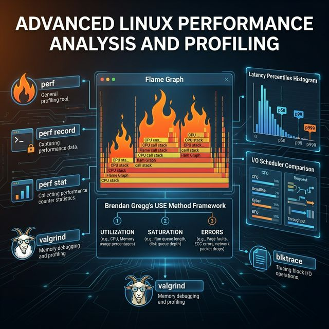
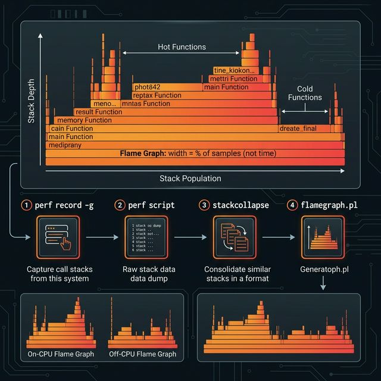

# 73: Advanced Performance Analysis & Profiling

<p align="center">
  
</p>

## 🎯 The Big Goal

> **After this chapter, you'll transcend guessing games ("maybe it's the database?") and learn Brendan Gregg's methodology for scientifically isolating performance bottlenecks across CPU, Memory, and Disk I/O.**

Performance engineering isn't about knowing magic tuning flags. It's about knowing how to ask the kernel exactly what it's waiting for.

---

## 1. The USE Method Framework

Netflix performance expert Brendan Gregg created the **USE Method** for analyzing complex systems. For every hardware resource, check:

| Metric | Definition | Command Line Triage |
| :--- | :--- | :--- |
| **Utilization** | The time the resource was busy processing work | CPU: `top` (%us, %sy) <br> Disk: `iostat -x` (%util) |
| **Saturation** | The degree to which work is queued (backlog) | CPU: `uptime` (load avg) <br> Disk: `iostat -x` (aqu-sz) |
| **Errors** | The count of error events | CPU: `dmesg` (MCE errors) <br> Net: `netstat -s` or `ifconfig` |

> 💡 **The Golden Rule:** High utilization is often fine (you paid for the CPU!). **Saturation is the real enemy** because it directly translates to latency.

---

## 2. Flame Graphs: Visualizing CPU Execution

<p align="center">
  
</p>

A flame graph solves the problem of "where is my application spending its CPU time?" by visualizing thousands of stack traces instantly.

### How to Read a Flame Graph

* **x-axis (Width):** Shows the population of the stack trace at that depth. A function taking up 50% of the width is executing in 50% of the sampled snapshots. **It is NOT time.**
* **y-axis (Depth):** Shows the call stack depth (who called whom). The top edge of the graph represents functions currently executing on the CPU (the "hot" functions).

### Generating a CPU Flame Graph

```bash
# 1. Capture stack traces at 99Hz for 60 seconds across all CPUs
sudo perf record -F 99 -a -g -- sleep 60

# 2. Dump the binary perf.data into text
sudo perf script > out.perf

# 3. Collapse stacks and generate SVG (requires FlameGraph scripts)
./stackcollapse-perf.pl out.perf > out.folded
./flamegraph.pl out.folded > cpu_flamegraph.svg
```

### On-CPU vs Off-CPU Profiling

* **On-CPU:** "Where is my thread executing instructions?"
* **Off-CPU:** "Why is my thread sleeping/blocked, and for how long?" (Requires tracing `sched:sched_switch` events).

---

## 3. High-Resolution Latency Analysis (Percentiles)

Averages lie. If an API call takes 2ms 99% of the time, and 10,000ms 1% of the time, the *average* might be 102ms. The average completely hides the 10-second stalls some users are experiencing.

### The Percentile Breakdown

| Percentile | Meaning | What It Represents |
| :--- | :--- | :--- |
| **p50 (Median)** | 50% of requests are faster than this | The typical user experience |
| **p90** | 90% are faster, the slowest 10% are this or worse | The slightly degraded experience |
| **p99** | 99% are faster, the slowest 1% are this or worse | The tail latency (often disk/GC stalls) |
| **p99.9** | The slowest 0.1% | Extreme outliers, timeouts, deadlocks |

> ⚠️ **Tail Latency Amplification:** In microservices, if one frontend request requires calling 100 backend services, the frontend p50 latency is driven by the backend's **p99 latency**. Even rare stalls destroy distributed system performance.

---

## 4. Advanced System Profiling with `perf`

`perf` is the official Linux profiler, tapping directly into kernel Hardware Performance Counters (PMCs).

### `perf stat` (Macro-level counting)

```bash
sudo perf stat -d ./my_program

# Output includes:
# - context-switches (Thread thrashing)
# - branch-misses (Poor CPU branch prediction)
# - L1-dcache-load-misses (Poor memory locality / cache thrashing)
# - page-faults (Allocating physical RAM)
```

### `perf record` (Micro-level sampling)

```bash
# Find functions causing cache misses
sudo perf record -e L1-dcache-load-misses -a -- sleep 10

# Analyze the results
sudo perf report
```

---

## 5. Disk I/O Deep Dive

### Analyzing Block I/O Saturation

```bash
# iostat -x 1
# Focus on these columns:
# - r/s, w/s: Read/Write IOPS
# - rkB/s, wkB/s: Throughput
# - aqu-sz: Average queue size (Saturation indicator! >1 means queuing)
# - await: Average time for request to complete (Device + Queue time)
# - %util: Utilization (Time device was busy handling requests)
```

### Linux I/O Schedulers comparison

Modern Linux kernels utilize multi-queue block scheduling (`blk-mq`), eliminating the single-queue lock contention of older kernels.

| Scheduler | Best For | Behavior |
| :--- | :--- | :--- |
| **none / mq-deadline** | NVMe / Enterprise SSD | Minimal overhead. Deadline guarantees request max wait time. |
| **kyber** | NVMe / High IOPS SSD | Uses target latencies to manage deep queues intelligently. |
| **bfq (Budget Fair Queuing)** | HDD / Desktop | Focuses on fairness and responsiveness over absolute throughput. |

```bash
# Check your current scheduler
cat /sys/block/sda/queue/scheduler
# [mq-deadline] kyber bfq none
```

---

## 6. Memory Analysis

High memory usage doesn't mean a leak; Linux aggressively caches files (Page Cache) to speed up I/O.

### The Page Fault Paradigm

| Type | What Happens | Performance Cost |
| :--- | :--- | :--- |
| **Minor Page Fault** | Process accesses mapped memory that doesn't have a physical page attached yet. Kernel allocates RAM. | Very fast (nanoseconds) |
| **Major Page Fault** | Process accesses mapped memory. Kernel must read the page from Disk. | **Terrible (milliseconds)** |

```bash
# Track major/minor page faults per process in real-time
pidstat -r 1
```

### Memory Profiling with Valgrind

While `perf` excels at CPU profiling, `valgrind` is the king of memory debugging:

```bash
# Detect memory leaks, uninitialized reads, and use-after-free
valgrind --leak-check=full ./my_program

# Profile memory allocations (Heap profiling)
valgrind --tool=massif ./my_program
# Use ms_print on the output file to see a graph of heap usage over time
```

---

## 🤔 Reflection Questions

1. **Why is high CPU utilization alone not proof of a performance problem?** If CPU utilization is at 100%, but the run queue length (saturation) is exactly 0, what does that indicate about the system's capacity?

2. **In a flame graph, the x-axis represents stack population, not chronological time.** How does this visual representation change the way you debug a program compared to stepping through it in a debugger like `gdb`?

3. **You optimize an API endpoint and the p50 latency drops from 200ms to 50ms, but the p99 latency remains at 4000ms.** What kinds of system events typically cause massive tail latencies like this, regardless of the core algorithm's efficiency?

4. **NVMe drives process thousands of parallel queues, making older single-queue I/O schedulers obsolete.** Why does the `none` (or `mq-deadline`) scheduler perform best for enterprise solid-state drives, while `bfq` is better for mechanical hard drives?

5. **A C program allocates 10GB of memory using `malloc()`, but `top` shows it using very little physical RAM (RES).** It only spikes in RAM usage when it starts writing data into that memory. Which Linux memory mechanism explains this behavior, and how is it related to page faults?

---

## 📝 Key Interview Talking Points

- Use Brendan Gregg's **USE Method**: check Utilization, Saturation, and Errors for every resource.
- Averages are misleading in distributed systems; always measure **percentiles (p90, p99)**.
- **Flame graphs** visualize CPU profiling data by stacking call frames (width = frequency, height = depth).
- **Major page faults** require disk I/O and destroy performance; minor page faults are fast.
- Modern NVMe drives bypass complex I/O schedulers because the hardware itself handles deep concurrent queues.

---

[<< Previous: Daemon Design](./72_Daemon_Design.md) | [Home: Curriculum Map](./README.md) | [Next: Kernel Scheduler & Interrupts >>](./74_Kernel_Scheduler_Interrupts.md)
