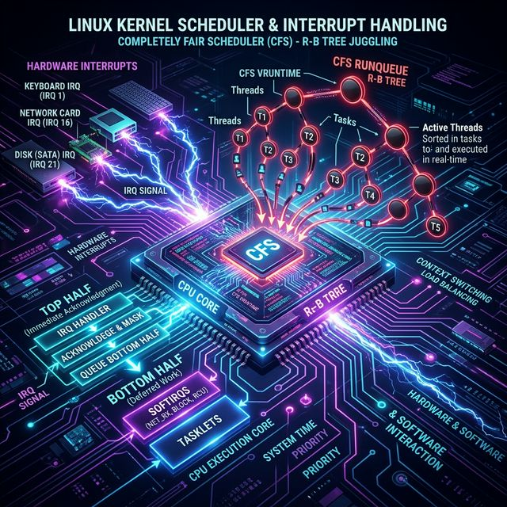
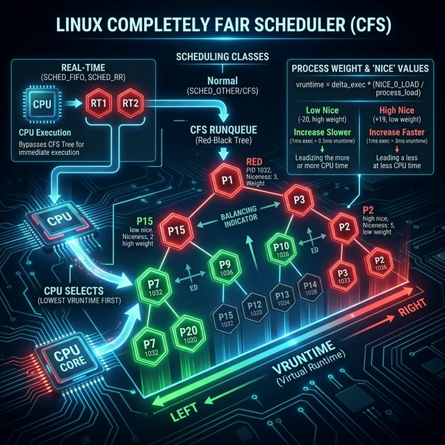
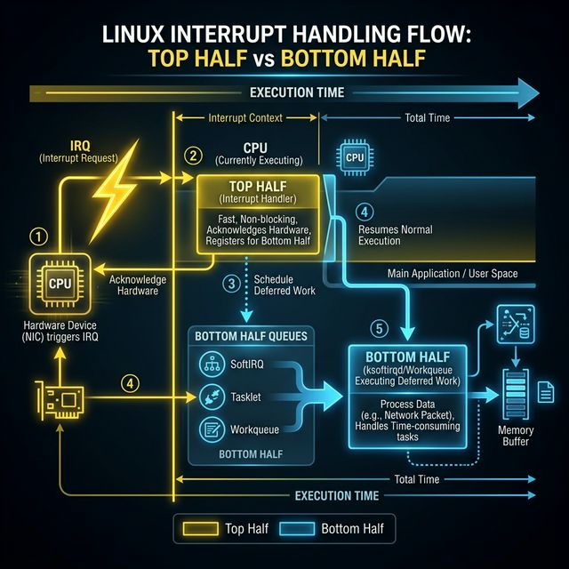

# 74: Kernel Scheduler & Interrupt Handling

<p align="center">
  
</p>

## 🎯 The Big Goal

> **After this chapter, you'll understand exactly how the Linux kernel decides which process runs next (using CFS), and how it handles asynchronous hardware events (IRQ) without freezing the entire system.**

The CPU is the most contested resource on any server. If you don't understand how it's shared, you can't understand application latency.

---

## 1. The Completely Fair Scheduler (CFS)

<p align="center">
  
</p>

Before CFS (Linux 2.6.23), schedulers used O(1) active/expired array priority queues. The Completely Fair Scheduler threw away traditional timeslices and replaced them with **virtual runtime (`vruntime`)**.

### How CFS Works

| Concept | Explanation |
| :--- | :--- |
| **Virtual Runtime** | The amount of time a task has executed, normalized by its priority. |
| **The Red-Black Tree** | CFS stores runnable tasks in an O(log N) red-black tree, sorted by `vruntime`. |
| **Selection** | The kernel always picks the leftmost node (lowest `vruntime`). |
| **Fairness** | If a task sleeps for I/O, its `vruntime` stays low. When it wakes up, it jumps to the left side of the tree and preempts CPU-heavy tasks immediately. |

### Niceness vs. Weight

The `nice` value (-20 to +19) doesn't give a thread a static time slice. It changes the *weight* of how `vruntime` accumulates:

```bash
# High Priority (Nice -20)
# 1ms of physical CPU execution = 0.015ms of vruntime increase
# Result: Stays on the left side of the tree longer

# Low Priority (Nice +19)
# 1ms of physical CPU execution = 64ms of vruntime increase
# Result: Rapidly moves to the right side of the tree
```

```bash
# View niceness and priority via top/htop
# NI = Nice value (-20 to 19)
# PR = Actual scheduling priority (NI + 20)
top
```

---

## 2. Real-Time Scheduling Policies

CFS handles the `SCHED_OTHER` scheduling class. But Linux supports POSIX Real-Time (RT) scheduling, which completely bypasses the CFS Red-Black tree.

| Policy | Behavior | Risk |
| :--- | :--- | :--- |
| **`SCHED_FIFO`** | First In, First Out. A runnable FIFO task will unconditionally preempt any `SCHED_OTHER` task and run until it yields or blocks. | **Deadlock.** If a `SCHED_FIFO` task enters an infinite loop, your system is dead. |
| **`SCHED_RR`** | Round Robin. Like FIFO, but multiple RT tasks share the CPU using fixed timeslices. | Same as FIFO. |

```bash
# Change a process scheduling policy and priority (requires root)
# Set PID 1234 to SCHED_FIFO with RT priority 99 (highest)
chrt -f -p 99 1234
```

> ⚠️ **RT Warning:** "Real-Time" in Linux does NOT mean "fast". It means **deterministic latency**. Do not use RT classes to make your database "faster" — you will starve kernel threads and crash the system.

---

## 3. CPU Affinity and NUMA

On modern multi-socket motherboards, RAM is physically attached to specific CPU dies (NUMA - Non-Uniform Memory Access).

If a thread on CPU Node 0 accesses memory on CPU Node 1, it suffers a severe latency penalty across the interconnect bus.

```bash
# View NUMA topology and memory hits/misses
numastat -m

# Tie a process to specific CPU cores (CPU Affinity)
# Run process on CPUs 0,1,2,3 only
taskset -c 0-3 ./my_database

# Ask Linux to allocate memory on the same node where the process is running
numactl --interleave=all ./my_database
```

CFS inherently tries to keep tasks on the same CPU (cache locality/hot L1 cache) and same NUMA node, but administrator overrides (`taskset`) guarantee it constraint.

---

## 4. Hardware Interrupts (IRQs)

An interrupt is an electrical signal from hardware (NIC, Disk, Keyboard) demanding immediate CPU attention. It literally stops whatever software instruction is currently executing.

<p align="center">
  
</p>

### The Top-Half / Bottom-Half Split

If the CPU spent all its time processing a massive network packet inside the interrupt handler, all other hardware would lock up. Therefore, Linux splits the work:

| Phase | Who | Characteristics | What it Does |
| :--- | :--- | :--- | :--- |
| **Top Half** | Hard IRQ Handler | Extremely fast, interrupts disabled | Acknowledges hardware, copies data to RAM, schedules Bottom Half. |
| **Bottom Half** | SoftIRQ, Tasklet, Workqueue | Preemptible, interrupts enabled | Actually parses the TCP/IP stack, updates data structures. |

```bash
# See where hardware interrupts are firing right now
watch -n 1 cat /proc/interrupts

# See deferred software interrupts (Bottom Halves)
watch -n 1 cat /proc/softirqs
```

---

## 5. Bottom Halves: SoftIRQs vs Workqueues

How the kernel defers work:

1. **SoftIRQs:** Reserved for the most latency-critical sub-systems (Networking `NET_RX`, Block I/O). Execute in interrupt context. Cannot sleep/block.
2. **Tasklets:** Built on top of SoftIRQs. Simpler locking (tasklets of the same type cannot run concurrently on multiple CPUs). Cannot sleep.
3. **Workqueues:** Execute in process context (via kernel threads). **Can sleep/block.** Used for disk I/O or tasks that require waiting on locks.

### IRQ Balancing

A 100Gbps network card generates millions of interrupts per second. If they all hit CPU 0, CPU 0 hits 100% usage while CPUs 1-15 are idle.

```bash
# Check if irqbalance daemon is running
systemctl status irqbalance

# Or manually pin an IRQ to a specific CPU (e.g., pin IRQ 45 to CPU 1)
# echo "2" > /proc/irq/45/smp_affinity
```

---

## 🤔 Reflection Questions

1. **CFS doesn't use static time slices.** If an I/O-bound process wakes up after sleeping for 10 seconds, its `vruntime` would logically be 0, making it dominate the CPU infinitely. How does CFS prevent an I/O task from unfairly preempting long-running CPU tasks when it finally wakes up?

2. **A server running an intensive application on `SCHED_OTHER` works fine.** A junior admin reads an article and changes the process to `SCHED_FIFO` with RT priority 99 to make it "faster". Ten minutes later, SSH becomes completely unresponsive. Why?

3. **Database servers often disable HyperThreading (SMT) and manually pin connections to physical cores.** Given what you know about CPU caching, NUMA, and the CFS queue, why might bypassing the Linux scheduler entirely (pinning) be better for specific enterprise workloads?

4. **Hard IRQs disable local interrupts.** If a Top Half interrupt handler has a bug and enters an infinite loop while holding a spinlock, what happens to the specific CPU core? What happens to the overall server?

5. **`NET_RX` SoftIRQs often spike to 100% on a single CPU during a DDoS attack.** Using your knowledge of `irqbalance` and NIC hardware queues (RSS - Receive Side Scaling), how would you distribute this attack traffic across all 32 cores of a server?

---

## 📝 Key Interview Talking Points

- **CFS uses a Red-Black tree**, scheduling the task with the lowest virtual runtime (`vruntime`).
- The `nice` command changes how fast `vruntime` increases, not static timeslices.
- **Top Halves (Hard IRQs)** acknowledge hardware quickly; **Bottom Halves (SoftIRQs/Workqueues)** do the actual processing.
- You **cannot sleep** inside an Interrupt Context (Hard IRQ or SoftIRQ); if you must wait for a lock/disk, you must use a Workqueue.
- **NUMA awareness** is critical for performance; accessing RAM tied to another CPU socket introduces severe latency.

---

[<< Previous: Advanced Performance](./73_Advanced_Performance.md) | [Home: Curriculum Map](./README.md)
