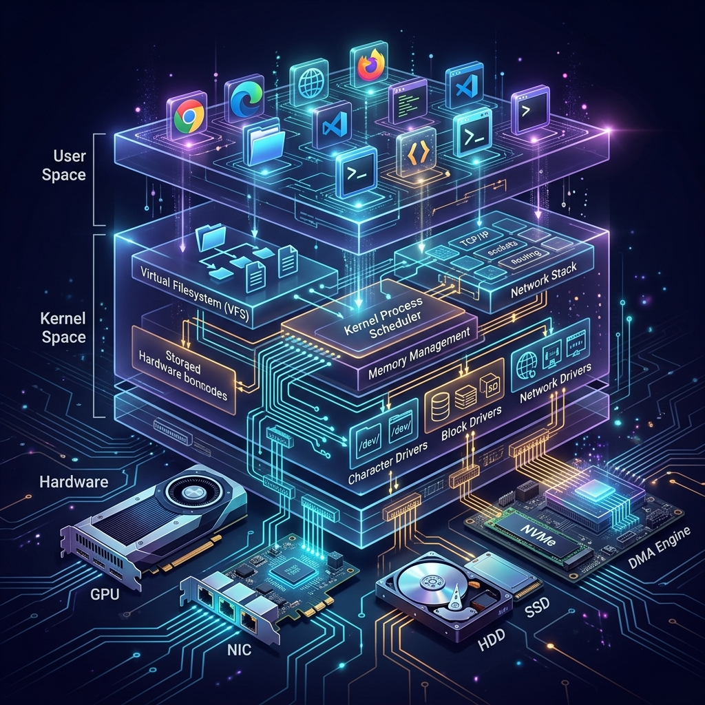

# 75: Linux Device Driver Architecture

<p align="center">
  
</p>

## 🎯 The Big Goal

> **After this chapter, you'll understand the intricate architecture bridging userspace applications to physical hardware via the Linux kernel, focusing on character, block, and network device drivers, memory mapping, and DMA.**

The kernel is essentially a resource manager. Device drivers are the plugins that teach the kernel how to manage specific hardware components. Understanding this layer provides profound insight into system performance and hardware interactions.

---

## 1. The Device Driver Hierarchy

The Linux kernel categorizes device drivers into three primary classes:

| Driver Type | Characteristics | Examples |
| :--- | :--- | :--- |
| **Character (Char)** | Accessed as a stream of bytes. No caching. Sequential. | `/dev/tty`, `/dev/null`, keyboards, mice, serial ports |
| **Block** | Accessed in discrete blocks. Heavily cached. Random access. | `/dev/sda`, hard drives, SSDs, flash memory |
| **Network** | Packet-based transmission. Integrated with the network stack. | `eth0`, `wlan0`, loopback |

### Device Nodes and Major/Minor Numbers

In `/dev/`, devices are represented as special files. The kernel identifies the driver using **Major** and **Minor** numbers.

```bash
# View major/minor numbers
ls -l /dev/sda /dev/ttyS0
# brw-rw---- 1 root disk 8, 0 Mar 29 00:00 /dev/sda
# crw-rw---- 1 root dialout 4, 64 Mar 29 00:00 /dev/ttyS0
```
- `b` or `c` indicates Block or Character.
- `8` (major) identifies the block driver (e.g., SCSI disk).
- `0` (minor) identifies the specific instance (e.g., first disk).

---

## 2. Character Device Internals

Character devices implement a `file_operations` structure (fops), mapping system calls to driver functions.

```c
// Example: The file_operations mapping
struct file_operations my_fops = {
    .owner   = THIS_MODULE,
    .read    = my_device_read,
    .write   = my_device_write,
    .open    = my_device_open,
    .release = my_device_release,
    .unlocked_ioctl = my_device_ioctl,
};
```

```bash
# Unlike userspace C, device drivers use the Kernel Build System (Kbuild)
# You need a single-line Makefile: obj-m += my_device.o
# Then compile against the running kernel explicitly:
make -C /lib/modules/$(uname -r)/build M=$PWD modules
```

### The ioctl() System Call
When standard `read`/`write` are insufficient, `ioctl` (Input/Output Control) allows sending custom commands to the driver, like changing baud rates or querying hardware status.

---

## 3. Block Layer and the I/O Scheduler

Block devices sit beneath the **Virtual Filesystem (VFS)** and the **Page Cache**.

<p align="center">
  
</p>

When an application writes to a file:
1. **Application** calls `write()`.
2. **VFS** translates it to file operations.
3. **Page Cache** absorbs the write (dirty pages).
4. **Block Layer** creates Bio (Block I/O) requests.
5. **I/O Scheduler** merges/sorts requests for optimal hardware access (e.g., CFQ, Deadline, Kyber, BFQ).
6. **Device Driver** initiates hardware DMA.

---

## 4. Hardware Interaction: Interrupts and DMA

### 4.1 Interrupt Handling
Hardware signals the CPU via interrupts. To keep the system responsive, drivers split interrupt handling:
- **Top Half (Hard IRQ)**: Acknowledges the hardware immediately. Fast, non-blocking.
- **Bottom Half (SoftIRQ/Tasklet)**: Defers the heavy processing to run when the CPU is less busy.

### 4.2 Direct Memory Access (DMA)
Instead of the CPU copying every byte from device to RAM, the device is given a DMA controller configuration to copy data directly into RAM, raising an interrupt only when finished.

---

## 🤔 Reflection Questions

1. **Why do character devices bypass the page cache while block devices rely on it?** What would happen if you tried to cache a serial port stream?
2. **In modern NVMe drives, traditional I/O schedulers are often bypassed (using `none`).** Why are elevators and sorting algorithms less relevant for SSDs compared to spinning HDDs?
3. **How does standard memory differs from DMA memory buffers?** Discuss the importance of contiguous physical memory.

---

## 📝 Key Interview Talking Points

- Explain Top Half vs Bottom Half interrupt handling and why it's critical to avoid system lockups.
- Know the difference between a major number (points to driver code) and a minor number (points to physical device instance).
- Be able to describe the path of data from an SSD hardware platter up to a user-space buffer.

---

[<< Previous: Kernel Scheduler & Interrupt Handling](./74_Kernel_Scheduler_Interrupts.md) | [Home: Curriculum Map](./README.md) | [Next: Linux Developer Toolchain >>](./76_Developer_Toolchain.md)
