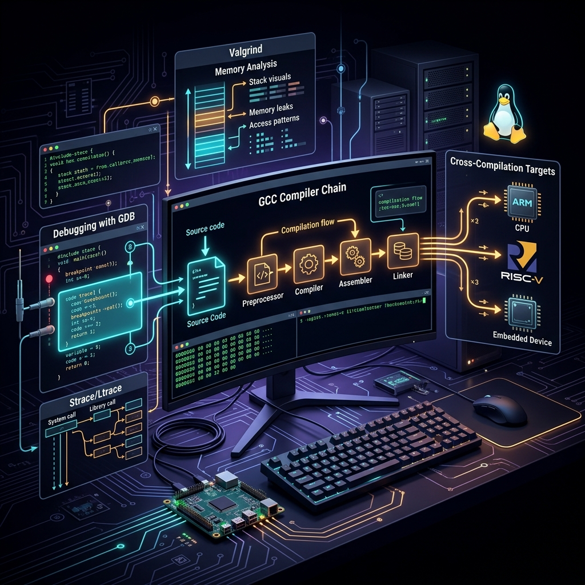

# 76: Linux Developer Toolchain

<p align="center">
  
</p>

## 🎯 The Big Goal

> **After this chapter, you'll master the foundational GNU toolchain (GCC, GDB, binutils) that compiles the Linux world, understanding exactly how C source code transforms into executable binaries and how to debug them effectively.**

A developer on Linux doesn't just write code; they command a pipeline of preprocessors, compilers, assemblers, and linkers. Understanding this toolchain is essential for low-level systems programming and troubleshooting linking errors.

---

## 1. The Compilation Pipeline (GCC)

The GNU Compiler Collection (`gcc`) is actually a frontend driver that coordinates four distinct steps:

| Step | Tool | Output | Description |
| :--- | :--- | :--- | :--- |
| **1. Preprocessor** | `cpp` | `.i` | Expands macros, `#include`, removes comments. |
| **2. Compiler** | `cc1` | `.s` | Translates C code into processor-specific Assembly. |
| **3. Assembler** | `as` | `.o` | Translates Assembly into machine code (Object file). |
| **4. Linker** | `ld` | executable | Links object files with libraries to create the final ELF. |

```bash
# View the separate stages:
gcc -E hello.c -o hello.i  # Preprocess
gcc -S hello.i -o hello.s  # Compile
gcc -c hello.s -o hello.o  # Assemble
gcc hello.o -o hello     # Link
```

---

## 2. Shared vs Static Libraries

Libraries are collections of pre-compiled object files used for reuse.

### Static Libraries (`.a`)
- Archives of `.o` files.
- Linked at compile-time directly into the binary.
- **Result**: Larger binaries, but completely standalone.
- **Tool**: Created utilizing `ar`.

### Shared Libraries (`.so`)
- Dynamic libraries loaded into memory at runtime.
- **Result**: Smaller binaries, lower RAM usage, easier updates (update `.so` to patch all apps).
- **Tool**: The dynamic linker (`ld.so`) loads them.

```bash
# See which shared libraries an executable requires:
ldd /usr/bin/ls
#    linux-vdso.so.1 =>  (0x00007ffe489ac000)
#    libc.so.6 => /lib/x86_64-linux-gnu/libc.so.6 (0x00007f3c8a9d1000)
```

---

## 3. Advanced Debugging with GDB

The GNU Debugger (`gdb`) allows you to step through execution, inspect registers, memory, and variables. Be sure to compile with `-g` to include debug symbols mapping assembly back to line numbers.

### Core GDB Commands
- `run` (or `r`): Start execution.
- `break main` (or `b`): Set a breakpoint at `main()`.
- `step` (or `s`): Step into functions.
- `next` (or `n`): Step over functions.
- `print var` (or `p`): Inspect a variable's value.
- `bt`: Print a backtrace of the call stack.

```bash
gdb ./my_program
(gdb) b 42
(gdb) run
(gdb) info registers
```

---

## 4. Dynamic Analysis: Valgrind and strace

While GDB is for pausing state, dynamic analysis involves watching programs live.

### Valgrind (Memcheck)
Detects memory leaks, double-frees, and out-of-bounds array access by wrapping standard `malloc()` calls.
```bash
valgrind --leak-check=full ./my_program
```

### Strace
Intersects all system calls a process makes. Invaluable for diagnosing crashes when source code isn't available.
```bash
strace -e openat,read ./my_program
```

---

## 🤔 Reflection Questions

1. **When would you choose a Static library over a Shared library?** What environments specifically benefit from statically linked binaries (like Golang binaries)?
2. **If `ldd` shows a library as "not found", how does the OS determine where to search for shared libraries?** Check `/etc/ld.so.conf` and `LD_LIBRARY_PATH`.
3. **What is the `linux-vdso.so.1` object visible in all `ldd` outputs?** How does it optimize system calls like `gettimeofday()`?

---

## 📝 Key Interview Talking Points

- Understand the path of `#include <stdio.h>` from preprocessor expansion to final linked `libc.so.6`.
- Understand how undefined symbols in linking relate to the `ld` stage.
- Differentiate between tracking syscalls (`strace`), tracking library calls (`ltrace`), and deep performance profiling (`perf`).

---

[<< Previous: Linux Device Driver Architecture](./75_Device_Driver_Architecture.md) | [Home: Curriculum Map](./README.md) | [Next: Audit & Compliance >>](./77_Audit_Compliance.md)
