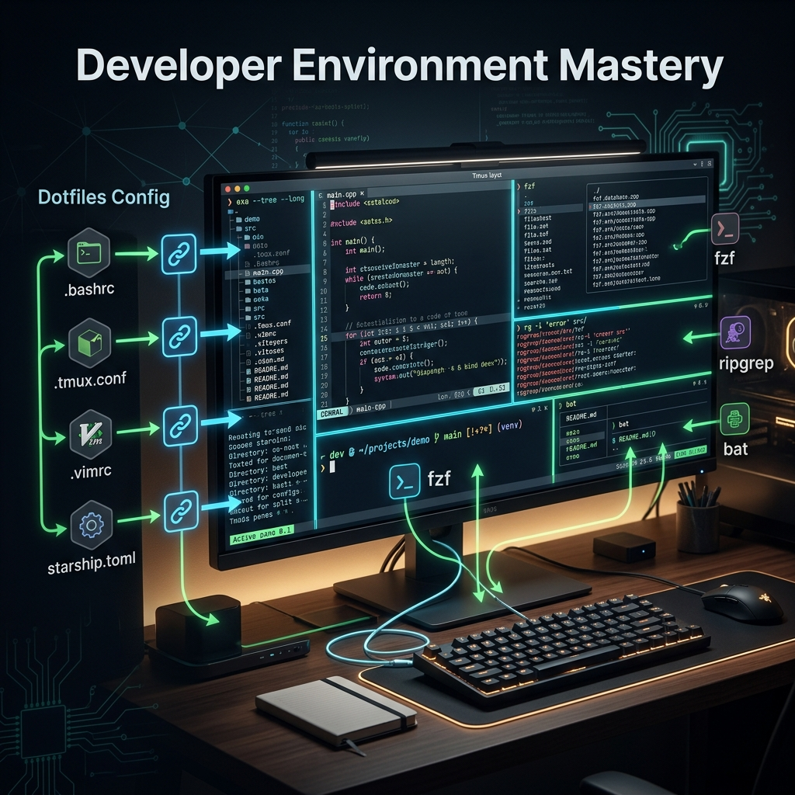

# 81: Developer Environment Mastery

<p align="center">
  
</p>

## 🎯 The Big Goal

> **After this chapter, you'll transform the bare terminal into a hyper-productive, multiplexed development IDE utilizing powerful standard CLI abstractions, dotfile management, and fuzzy-finding tools.**

The mouse is undeniably slow. True developer productivity on Linux means chaining modern tools natively to search, navigate, edit, and multiplex simultaneously without removing your hands from the keyboard.

---

## 1. Terminal Multiplexing with `tmux`

A multiplexer allows you to run multiple terminal sessions inside a single window, and crucially, detach from them securely while processes continue running in the background.

```bash
# Start a new named session
tmux new -s "backend-dev"

# Detach from session natively: Ctrl+B, then D

# Re-attach to the long-running session later
tmux attach -t "backend-dev"
```

### The Power of Panes
Inside `tmux`, you construct dynamic panes via `Ctrl+B`:
- `Ctrl+B %`: Split vertically.
- `Ctrl+B "`: Split horizontally.
- `Ctrl+B [arrow]`: Navigate panes.

---

## 2. The Modern Command Line Replacements

The older POSIX tools (`ls`, `find`, `grep`, `cat`) are ubiquitous but lack developer-friendly features (syntax highlighting, parallel execution). Rust-based modern replacements have revolutionized terminal life.

| Legacy Tool | Modern Equivalent | Advantage |
| :--- | :--- | :--- |
| `ls` | **eza** / **lsd** | Adds git status tracking, icons, structural trees, and coloring. |
| `grep` | **rg** (ripgrep) | Multithreaded, ignores `.gitignore` files automatically. Light speed. |
| `find` | **fd** | Colorized, ignores hidden files by default, straightforward syntax natively. |
| `cat` | **bat** | Syntax highlighting, line numbers, and Git diff integration natively. |

```bash
# Searching a massive repository for 'TODO'
rg "TODO"

# Finding all python files that have been modified recently
fd -e py -c "1 week"
```

---

## 3. Fuzzy Finding: The Omnipresent `fzf`

`fzf` is the absolute masterstroke of the terminal. It provides interactive, keystroke-based fuzzy filtering for literally any command list piped into it.

```bash
# Find a file in a massive project and pass it clearly to Vim
vim $(fzf)

# Search bash history natively and clearly visually
history | fzf

# Interactively checkout a git branch
git checkout $(git branch | fzf)
```
Combined with keyboard shortcuts like `Ctrl+R` (fzf history search) and `Ctrl+T` (fzf directory traversal), navigation becomes instantaneous.

---

## 4. Dotfile Management via GNU Stow

`Dotfiles` (`.bashrc`, `.vimrc`, `.tmux.conf`) are your unique configurations. Managing them universally requires version control. **GNU Stow** creates a highly effective symlink farm cleanly.

### The Setup
1. Create a `~/dotfiles/` directory securely managed by Git.
2. Store config structure mirrored (e.g., `~/dotfiles/bash/.bashrc`).
3. Run Stow.

```bash
cd ~/dotfiles
stow bash
stow vim
```
Stow will intelligently symlink `~/dotfiles/bash/.bashrc` to `~/.bashrc`. If you edit `~/.bashrc`, you are explicitly directly editing your Git repository. Commit, push, and clone to uniformly setup new machines.

---

## 🤔 Reflection Questions

1. **When a network explicitly drops your SSH connection natively**, how does `tmux` preserve your running compiling binary flawlessly?
2. **Tools like `ripgrep` (`rg`) ignore `.gitignore` files automatically.** In heavily populated node or rust environments, how does this explicitly outperform `grep -R` in timing analysis?
3. **If you possess ten specialized aliases inside `.bashrc`**, why must they be heavily transferred directly through Git to guarantee a uniform IDE experience remotely?

---

## 📝 Key Interview Talking Points

- Explain the precise structural difference between terminal emulation (iTerm/Alacritty) and terminal multiplexing (`tmux`/`screen`).
- Justify the usage of modern Rust ports natively (rg, fd, bat) strictly for their parallelized design logic.
- Possess a distinct, definitive methodology for organizing cross-machine environments (Dotfiles).

---

[<< Previous: Shell Scripting Cookbook](./80_Shell_Scripting_Cookbook.md) | [Home: Curriculum Map](./README.md) | [Next: Software Dynamics >>](./82_Software_Dynamics.md)
