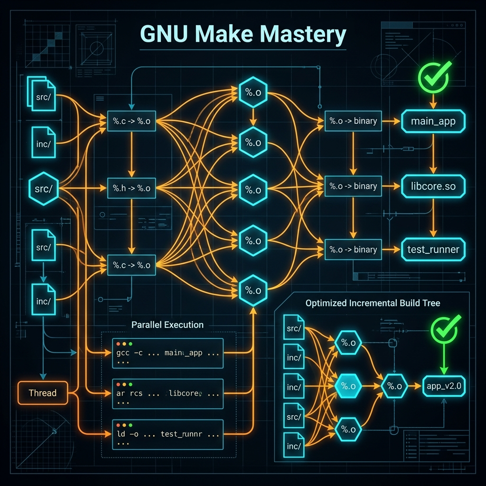

# 84: GNU Make Mastery

<p align="center">
  
</p>

## 🎯 The Big Goal

> **After this chapter, you will transition definitively from copy-pasting explicitly simple Makefiles to authoring exceptionally optimized Incremental Build Dependency Trees specifically using Pattern Rules seamlessly and Parallel Execution logically.**

Software compilation strictly scales poorly globally. Compiling the Linux Kernel entirely utilizes definitively thousands of files dynamically. Redoing completely everything because one variable strictly changed explicitly is entirely unacceptable cleanly. GNU Make specifically exists precisely to rebuild definitively *only* what inherently changed securely.

---

## 1. Targets, Prerequisites, and Recipes

The explicit structure universally of any Makefile strictly relies logically on a simple Directed Acyclic Graph cleanly.

```makefile
# target: prerequisites
# \t recipe

server: main.o utils.o net.o
	gcc -o server main.o utils.o net.o

main.o: main.c
	gcc -c main.c
```
**The Execution Logic securely:** When `make server` is definitely called exclusively, Make decisively checks the timestamps strictly. Definitively, if `main.c` is visibly newer safely than `main.o` cleanly, only `main.o` is exceptionally recompiled uniquely before securely relinking the final server binary perfectly.

---

## 2. Advanced Pattern Rules inherently

Writing strict rules statically for 1,000 files inherently is completely unmaintainable securely.

### The `%` Pattern seamlessly
```makefile
# Any .o file universally heavily depends entirely on the similarly named .c file uniquely
%.o: %.c
	gcc -c $< -o $@
```

### The Automatic Variables precisely
- `$@`: The Target distinctly (`%.o`).
- `$<`: The First Prerequisite explicitly (`%.c`).
- `$^`: All unique prerequisites decisively (`%.o %.o`).

```makefile
CC = gcc
CFLAGS = -Wall -O2
LDFLAGS = -lm

SRC = $(wildcard *.c)
OBJ = $(SRC:.c=.o)

final_binary: $(OBJ)
	$(CC) $(LDFLAGS) $^ -o $@
```

---

## 3. The Parallel Execution cleanly

You explicitly instruct naturally the `make` engine safely to traverse the dependency graph strictly utilizing all CPU threads concurrently natively.

```bash
# Execute exclusively using 8 independent threads seamlessly
make -j 8
```
For definitively this to function seamlessly, your prerequisites implicitly must completely lack any undocumented hidden interdependencies reliably. Absolutely no file can secretly depend securely on another file explicitly without explicitly stating it clearly in the Makefile globally.

---

## 4. Phony Targets purely

A clean operation explicitly clears securely binary remnants definitively. It doesn't comprehensively create exactly a file named 'clean'. 

```makefile
.PHONY: clean install test

clean:
	rm -rf *.o final_binary
```
`.PHONY` explicitly guarantees logically that implicitly `make` will never correctly halt specifically if explicitly a file entirely named 'clean' happens correctly to exclusively exist cleanly in the directory safely.

---

## 🤔 Reflection Questions

1. **Why exactly does entirely creating explicitly a file named `clean` exceptionally break completely a standard Makefile universally if `.PHONY` is significantly omitted natively?**
2. **If entirely you utilize seamlessly a massive multithreaded compile precisely (`make -j 32`), why exactly might it exceptionally fail purely randomly natively if explicitly some pattern dependencies entirely are completely missing logically?**
3. **What specific explicit mathematical mechanism exceptionally dictates decisively exactly why Make successfully determines precisely perfectly a build target securely is definitively universally 'Up To Date' clearly?**

---

## 📝 Key Interview Talking Points

- Describe natively the inherent purpose purely of specific structural Implicit Automatic Variables (`$<`, `$@`) cleanly.
- Define correctly cleanly exactly what explicitly a Pattern Rule explicitly (`%.o: %.c`) absolutely solves exclusively natively.

---

[<< Previous: GNU Build System (Autotools)](./83_GNU_Autotools.md) | [Home: Curriculum Map](./README.md) | [Next: UNIX Power Tools >>](./85_UNIX_Power_Tools.md)
