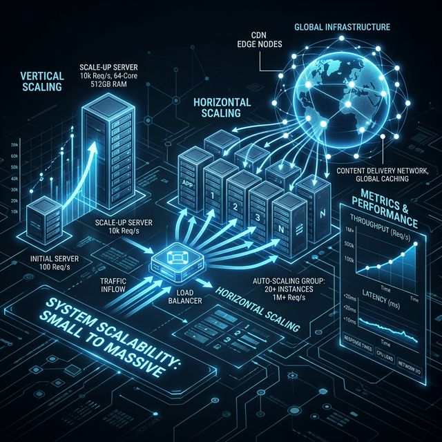
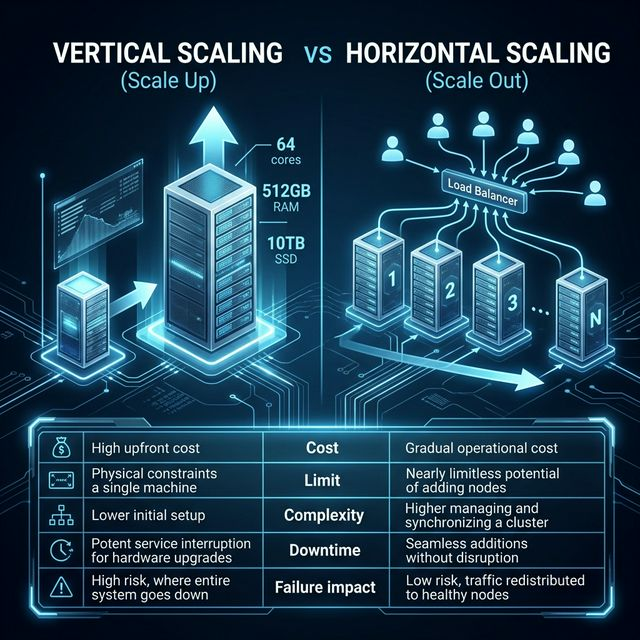
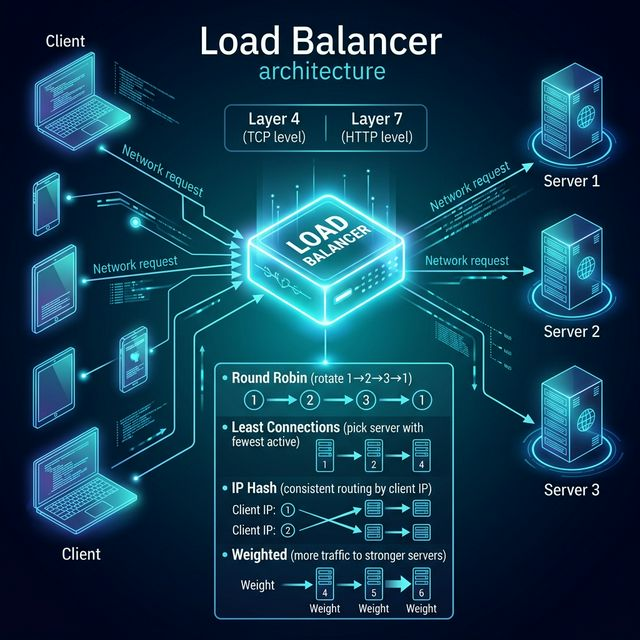
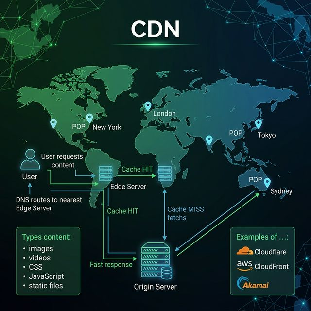
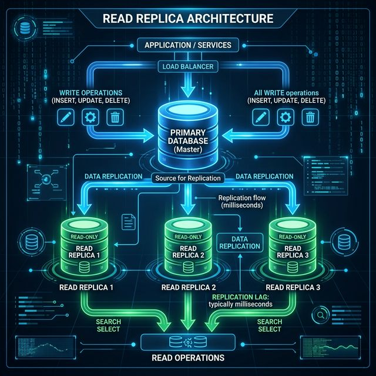

# 01: Scalability Fundamentals

<p align="center">
  
</p>

> 🧠 **The Feynman Hook:** Imagine you open a lemonade stand. At first, one table and one pitcher handles everything. But on a blazing summer day, 500 people show up. Do you brew more lemonade in the same pitcher (bigger hardware), or do you set up 10 more stands with their own pitchers (more machines)? This is the entire question of scalability — and getting the answer right is what separates systems that survive success from systems that crumble under it.

## 🎯 What You'll Learn

> **After this chapter, you'll understand how systems grow from handling 100 users to 100 million users — and the architectural decisions that make this possible.**

Every application starts small. A single server handles everything: web requests, business logic, and database queries. But what happens when your user base explodes? The answer is **scalability** — the art of growing your system's capacity without redesigning it from scratch.

---

## 1. What Is Scalability?

> **Feynman Insight:** Scalability is how well your lemonade stand handles a crowd. A scalable stand can serve 10 people or 10,000 people — it just needs more resources. A non-scalable stand collapses under load because its design assumes a fixed number of customers.

Scalability is a system's ability to handle **increased load** by adding resources.

| Term | Definition |
| :--- | :--- |
| **Load** | The demand placed on a system (requests/sec, concurrent users, data volume) |
| **Throughput** | How much work the system completes per unit time |
| **Latency** | How long it takes to complete a single request |
| **Capacity** | The maximum load a system can handle before degradation |

> 💡 **Key Insight:** A system is scalable if adding resources increases throughput proportionally without increasing latency.

---

## 2. Vertical vs Horizontal Scaling

> **Feynman Insight:** Vertical scaling is like upgrading your chef to Gordon Ramsay — one brilliant person can cook faster, but there's still only one of them, and they can only cook so fast. Horizontal scaling is like hiring 10 regular chefs — more horsepower, and if one gets sick, the kitchen still runs. One hits a ceiling; the other scales forever.

<p align="center">
  
</p>

| Aspect | Vertical Scaling | Horizontal Scaling |
| :--- | :--- | :--- |
| **How** | Bigger hardware (more CPU, RAM) | More machines |
| **Cost** | Expensive (diminishing returns) | Linear cost growth |
| **Limit** | Hardware ceiling | Virtually unlimited |
| **Complexity** | Simple (single machine) | Complex (distributed system) |
| **Downtime** | Requires restart | Zero-downtime possible |
| **Failure** | Single point of failure | Fault-tolerant |

> 🏢 **Real-World:** Netflix started vertical on a single Oracle database. Today they run on thousands of horizontally scaled microservices across AWS.

---

## 3. Load Balancers

> **Feynman Insight:** A load balancer is like the maître d' at a busy restaurant. Customers walk in (requests), and instead of letting them pile up at one table (one server), the maître d' distributes them evenly across all available tables. If one table's waiter calls in sick, the maître d' stops seating people there — automatically.

<p align="center">
  
</p>

### Load Balancing Algorithms:

| Algorithm | How It Works | Best For |
| :--- | :--- | :--- |
| **Round Robin** | Each request goes to the next server in order | Equal-capacity servers |
| **Weighted Round Robin** | Servers with more capacity get more traffic | Mixed hardware |
| **Least Connections** | Route to the server with fewest active connections | Variable-length requests |
| **IP Hash** | Hash the client IP to assign a fixed server | Session affinity |
| **Random** | Pick a random server | Simple workloads |

### Types of Load Balancers:
- **Layer 4 (Transport):** Routes based on IP + port. Fast, simple. (e.g., HAProxy)
- **Layer 7 (Application):** Routes based on HTTP headers, URL, cookies. Smarter. (e.g., Nginx, AWS ALB)

---

## 4. Content Delivery Networks (CDN)

> **Feynman Insight:** Imagine a library with only one branch in New York. If you live in Tokyo, getting a book means waiting for it to ship across the Pacific. CDNs are like opening library branches in every major city — a copy of the most popular books sits close to you, and you get it instantly. Your origin server is New York; the CDN edges are the local branches worldwide.

<p align="center">
  
</p>

| CDN Strategy | When to Use |
| :--- | :--- |
| **Push CDN** | Upload content to CDN proactively (small, rarely changing files) |
| **Pull CDN** | CDN fetches from origin on first request, then caches (dynamic sites) |

> 🌐 **Example:** Netflix uses AWS CloudFront + their own Open Connect CDN to serve 15% of global internet traffic.

---

## 5. Stateless vs Stateful Design

> **Feynman Insight:** A stateful server is like a doctor who remembers everything about you in their head — if they're on vacation, a substitute doctor knows nothing. A stateless server is like a doctor's office where all your records are in a shared filing cabinet — any doctor can treat you because the knowledge isn't locked inside one person.

| Aspect | Stateful | Stateless |
| :--- | :--- | :--- |
| **Session storage** | On the server | External (Redis, DB) |
| **Scaling** | Difficult (sticky sessions) | Easy (any server can handle any request) |
| **Failure recovery** | Session lost if server dies | Session survives server failure |

```
STATEFUL (Bad for Scaling):
  User A ──── always ──── Server 1 (holds session)
  User B ──── always ──── Server 2 (holds session)

STATELESS (Good for Scaling):
  User A ──── any ──── Server 1 ┐
  User B ──── any ──── Server 2 ├── All read from shared Session Store (Redis)
  User C ──── any ──── Server 3 ┘
```

---

## 6. Database Scaling

> **Feynman Insight:** Your database is like the kitchen in a restaurant — it's almost always the bottleneck. More waiters (web servers) don't help if the kitchen can only make 10 dishes an hour. You solve it either by adding more kitchen windows (read replicas) or by opening multiple kitchens across town (sharding).

### Read Replicas:

<p align="center">
  
</p>

### Sharding:
```
  User ID 1-1M    ──── Shard A
  User ID 1M-2M   ──── Shard B
  User ID 2M-3M   ──── Shard C
```

---

## 7. The Scaling Roadmap

| Users | Architecture |
| :--- | :--- |
| **1-100** | Single server (app + DB on one machine) |
| **100-10K** | Separate web server and DB server |
| **10K-100K** | Load balancer + multiple app servers + read replicas |
| **100K-1M** | CDN + caching layer (Redis) + database sharding |
| **1M-10M** | Microservices + message queues + auto-scaling |
| **10M+** | Global CDN + multi-region + event-driven architecture |

---

## 🤔 Reflection Questions

1. **You're building a social media app that just went viral overnight — traffic jumped from 1,000 to 100,000 users.** Which would you scale first: the web servers, the database, or the caching layer? Why does the order matter?
<details>
<summary>💡 View Answer</summary>

Scale the **web servers first** via horizontal scaling behind a load balancer — they are stateless and cheapest to clone. Next, add a **caching layer** (Redis) to absorb repeated read queries before they hit the database. The database is scaled last because it holds state, making sharding and replication the most complex and risky operation. As Alex Xu's scaling roadmap shows, order matters because each tier shields the tier behind it from load.
</details>

2. **A stateful design stores user sessions on each server.** What happens if a server crashes at 3 AM? How would a stateless design change the recovery story, and what new components would you need to introduce?
<details>
<summary>💡 View Answer</summary>

If a stateful server crashes, every user pinned to that server instantly loses their session and is logged out. A **stateless design** externalizes session data into a shared store like Redis or Memcached. Now any surviving server can serve any user by reading the session from the shared store. You need to introduce a **load balancer** (to distribute traffic freely) and a **distributed session cache** (Redis cluster). As described in *Designing Data-Intensive Applications*, removing state from application servers is a prerequisite for elastic horizontal scaling.
</details>

3. **Your team argues: "Let's just buy a bigger server."** Under what circumstances is vertical scaling actually the better choice? When does it become a trap, and how would you convince your team to invest in horizontal scaling infrastructure early?
<details>
<summary>💡 View Answer</summary>

Vertical scaling is genuinely better for small teams with simple workloads where operational complexity matters more than raw capacity — a single powerful database server is far easier to manage than a sharded cluster. It becomes a trap when you hit the hardware ceiling (you cannot buy infinite RAM) and when it creates a **single point of failure** with no redundancy. Convince the team by showing that horizontal scaling provides both capacity growth *and* fault tolerance simultaneously, which vertical scaling can never offer.
</details>

4. **You're asked to design a system that must handle both read-heavy and write-heavy workloads.** Can a single scaling strategy (e.g., replicas or shards) handle both? What happens if you pick the wrong one?
<details>
<summary>💡 View Answer</summary>

No single strategy handles both well. **Read replicas** absorb read load by cloning data to follower nodes, but every write still hits the single leader — so they don't help write throughput at all. **Sharding** distributes writes across multiple nodes, but makes cross-shard reads (like joins) extremely expensive. As Kleppmann explains in DDIA, the correct approach is to combine both: shard the database for write distribution, then add read replicas *within each shard* for read scaling.
</details>

5. **CDNs solve latency for static content, but what about dynamic content** like real-time dashboards or personalized feeds? How would you deliver fast experiences for data that changes every second?
<details>
<summary>💡 View Answer</summary>

For dynamic, real-time content, CDNs alone are insufficient. You use **edge computing** (running lightweight logic at CDN nodes), **WebSocket connections** for server-push updates, and aggressive **short-TTL caching** (cache for 1–5 seconds) combined with cache invalidation on write. For personalized feeds, Alex Xu's design recommends pre-computing feeds via fan-out-on-write into per-user caches (Redis), so the "read" is always fast even though the underlying data is dynamic.
</details>

---

## 📝 Key Interview Talking Points

- Always start with a single server and explain *why* you need to scale each component
- Distinguish between **read-heavy** (add replicas + cache) and **write-heavy** (add shards) workloads
- Stateless design is a prerequisite for horizontal scaling
- The load balancer is the entry point for all scaling conversations

---

[Home: Curriculum Map](./README.md) | [Next: Databases and Storage >>](./02_Databases_and_Storage.md)
