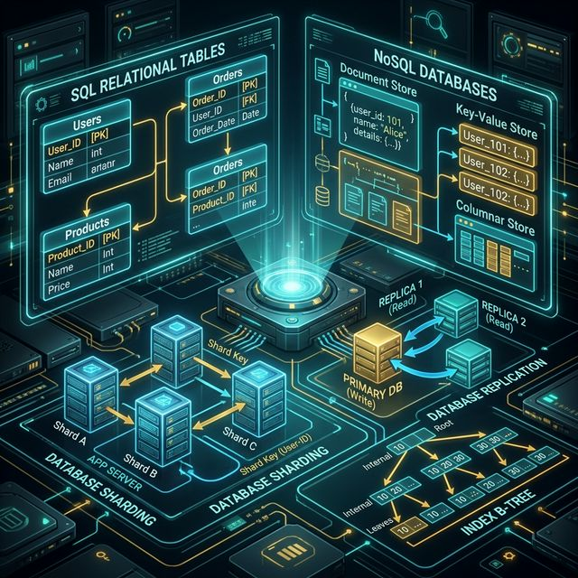
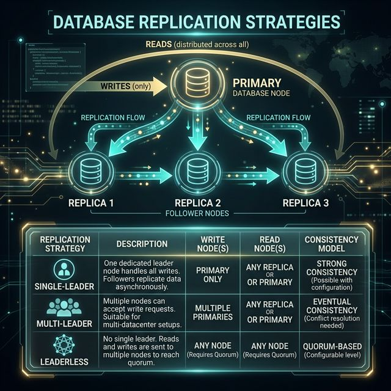

# 02: Databases and Storage

<p align="center">
  
</p>

## 🎯 The Big Goal

> **After this chapter, you'll know when to choose SQL vs NoSQL, how to scale databases with replication and sharding, and how indexes make queries fast.**

The database is the heart of every system. Get this choice wrong and you'll spend years fighting your own infrastructure. Get it right and your data layer becomes invisible — fast, reliable, and scalable.

---

## 1. SQL vs NoSQL — The Fundamental Choice

| Aspect | SQL (Relational) | NoSQL |
| :--- | :--- | :--- |
| **Data Model** | Tables with rows and columns | Documents, key-value, wide-column, graph |
| **Schema** | Fixed schema (ALTER TABLE to change) | Flexible / schema-less |
| **Relationships** | JOINs across tables | Denormalized, embedded data |
| **Transactions** | Full ACID compliance | Usually eventual consistency |
| **Scaling** | Primarily vertical | Designed for horizontal |
| **Query Language** | SQL (standardized) | Database-specific APIs |
| **Examples** | PostgreSQL, MySQL, Oracle | MongoDB, Cassandra, Redis, DynamoDB |

### When to Use SQL:
- Complex queries with JOINs
- Transactions are critical (banking, e-commerce)
- Data has clear relationships
- Data integrity > flexibility

### When to Use NoSQL:
- Massive write throughput
- Flexible, evolving data models
- Horizontal scaling is essential
- Low-latency reads at scale

---

## 2. NoSQL Database Types

```
┌────────────────┬───────────────────┬──────────────────┬────────────────┐
│  Key-Value     │  Document Store   │  Wide-Column     │  Graph         │
├────────────────┼───────────────────┼──────────────────┼────────────────┤
│ Redis          │ MongoDB           │ Cassandra        │ Neo4j          │
│ DynamoDB       │ CouchDB           │ HBase            │ Amazon Neptune │
│ Memcached      │ Firestore         │ ScyllaDB         │ ArangoDB       │
├────────────────┼───────────────────┼──────────────────┼────────────────┤
│ Session cache  │ Content mgmt      │ Time-series      │ Social graphs  │
│ Shopping cart  │ User profiles     │ IoT data         │ Recommendations│
│ Leaderboards   │ Product catalogs  │ Message logs     │ Fraud detection│
└────────────────┴───────────────────┴──────────────────┴────────────────┘
```

---

## 3. ACID Properties

Every transactional database guarantees these four properties:

| Property | Meaning | Example |
| :--- | :--- | :--- |
| **Atomicity** | All operations succeed or all fail | Bank transfer: debit AND credit, or neither |
| **Consistency** | Data always moves from one valid state to another | Balance can never go negative |
| **Isolation** | Concurrent transactions don't interfere | Two users buying the last item |
| **Durability** | Once committed, data survives crashes | Write to disk, not just memory |

---

## 4. Database Indexing

An index is a data structure that speeds up reads at the cost of slower writes:

```
WITHOUT INDEX:       Scan every row → O(n)
WITH B-TREE INDEX:   Binary search → O(log n)

Table: users (10 million rows)
Query: SELECT * FROM users WHERE email = 'alice@example.com'

Without index:  Full table scan → ~5 seconds
With index:     B-Tree lookup → ~5 milliseconds
                                  (1000x faster!)
```

### Index Types:
| Type | Best For | How It Works |
| :--- | :--- | :--- |
| **B-Tree** | Range queries, sorting | Balanced tree with sorted keys |
| **Hash** | Exact matches (=) | Hash function maps key to location |
| **Full-Text** | Text search | Inverted index of words |
| **Composite** | Multi-column queries | Index on (col_a, col_b) |

> ⚠️ **Trade-off:** Every index slows down INSERT/UPDATE/DELETE because the index must also be updated. Don't index everything.

---

## 5. Database Replication

Replication copies data across multiple servers for **availability and read performance**:

<p align="center">
  
</p>

| Strategy | Writes | Reads | Consistency |
| :--- | :--- | :--- | :--- |
| **Single-Leader** | One primary | Any replica | Strong (if synchronous) |
| **Multi-Leader** | Multiple primaries | Any node | Eventual |
| **Leaderless** | Any node | Any node | Quorum-based |

---

## 6. Database Sharding

Sharding splits data across multiple databases, each holding a **subset** of the data:

```
┌────────────────────────────┐
│    SHARD KEY: user_id      │
├────────────┬───────────────┤
│ Shard A    │ user_id 1-1M  │ ──── DB Server 1
│ Shard B    │ user_id 1M-2M │ ──── DB Server 2
│ Shard C    │ user_id 2M-3M │ ──── DB Server 3
└────────────┴───────────────┘
```

### Sharding Strategies:
| Strategy | How | Pro | Con |
| :--- | :--- | :--- | :--- |
| **Range-based** | Shard by ID range | Simple | Hot spots if ranges are uneven |
| **Hash-based** | Hash(key) % N | Even distribution | Hard to do range queries |
| **Directory-based** | Lookup table maps key → shard | Flexible | Lookup table is a bottleneck |

> 💡 **Pro Tip:** Avoid sharding as long as possible. It adds enormous complexity (cross-shard JOINs, rebalancing, transactions). Try read replicas and caching first.

---

## 🤔 Reflection Questions

1. **You're designing a new e-commerce platform.** The product catalog has complex relationships (categories, variants, reviews), but the shopping cart needs blazing-fast reads. Would you use one database or two? What happens when they need to share data?

2. **"Just add an index on every column and queries will be fast."** Why is this advice dangerous? Think about what happens during a Black Friday sale with millions of writes per second.

3. **Your database has 500 million rows and queries are slow.** How would you decide between adding read replicas vs. sharding? What questions would you ask about the workload before choosing?

4. **A NoSQL database promises infinite scalability and flexible schemas.** But six months later, your team is writing complex application-level JOINs. What went wrong in the original decision, and how would you avoid this trap?

5. **Single-leader replication means all writes go through one node.** What happens when that node is in Virginia but most of your users are in Tokyo? How does this architectural constraint influence the rest of your system design?

---

## 📝 Key Interview Talking Points

- Start with SQL unless you have a specific reason for NoSQL
- Indexes are your first tool for query optimization
- Replication solves read scaling; sharding solves write scaling
- Always mention the CAP theorem trade-offs when discussing distributed databases

---

[<< Previous: Scalability](./01_Scalability_Fundamentals.md) | [Home: Curriculum Map](./README.md) | [Next: Caching Strategies >>](./03_Caching_Strategies.md)
