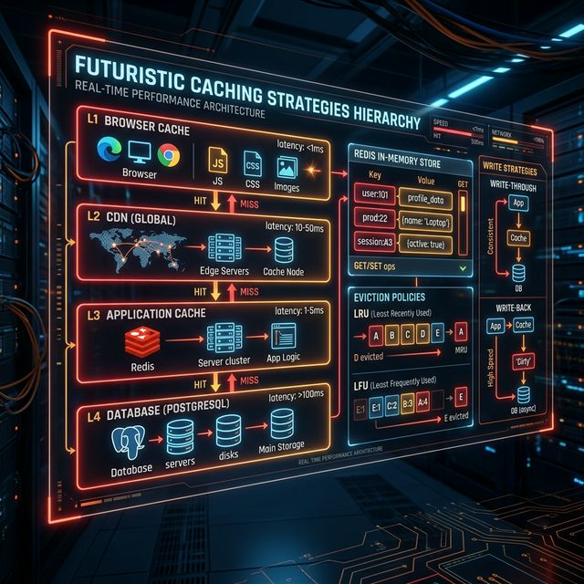
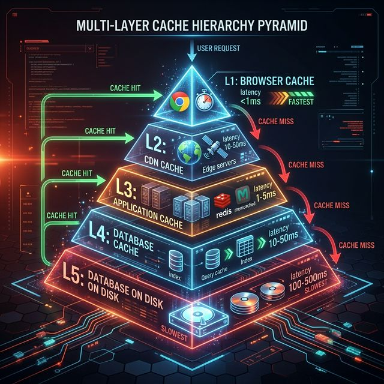

# 03: Caching Strategies

<p align="center">
  
</p>

## 🎯 The Big Goal

> **After this chapter, you'll understand the five major caching strategies, when to use each one, and how caching reduces latency from hundreds of milliseconds to under a millisecond.**

Caching is the single most impactful performance optimization in system design. It stores frequently accessed data in fast, temporary storage — trading a small amount of memory for massive speed gains.

---

## 1. Why Cache?

```
Database query:     100-500ms
Redis cache hit:    1-5ms
Local memory:       <0.1ms
                    ─────────────────
                    100x to 1000x faster!
```

---

## 2. The Cache Hierarchy

<p align="center">
  
</p>

---

## 3. The Five Caching Strategies

### Strategy 1: Cache-Aside (Lazy Loading)

```
Read:   App checks cache → Miss? → Query DB → Store in cache → Return
Write:  App writes to DB → Invalidate cache
```

| Pros | Cons |
| :--- | :--- |
| Only requested data is cached | First request is always slow (cache miss) |
| Cache failure doesn't break the system | Data can become stale |

> 🏢 **Used by:** Most web applications, social media feeds

### Strategy 2: Read-Through Cache

```
Read:   App checks cache → Miss? → Cache queries DB itself → Returns data
```

| Pros | Cons |
| :--- | :--- |
| Simpler app code (cache handles DB reads) | Cache library must support DB integration |
| Consistent read path | Same staleness issue |

### Strategy 3: Write-Through Cache

```
Write:  App writes to cache → Cache writes to DB → Confirm
Read:   Always served from cache (always fresh)
```

| Pros | Cons |
| :--- | :--- |
| Cache is always consistent | Higher write latency (2 writes) |
| No stale data | Caches data that may never be read |

### Strategy 4: Write-Back (Write-Behind)

```
Write:  App writes to cache → Acknowledge immediately → Cache writes to DB later (async)
```

| Pros | Cons |
| :--- | :--- |
| Fastest writes (async) | Risk of data loss if cache crashes |
| Batches DB writes | Complexity of async write handling |

### Strategy 5: Write-Around

```
Write:  App writes to DB directly → Cache is NOT updated
Read:   Cache-aside pattern (DB on miss)
```

| Pros | Cons |
| :--- | :--- |
| Good for infrequently read data | First read after write is slow |
| Avoids filling cache with write-heavy data | |

---

## 4. Cache Eviction Policies

When the cache is full, which item gets removed?

| Policy | How It Works | Best For |
| :--- | :--- | :--- |
| **LRU** (Least Recently Used) | Evict the item accessed longest ago | General purpose (most common) |
| **LFU** (Least Frequently Used) | Evict the item accessed fewest times | Stable popularity patterns |
| **FIFO** (First In, First Out) | Evict the oldest item | Simple, time-based expiry |
| **TTL** (Time-to-Live) | Evict after a fixed time | Data with known freshness |
| **Random** | Evict a random item | Surprisingly effective! |

---

## 5. Cache Invalidation — The Hardest Problem

> *"There are only two hard things in Computer Science: cache invalidation and naming things."* — Phil Karlton

| Approach | How | Trade-off |
| :--- | :--- | :--- |
| **TTL-based** | Data expires after N seconds | Simple, but stale for up to TTL |
| **Event-driven** | DB change triggers cache invalidation | Fresh, but complex |
| **Write-through** | Every write updates cache | No stale data, but slower writes |
| **Manual** | Application explicitly deletes cache keys | Maximum control, error-prone |

---

## 6. Redis — The Universal Cache

Redis is an in-memory data structure store used as cache, message broker, and more:

| Feature | Description |
| :--- | :--- |
| **Data Structures** | Strings, hashes, lists, sets, sorted sets, streams |
| **Persistence** | RDB snapshots + AOF (append-only file) |
| **Replication** | Master-replica architecture |
| **Cluster Mode** | Automatic sharding across nodes |
| **TTL** | Built-in key expiration |
| **Pub/Sub** | Real-time messaging |

---

## 🤔 Reflection Questions

1. **A user updates their profile picture, but their friends still see the old one for 5 minutes.** Which caching strategy caused this? How would you redesign the cache invalidation to make the update appear instantly without sacrificing read performance?
<details>
<summary>💡 View Answer</summary>

This is caused by a **Cache-Aside strategy with a TTL** — the database was updated, but the cache still holds the stale entry until the TTL expires. To fix it, implement **Write-Through** or explicit **cache invalidation on write**: when the profile picture is updated in the database, the backend immediately deletes or overwrites the corresponding cache key. This guarantees the next read fetches fresh data from the database and re-populates the cache, with no stale window.
</details>

2. **Your Redis cache holds 10 million keys and just ran out of memory.** You need to choose an eviction policy. How would you decide between LRU and LFU? What data about your access patterns would change your answer?
<details>
<summary>💡 View Answer</summary>

Choose **LRU (Least Recently Used)** if your access pattern has strong temporal locality — recent items are re-accessed soon (e.g., trending news articles). Choose **LFU (Least Frequently Used)** if some items are consistently popular over time regardless of recency (e.g., a popular product page that's always viewed). Analyze your cache hit/miss logs: if items older than 1 hour are rarely accessed, LRU wins. If some old items have consistently high access counts, LFU preserves them better.
</details>

3. **Write-back caching offers the fastest writes, but what if the cache crashes before flushing to the database?** How would you design a system that gets the speed benefits of write-back without risking data loss? Is this even possible?
<details>
<summary>💡 View Answer</summary>

Pure write-back caching risks data loss because uncommitted writes exist only in volatile memory. To mitigate this, use a **Write-Ahead Log (WAL)** alongside the cache: every write is first appended to a persistent log on disk before being acknowledged. If the cache crashes, the WAL is replayed to recover lost writes. This is exactly the pattern Kafka uses (as described in *Kafka: The Definitive Guide*) and what databases use internally. You trade some write latency (the WAL append) for durability, but it's still far faster than writing to the main database synchronously.
</details>

4. **Your system uses cache-aside, and a cache stampede just took down your database** — hundreds of servers simultaneously got a cache miss and hammered the DB. What mechanisms would you put in place to prevent this from happening again?
<details>
<summary>💡 View Answer</summary>

Three key mechanisms prevent cache stampedes: 1) **Locking/Singleflight**: when a cache miss occurs, only one thread is allowed to fetch from the database; all others wait for that result. 2) **Pre-warming**: proactively populate the cache before the TTL expires using a background job, so keys never expire under load. 3) **Stale-While-Revalidate**: serve the slightly expired cached value immediately while asynchronously refreshing it in the background. As Alex Xu describes, this pattern is critical for any system handling bursty traffic.
</details>

5. **"We should cache everything to make the system fast."** Why might caching make your system *harder* to reason about and debug? Think about the hidden costs of maintaining cache consistency across multiple services.
<details>
<summary>💡 View Answer</summary>

Caching introduces a **second source of truth** that can diverge from the database, making bugs extremely hard to reproduce — a developer might not see the same data a user sees because the cache state differs. In microservices, if Service A and Service B both cache the same entity, invalidating one cache doesn't invalidate the other, leading to inconsistent views. As *Designing Data-Intensive Applications* emphasizes, cache invalidation is one of the two hardest problems in computer science. Every cache layer adds operational complexity: monitoring hit rates, debugging stale data, handling cold starts, and coordinating invalidation across services.
</details>

---

## 📝 Key Interview Talking Points

- Always mention **cache-aside** as the default strategy
- Discuss **cache invalidation** — interviewers love this topic
- Choose eviction policy based on access pattern: LRU for general, LFU for stable popularity
- Redis vs Memcached: Redis has more data structures; Memcached is simpler and faster for pure key-value

---

[<< Previous: Databases](./02_Databases_and_Storage.md) | [Home: Curriculum Map](./README.md) | [Next: Networking & Protocols >>](./04_Networking_and_Protocols.md)
