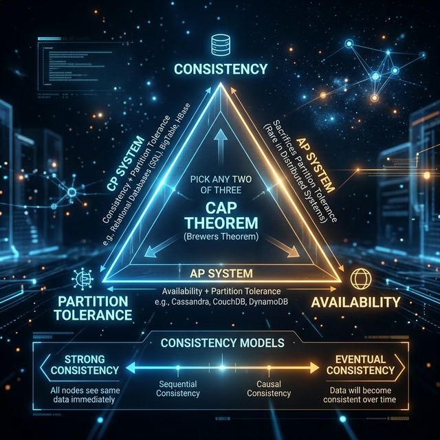
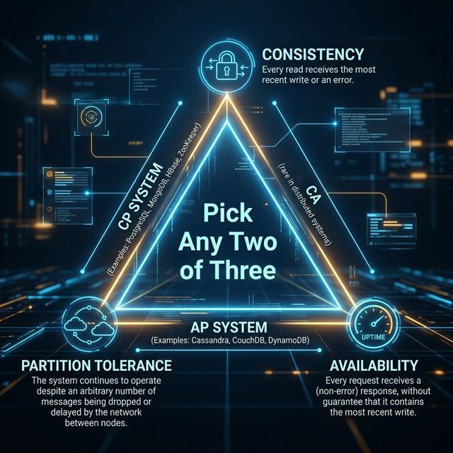

# 05: CAP Theorem & Consistency Models

<p align="center">
  
</p>

## 🎯 The Big Goal

> **After this chapter, you'll understand why distributed systems must make trade-offs between consistency, availability, and partition tolerance — and how to choose the right balance for your use case.**

---

## 1. The CAP Theorem

In any distributed system, you can only guarantee **two out of three** properties:

<p align="center">
  
</p>

| Property | Definition | Example |
| :--- | :--- | :--- |
| **Consistency (C)** | Every read receives the most recent write | All nodes see the same data simultaneously |
| **Availability (A)** | Every request receives a response (even if stale) | System never refuses to answer |
| **Partition Tolerance (P)** | System works despite network failures between nodes | Messages between nodes can be lost/delayed |

> ⚠️ **Critical Point:** Network partitions are **inevitable** in distributed systems. So you're really choosing between **CP** (consistency) and **AP** (availability).

---

## 2. CP vs AP Systems

| System Type | Guarantees | Sacrifices | Examples |
| :--- | :--- | :--- | :--- |
| **CP** | Consistency + Partition Tolerance | Availability (rejects requests during partition) | PostgreSQL, MongoDB, HBase, ZooKeeper |
| **AP** | Availability + Partition Tolerance | Consistency (may serve stale data) | Cassandra, DynamoDB, CouchDB |

### When to Choose CP:
- Financial transactions (bank transfers)
- Inventory management (don't oversell)
- User credentials (authentication must be correct)

### When to Choose AP:
- Social media feeds (slight delay is OK)
- Shopping cart (merge conflicts later)
- Analytics dashboards (stale data is acceptable)

---

## 3. Consistency Models — The Spectrum

```
STRONGEST ◄──────────────────────────────────────► WEAKEST

Linearizable → Sequential → Causal → Eventual
   │                                      │
   │ All see same data                    │ Data converges
   │ at the same time                     │ eventually
   │                                      │
   └── Bank account balance               └── DNS propagation
       Ticket booking                         Social media likes
```

| Model | Guarantee | Latency | Example |
| :--- | :--- | :--- | :--- |
| **Linearizability** | Reads always return the latest write | High | Distributed locks, leader election |
| **Sequential** | All see operations in same order | Medium | Multi-player games |
| **Causal** | Cause-effect ordering preserved | Low-Medium | Chat messages (reply after original) |
| **Eventual** | All replicas converge given enough time | Low | DNS updates, shopping cart |

---

## 4. ACID vs BASE

| ACID (SQL) | BASE (NoSQL) |
| :--- | :--- |
| **A**tomicity | **B**asically **A**vailable |
| **C**onsistency | **S**oft state |
| **I**solation | **E**ventual consistency |
| **D**urability | |
| Strong guarantees, slower | Weak guarantees, faster |
| PostgreSQL, MySQL | Cassandra, DynamoDB |

---

## 5. Conflict Resolution Strategies

When eventual consistency leads to conflicts:

| Strategy | How | Used By |
| :--- | :--- | :--- |
| **Last Write Wins (LWW)** | Most recent timestamp wins | Cassandra |
| **Version Vectors** | Track causal history, merge | DynamoDB |
| **CRDTs** | Conflict-free data structures | Riak, Redis |
| **Application-level** | App decides how to merge | Shopping carts |

---

## 📝 Key Interview Talking Points

- Network partitions are unavoidable — the real choice is CP vs AP
- **Default to eventual consistency** unless you have a strong reason for linearizability
- Banking = CP (correctness is critical). Social media = AP (availability is king)
- Know the consistency spectrum and be able to pick the right model for each component

---

[<< Previous: Networking](./04_Networking_and_Protocols.md) | [Home: Curriculum Map](./README.md) | [Next: Replication & Partitioning >>](./06_Replication_and_Partitioning.md)
