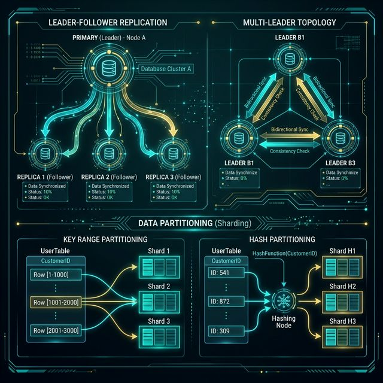
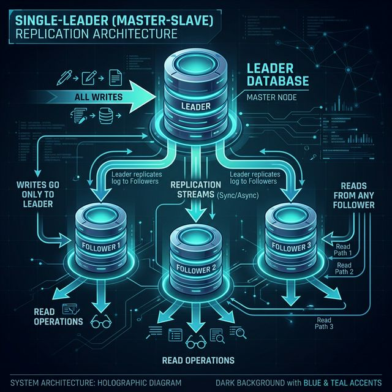
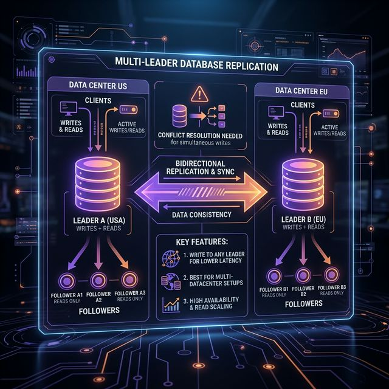

# 06: Replication & Partitioning

<p align="center">
  
</p>

## 🎯 The Big Goal

> **After this chapter, you'll understand how distributed databases replicate data for fault tolerance and partition data for scalability — and the trade-offs in each approach.**

---

## 1. Why Replicate?

| Goal | How Replication Helps |
| :--- | :--- |
| **High Availability** | If one node fails, replicas continue serving |
| **Read Scalability** | Distribute reads across replicas |
| **Geographic Proximity** | Replicas near users reduce latency |

---

## 2. Replication Strategies

### Single-Leader (Master-Slave)

<p align="center">
  
</p>

| Aspect | Detail |
| :--- | :--- |
| **Writes** | Only to leader |
| **Reads** | From any follower |
| **Consistency** | Synchronous = strong, Async = eventual |
| **Failover** | Promote a follower to leader |
| **Used by** | PostgreSQL, MySQL, MongoDB |

### Multi-Leader

<p align="center">
  
</p>

| Pros | Cons |
| :--- | :--- |
| Write to any leader (lower latency) | Write conflicts are complex |
| Better for multi-datacenter | Conflict resolution needed |

### Leaderless (Dynamo-style)

```
  Client writes to N nodes simultaneously
  Read from R nodes, take the most recent
  W + R > N ensures overlap (quorum)
```

| Parameter | Meaning |
| :--- | :--- |
| **N** | Number of replicas |
| **W** | Write quorum (nodes that must confirm) |
| **R** | Read quorum (nodes to read from) |

> 💡 **Example:** N=3, W=2, R=2 → At least 1 node has latest data in every read.

---

## 3. Synchronous vs Asynchronous Replication

| Type | Behavior | Trade-off |
| :--- | :--- | :--- |
| **Synchronous** | Leader waits for follower confirmation | Strong consistency, higher latency |
| **Asynchronous** | Leader confirms immediately, replicates later | Low latency, risk of data loss |
| **Semi-synchronous** | 1 follower sync, rest async | Balance of both |

---

## 4. Partitioning (Sharding)

When data is too large for one server, split it across multiple:

<p align="center">
  
</p>

### Partitioning Strategies:

| Strategy | How | Pros | Cons |
| :--- | :--- | :--- | :--- |
| **Range** | By key range (A-H, I-P) | Range queries work | Hot spots possible |
| **Hash** | hash(key) % N | Even distribution | No range queries |
| **Directory** | Lookup table | Flexible | Lookup = bottleneck |
| **Consistent Hashing** | Hash ring | Minimal redistribution | Complex implementation |

### Consistent Hashing

<p align="center">
  
</p>

When a node is added/removed, only **K/N keys** need to move (K = total keys, N = nodes).

---

## 5. Rebalancing

When adding/removing nodes, data must be redistributed:

| Strategy | Disruption | Used By |
| :--- | :--- | :--- |
| **Fixed partitions** | Reassign whole partitions to new node | Riak, Elasticsearch |
| **Dynamic partitions** | Split/merge as data grows | HBase, MongoDB |
| **Consistent hashing** | Minimal key movement | DynamoDB, Cassandra |

---

## 🤔 Reflection Questions

1. **Your application uses asynchronous replication for performance, but a leader node crashes before replicating the latest writes.** Those writes are lost forever. How would you design a system that balances write speed with durability guarantees?
<details>
<summary>💡 View Answer</summary>

Use **semi-synchronous replication**: the leader waits for at least *one* follower to acknowledge the write before responding to the client, while the remaining followers replicate asynchronously. This guarantees that if the leader crashes, at least one other node has the latest data. As Kleppmann describes in DDIA Chapter 5, this approach balances the speed of async replication with the durability guarantee that data exists on more than one node. For critical data, you can also use the `acks=all` setting in Kafka to ensure all in-sync replicas confirm.
</details>

2. **You're sharding by user ID, but a single celebrity account generates 100x more traffic than average users.** How does this "hot partition" problem affect your system? What partitioning strategies would you use to mitigate it?
<details>
<summary>💡 View Answer</summary>

A hot partition overwhelms a single node's CPU, memory, and disk I/O while other shards sit idle — defeating the purpose of sharding entirely. Mitigation strategies: 1) **Key salting**: append a random suffix to the celebrity's user ID (e.g., `celebrity_1`, `celebrity_2`, ..., `celebrity_10`) to spread their data across 10 shards. Reads must fan out and merge results. 2) **Dedicated shard**: route known hot keys to a higher-capacity node specifically provisioned for them. 3) **Aggressive caching**: cache the celebrity's data in Redis so reads never hit the shard. As Alex Xu notes, Instagram handles this by caching celebrity feeds entirely in memory.
</details>

3. **Consistent hashing minimizes data movement when nodes join or leave.** But what happens when all the data for a popular key happens to land on the weakest node? How do virtual nodes solve this, and what trade-offs do they introduce?
<details>
<summary>💡 View Answer</summary>

In basic consistent hashing, each physical node owns one arc of the hash ring, leading to uneven distribution if nodes are placed poorly. **Virtual nodes** solve this by assigning each physical node 100–200 positions on the ring. This statistically guarantees even data distribution regardless of hash placement. The trade-off is increased metadata: the routing table grows proportionally with virtual nodes, and rebalancing now involves transferring data from many small ranges rather than one large one. As described in DDIA, DynamoDB and Cassandra both use virtual nodes as their default partitioning strategy.
</details>

4. **Your multi-leader replication setup has two leaders in different data centers that both accept a write to the same row at the same time.** How do you decide which write "wins"? Is Last-Write-Wins always safe? What data could you lose?
<details>
<summary>💡 View Answer</summary>

**Last-Write-Wins (LWW)** uses timestamps to pick the "latest" write, but as Kleppmann warns in DDIA, clock skew between data centers means the "latest" timestamp might not reflect the actual causal order. You can silently lose writes that were logically later but had an earlier timestamp. LWW is only safe for data where losing a concurrent write is acceptable (e.g., a user's last-seen timestamp). For critical data, use **version vectors** or **CRDTs** that track causality and merge concurrent writes instead of discarding one. Multi-leader replication fundamentally trades consistency for availability — you must design your conflict resolution strategy before deploying it.
</details>

5. **Adding a new shard to a hash-based partition scheme requires rehashing all keys.** During rebalancing, what happens to reads and writes? How would you design a zero-downtime rebalancing process?
<details>
<summary>💡 View Answer</summary>

During naive rehashing (key % N → key % N+1), nearly every key maps to a different shard, requiring massive data migration during which reads may return stale data and writes may target the wrong shard. For zero-downtime rebalancing: 1) Use **consistent hashing** so only keys adjacent to the new node must move (~1/N of total data). 2) Implement **double-read**: during migration, if a key is not found on the new shard, fall back to the old shard. 3) Use a background migration process that copies data incrementally while the system remains live. Kafka uses a similar approach with its partition reassignment tool, which transfers data between brokers without stopping producers or consumers.
</details>

---

## 📝 Key Interview Talking Points

- Replication = copies of same data → fault tolerance and read scaling
- Partitioning = different data on different nodes → write scaling
- Single-leader is the default; multi-leader only for multi-datacenter
- Consistent hashing minimizes data movement when the cluster changes

---

[<< Previous: CAP Theorem](./05_CAP_Theorem_Consistency.md) | [Home: Curriculum Map](./README.md) | [Next: Transactions & Concurrency >>](./07_Transactions_and_Concurrency.md)
