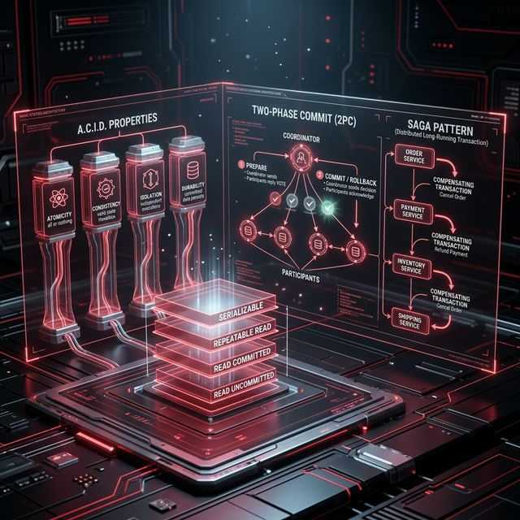
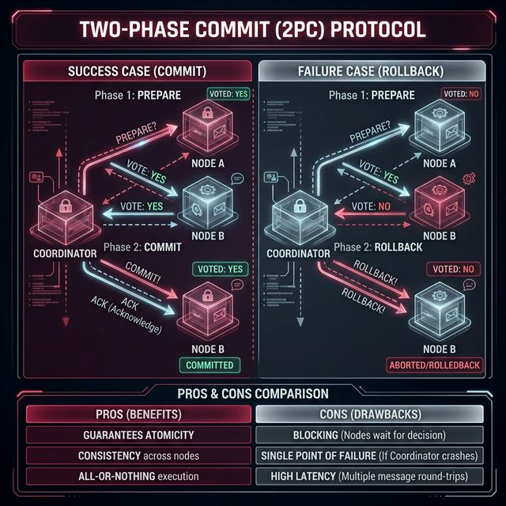

# 07: Transactions & Concurrency

<p align="center">
  
</p>

## 🎯 The Big Goal

> **After this chapter, you'll understand how databases ensure correctness when multiple operations happen simultaneously — isolation levels, distributed transactions, and the Saga pattern.**

---

## 1. Why Transactions Matter

Without transactions, concurrent operations can corrupt data:

```
PROBLEM: Two users buy the last item simultaneously

Thread A: reads stock = 1     ──→ stock > 0? YES ──→ stock = stock - 1 = 0 ✅
Thread B: reads stock = 1     ──→ stock > 0? YES ──→ stock = stock - 1 = 0 ⛔ OVERSOLD!
```

A transaction wraps multiple operations into an atomic unit: **all succeed or all fail.**

---

## 2. Isolation Levels

| Level | Dirty Read | Non-Repeatable Read | Phantom Read | Performance |
| :--- | :--- | :--- | :--- | :--- |
| **Read Uncommitted** | ⛔ Possible | ⛔ Possible | ⛔ Possible | Fastest |
| **Read Committed** | ✅ Prevented | ⛔ Possible | ⛔ Possible | Fast |
| **Repeatable Read** | ✅ Prevented | ✅ Prevented | ⛔ Possible | Medium |
| **Serializable** | ✅ Prevented | ✅ Prevented | ✅ Prevented | Slowest |

### Anomalies Explained:
- **Dirty Read:** Reading data written by an uncommitted transaction
- **Non-Repeatable Read:** Same query returns different results within one transaction
- **Phantom Read:** New rows appear between two identical queries

> 🏢 **PostgreSQL default:** Read Committed. **MySQL InnoDB default:** Repeatable Read.

---

## 3. Distributed Transactions: Two-Phase Commit (2PC)

<p align="center">
  
</p>

| Pros | Cons |
| :--- | :--- |
| Guarantees atomicity across nodes | Blocking (all nodes wait) |
| Consistent outcome | Coordinator is single point of failure |
| | High latency (2 round trips) |

---

## 4. The Saga Pattern

For long-running transactions across microservices, use **Sagas** instead of 2PC:

```
Order     →    Payment    →    Inventory    →    Shipping
Service        Service         Service           Service
  │               │                │                │
  │  Create       │  Charge        │  Reserve       │  Ship
  │  Order        │  Card          │  Stock         │  Item
  │               │                │                │
  │  ◄── If any step fails, run COMPENSATING transactions ──►
  │               │                │                │
  │  Cancel       │  Refund        │  Release       │  Cancel
  │  Order        │  Card          │  Stock         │  Shipment
```

### Saga Types:

| Type | Coordination | Pros | Cons |
| :--- | :--- | :--- | :--- |
| **Choreography** | Each service triggers the next via events | Simple, decoupled | Hard to track |
| **Orchestration** | Central orchestrator directs steps | Clear flow, easy to debug | Orchestrator = bottleneck |

---

## 5. Optimistic vs Pessimistic Locking

| Strategy | How | Best For |
| :--- | :--- | :--- |
| **Pessimistic** | Lock the data before modifying | High-contention (many writers) |
| **Optimistic** | Check for conflicts at commit time | Low-contention (mostly reads) |

```
PESSIMISTIC:  Lock row → Read → Modify → Commit → Unlock
              (Others wait during entire operation)

OPTIMISTIC:   Read (version=1) → Modify → Commit IF version still = 1
              (If version changed → retry)
```

---

## 🤔 Reflection Questions

1. **Your e-commerce system uses Serializable isolation for all transactions but Black Friday traffic causes massive lock contention and timeouts.** Could you safely lower the isolation level? Which anomalies would you accept, and which are catastrophic for an order system?
<details>
<summary>💡 View Answer</summary>

Yes, lower to **Read Committed** or **Repeatable Read**. At Read Committed, you accept non-repeatable reads (a product price might change between two reads in the same transaction) — this is fine for browsing. The anomaly you absolutely cannot accept is a **Lost Update**: two customers simultaneously buying the last item and both succeeding. Prevent this with **optimistic locking** (version columns) even at lower isolation levels. As DDIA Chapter 7 explains, Serializable isolation uses either actual serial execution, 2PL (two-phase locking), or serializable snapshot isolation — all of which devastate throughput under high contention.
</details>

2. **A Saga's "Refund Card" compensating transaction fails — the payment gateway is down.** Now you have a charged customer, a cancelled order, and a stuck saga. How would you design a system that handles compensating transaction failures gracefully?
<details>
<summary>💡 View Answer</summary>

The saga orchestrator must implement **persistent retry with exponential backoff**. The failed compensating action is stored in a durable outbox/retry table. A background scheduler retries the refund every 30s, then 1m, then 5m, with a maximum retry count. If all retries are exhausted, the saga enters a **"requires human intervention"** state and alerts the operations team via PagerDuty. As *Software Architecture: The Hard Parts* (Neal Ford) explains, compensating transactions must be designed to be **idempotent** — retrying a refund that already succeeded must not refund twice.
</details>

3. **Two-Phase Commit guarantees atomicity, but the coordinator is a single point of failure.** What happens if the coordinator crashes *after* sending PREPARE but *before* sending COMMIT? How do participants know whether to commit or abort?
<details>
<summary>💡 View Answer</summary>

This is the fundamental flaw of 2PC: if the coordinator crashes between PREPARE and COMMIT, all participants are **stuck holding locks indefinitely** (called the "in-doubt" state) because they don't know the final decision. They cannot unilaterally abort (another participant might have committed) or commit (the coordinator might have decided to abort). The participants must wait for the coordinator to recover. This is why DDIA strongly advises against 2PC in modern distributed systems — it's a blocking protocol. Modern systems use Sagas or consensus-based approaches (like Kafka transactions in KRaft mode) instead.
</details>

4. **Your team uses optimistic locking because "most of our workload is reads."** But during a flash sale, hundreds of users try to purchase the same item simultaneously. How does optimistic locking behave under sudden contention, and when should you switch strategies?
<details>
<summary>💡 View Answer</summary>

Under high contention, optimistic locking causes **massive retry storms**. Every concurrent write reads the same version number, but only one succeeds — the other 99 get a version conflict, must re-read, and retry. This creates wasted work proportional to the square of concurrent writers. Switch to **pessimistic locking** (SELECT FOR UPDATE) for known hot items during flash sales, or use a **queue-based approach**: serialize purchase requests through a message queue so they're processed one at a time, eliminating contention entirely. The pattern should be chosen per-operation, not globally.
</details>

5. **A choreography-based Saga has 8 steps, and debugging which step failed is nearly impossible.** At what point of complexity should you switch from choreography to orchestration? What are the architectural implications of that switch?
<details>
<summary>💡 View Answer</summary>

Switch to **orchestration** when the saga has more than 3–4 steps, involves conditional branching, or requires complex compensating transactions. As *Building Event-Driven Microservices* (Bellemare) explains, choreography works for simple linear flows where each service publishes an event and the next service reacts. Beyond that, the flow becomes invisible — no single place in the codebase shows the complete business process. Orchestration introduces a central **Saga Coordinator** service that explicitly defines the workflow, making it debuggable, auditable, and testable. The trade-off is that the orchestrator becomes a single point of ownership (not failure — it should be stateless and horizontally scaled).
</details>

---

## 📝 Key Interview Talking Points

- Use **2PC** only within a single database cluster; use **Sagas** across microservices
- **Choreography** Sagas for simple flows; **Orchestration** for complex multi-step processes
- **Optimistic locking** for read-heavy systems; **Pessimistic** for write-heavy
- Always ask: "What happens if this step fails?" — that's where compensating transactions come in

---

[<< Previous: Replication](./06_Replication_and_Partitioning.md) | [Home: Curriculum Map](./README.md) | [Next: Consensus & Coordination >>](./08_Consensus_and_Coordination.md)
