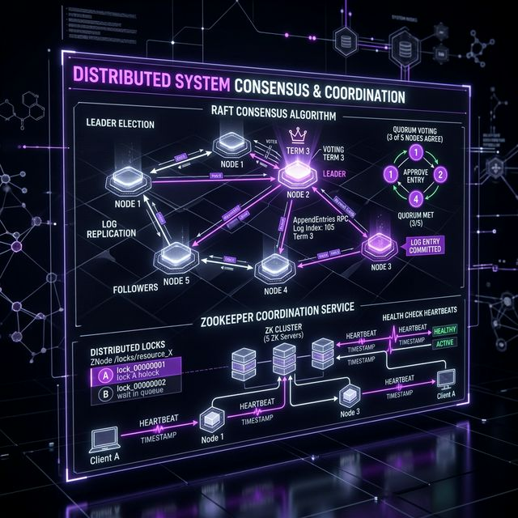

# 08: Consensus & Coordination

<p align="center">
  
</p>

## 🎯 The Big Goal

> **After this chapter, you'll understand how distributed nodes agree on a single truth — leader election, distributed locks, and consensus algorithms like Raft and Paxos.**

---

## 1. The Consensus Problem

In a distributed system, nodes must agree on a value even when some nodes fail or messages are delayed. This is **consensus** — the most fundamental problem in distributed computing.

```
Node 1: "The leader is A"
Node 2: "The leader is A"    ← AGREEMENT ✅
Node 3: "The leader is A"

Node 1: "The leader is A"
Node 2: "The leader is B"    ← SPLIT BRAIN ⛔
Node 3: "The leader is A"
```

---

## 2. Raft Consensus Algorithm

Raft is the most understandable consensus algorithm (designed as a simpler alternative to Paxos):

### Three Roles:
| Role | Responsibility |
| :--- | :--- |
| **Leader** | Handles all client requests, replicates to followers |
| **Follower** | Passively accepts logs from leader |
| **Candidate** | Temporarily during elections |

### Leader Election:
```
1. Followers wait for heartbeats from leader
2. If heartbeat timeout ──→ Follower becomes Candidate
3. Candidate requests votes from all nodes
4. If majority vote YES ──→ Candidate becomes Leader
5. New leader sends heartbeats to prevent new elections
```

### Log Replication:
```
Client ──→ Leader: "set x=5"
Leader ──→ Appends to own log
Leader ──→ Sends AppendEntries to all followers
Followers ──→ Append to their logs, acknowledge
Leader ──→ Once majority acknowledge: COMMIT
Leader ──→ Respond to client: "OK"
```

---

## 3. Quorum — The Majority Rule

A quorum ensures at least one node has the latest data:

```
N = 5 nodes
Quorum = ⌈N/2⌉ + 1 = 3

Write must be confirmed by 3 nodes  ┐
Read must query 3 nodes             ├── Overlap guarantees freshness
                                    ┘
```

| Cluster Size | Quorum | Failures Tolerated |
| :--- | :--- | :--- |
| 3 nodes | 2 | 1 failure |
| 5 nodes | 3 | 2 failures |
| 7 nodes | 4 | 3 failures |

> 💡 **Why odd numbers?** Even clusters (4 nodes, quorum=3) tolerate the same failures as N-1 (3 nodes, quorum=2) but cost more.

---

## 4. Distributed Coordination Services

### ZooKeeper
| Feature | Purpose |
| :--- | :--- |
| **Configuration Management** | Store shared config, automatic updates |
| **Service Discovery** | Register and find services |
| **Distributed Locks** | Coordinate access to shared resources |
| **Leader Election** | Elect a leader among competing nodes |
| **Group Membership** | Track which nodes are alive |

### etcd
- **Used by:** Kubernetes (stores all cluster state)
- **Protocol:** Raft consensus
- **Interface:** HTTP/gRPC API with watch capabilities

---

## 5. Distributed Locks

### Requirements:
1. **Mutual Exclusion:** Only one client holds the lock
2. **Deadlock-Free:** Locks auto-expire (TTL)
3. **Fault-Tolerant:** Works even if some nodes fail

### Redlock Algorithm (Redis):
```
1. Get current time
2. Try to acquire lock on N (e.g., 5) Redis instances
3. Lock acquired if: majority (3/5) succeed AND total time < TTL
4. If failed: release all locks and retry
```

---

## 6. Heartbeats and Failure Detection

```
Node A ──heartbeat──→ Node B (every 1 second)
Node A ──heartbeat──→ Node B
Node A ──heartbeat──→ Node B
Node A ── ✗ ── Node B ?? (missed 3 heartbeats)
Node B: "Node A is DEAD" ──→ trigger failover
```

| Parameter | Effect |
| :--- | :--- |
| Short timeout | Fast detection, more false positives |
| Long timeout | Slow detection, fewer false positives |

---

## 🤔 Reflection Questions

1. **A Raft cluster with 5 nodes loses 3 nodes simultaneously.** The remaining 2 cannot form a quorum. Your entire system is down. Is this a design flaw in Raft, or a reasonable trade-off? How would you protect against this scenario?
<details>
<summary>💡 View Answer</summary>

This is a deliberate trade-off, not a flaw. Raft requires a quorum (N/2 + 1 = 3 out of 5) to prevent **split-brain** — two halves of the cluster independently processing conflicting writes. Without quorum enforcement, you'd get data corruption. Protect against it by distributing nodes across 3+ **independent failure domains** (Availability Zones or regions). With 5 nodes across 3 AZs (2-2-1), losing an entire AZ still leaves 3 nodes alive — enough for quorum. As DDIA explains, consensus algorithms deliberately sacrifice availability under extreme failure in exchange for absolute consistency safety.
</details>

2. **Your distributed lock in Redis expires while the process holding it is still working** (GC pause, slow network). Now two processes think they hold the lock. How does this violate safety, and what does Martin Kleppmann's critique of Redlock teach us?
<details>
<summary>💡 View Answer</summary>

This violates the **mutual exclusion** safety property — the entire point of locking. Two processes now execute the critical section concurrently, potentially corrupting shared data. Kleppmann's critique of Redlock argues that any lock based on wall-clock time is fundamentally unsafe because GC pauses, network delays, and clock skew are unbounded. His solution: use **fencing tokens**. The lock service issues a monotonically increasing token (e.g., 34) with each lock grant. The downstream resource (database) rejects any operation carrying a token older than the highest token it has already seen, ensuring stale lock holders cannot cause damage.
</details>

3. **Heartbeat timeout is set to 1 second.** A brief network congestion causes missed heartbeats, triggering a false failover. The old leader comes back and now you have two leaders (split brain). How would you prevent this, and what is the cost of a longer timeout?
<details>
<summary>💡 View Answer</summary>

Prevent split-brain by ensuring the old leader **steps down automatically** when it cannot communicate with a quorum of followers — it must prove it's still the leader by receiving acknowledgments. Raft handles this via term numbers: if the old leader's term is stale, its writes are rejected. Increasing the timeout (e.g., 5–10 seconds) reduces false failovers but increases **detection latency** — a genuinely crashed leader won't be replaced for 5–10 seconds, during which the system is unavailable for writes. The right timeout is a tuning decision: lower for latency-sensitive systems, higher for stability-sensitive ones.
</details>

4. **ZooKeeper uses consensus internally, but consensus algorithms are complex and slow.** Why not just use a single database to store configuration and leader information? What failure scenarios would make the single-database approach dangerous?
<details>
<summary>💡 View Answer</summary>

A single database is a **single point of failure**. If it crashes, no service can discover its leader, read configuration, or acquire locks — the entire distributed system halts. Even with a standby replica, failover is manual and risky (data might be lost if replication was async). ZooKeeper's consensus (ZAB protocol) ensures that configuration data is replicated to a quorum *before* being acknowledged, guaranteeing that the data survives any minority of node failures automatically. The complexity and latency of consensus is the price you pay for **automated, safe fault tolerance** — the single database approach is simpler but catastrophically fragile.
</details>

5. **Your system needs to elect a leader among 100 nodes across 5 data centers.** How does network latency between data centers affect consensus? Would you run one large Raft group or multiple smaller ones? What are the trade-offs?
<details>
<summary>💡 View Answer</summary>

A single 100-node Raft group across 5 data centers would be extremely slow — every write requires acknowledgment from 51 nodes, including cross-datacenter round-trips of 50–200ms. Instead, use **multiple smaller Raft groups** (e.g., one per data center or per partition). Each group elects its own local leader with fast intra-datacenter consensus. Cross-region coordination uses a higher-level protocol (like Kafka's ISR mechanism). The trade-off: smaller groups are faster but increase operational complexity and require a separate mechanism for global coordination. As *Foundations of Scalable Systems* explains, this is why production systems like CockroachDB use per-range Raft groups rather than a single global one.
</details>

---

## 📝 Key Interview Talking Points

- **Raft** is the go-to consensus algorithm — know the leader election flow
- Always use **odd-numbered** clusters (3, 5, 7)
- ZooKeeper/etcd for coordination; Redis for distributed locks (with caveats)
- Heartbeats detect failures but have an inherent accuracy/speed trade-off

---

[<< Previous: Transactions](./07_Transactions_and_Concurrency.md) | [Home: Curriculum Map](./README.md) | [Next: Message Queues >>](./09_Message_Queues_and_Streaming.md)
