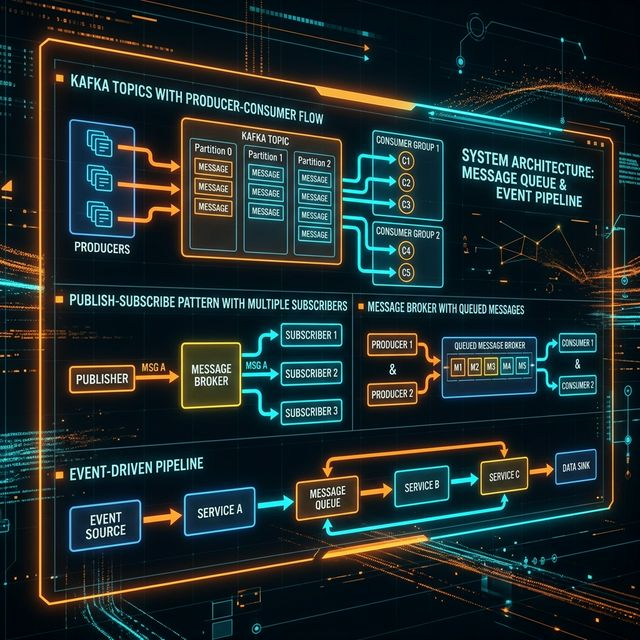
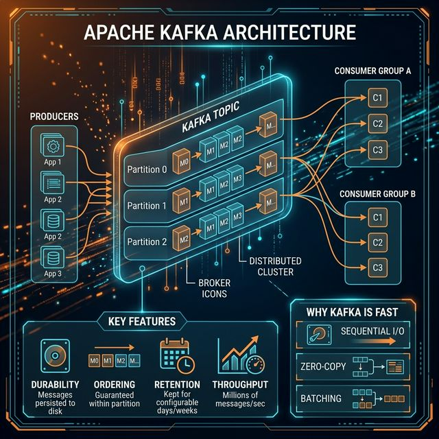

# 09: Message Queues & Streaming

<p align="center">
  
</p>

> 🧠 **The Feynman Hook:** Without message queues, services talk directly to each other like people in a phone chain — if one person is unavailable, the whole chain breaks. Message queues are like post office dropboxes: you drop your letter in the box (it's safe), and the recipient picks it up whenever they're ready — even if they were asleep when you sent it. This decoupling is what makes large-scale distributed systems resilient to individual component failures.

## 🎯 What You'll Learn

> **After this chapter, you'll understand how services communicate asynchronously using message queues and event streaming — and when to use Kafka vs RabbitMQ.**

---

## 1. Why Message Queues?

> **Feynman Insight:** Synchronous service calls are a chain of people holding hands — if one lets go, everyone falls. Queues break that chain: each service drops its output into a mailbox and moves on. Downstream services pick up the mail when they're ready. The system keeps working even when individual services are slow or temporarily down.

```
SYNCHRONOUS (Fragile):
  Order Service ──HTTP──→ Payment Service ──HTTP──→ Inventory Service
  (If Payment is down, the entire chain breaks!)

ASYNCHRONOUS (Resilient):
  Order Service ──msg──→ [QUEUE] ──msg──→ Payment Service
                                  ──msg──→ Inventory Service
  (If Payment is down, messages wait in the queue)
```

| Benefit | Description |
| :--- | :--- |
| **Decoupling** | Services don't need to know about each other |
| **Resilience** | Messages survive service failures |
| **Buffering** | Absorbs traffic spikes |
| **Scalability** | Add more consumers to process faster |

---

## 2. Messaging Patterns

> **Feynman Insight:** Point-to-point is like sending a letter to one specific person — one message, one recipient, and it's gone from the mailbox once delivered. Publish-Subscribe is like publishing a newspaper: one edition, but thousands of subscribers each get their own copy. The publisher doesn't know who the subscribers are — it just publishes, and whoever subscribed gets it.

### Point-to-Point (Queue)
```
Producer ──→ [Queue] ──→ Consumer
                      (one message, one consumer)
```

### Publish-Subscribe (Topic)
```
Publisher ──→ [Topic] ──→ Subscriber A
                     ──→ Subscriber B
                     ──→ Subscriber C
                  (one message, ALL subscribers)
```

---

## 3. Apache Kafka

> **Feynman Insight:** Kafka is like a record player with an immutable vinyl record. Traditional message queues delete messages after delivery (like a cassette tape that self-destructs). Kafka keeps the record permanently. Any number of listeners can play it from any point in time — even a consumer that joined 3 days late can replay from the start. This makes Kafka ideal not just for messaging but for event sourcing, audit logs, and real-time analytics.

Kafka is a distributed event streaming platform, not just a message queue:

<p align="center">
  
</p>

| Feature | Detail |
| :--- | :--- |
| **Durability** | Messages persisted to disk |
| **Ordering** | Guaranteed within a partition |
| **Retention** | Messages kept for days/weeks (not deleted after read) |
| **Throughput** | Millions of messages/sec |
| **Consumer Groups** | Multiple independent consumers read the same data |

### Why is Kafka Fast?
- Sequential disk I/O (faster than random memory access!)
- Zero-copy transfer (kernel sends data directly to network)
- Batching and compression
- Append-only log (no random writes)

---

## 4. RabbitMQ vs Kafka

> **Feynman Insight:** RabbitMQ is like a walkie-talkie — you send a message, someone acknowledges it, and it's done. Kafka is like a broadcast weather service journal that records every bulletin forever. RabbitMQ is perfect when you need task queuing with guaranteed delivery and acknowledgment. Kafka is perfect when multiple consumers need to independently read and replay the same stream of events.

| Feature | RabbitMQ | Kafka |
| :--- | :--- | :--- |
| **Model** | Message broker (queue) | Event streaming (log) |
| **Delivery** | Push to consumers | Consumers pull |
| **Ordering** | Per-queue | Per-partition |
| **Retention** | Delete after consumption | Retain for configurable time |
| **Replay** | ❌ No | ✅ Yes |
| **Throughput** | ~50K msg/sec | ~1M msg/sec |
| **Best For** | Task distribution, RPC | Event sourcing, analytics |

---

## 5. Event-Driven Architecture

> **Feynman Insight:** Event-driven architecture is like a row of dominoes. One event ("User Signed Up") falls, triggering a chain — welcome email, analytics tracking, recommendation initialization — all in parallel, without any service knowing about the others. The trigger (the first domino) doesn’t care who's listening. This creates extraordinarily flexible, loosely coupled systems.

```
  User signs up ──→ [UserCreated Event]
                         │
                    ┌────┴────────┬────────────┐
                    ▼             ▼             ▼
              Email Service  Analytics     Recommendation
              (Send welcome) (Track)       (Initialize)
```

| Pattern | Description |
| :--- | :--- |
| **Event Notification** | Emit events, consumers react |
| **Event-Carried State** | Event includes all data needed |
| **Event Sourcing** | Store events as source of truth, derive state |
| **CQRS** | Separate read and write models |

---

## 🤔 Reflection Questions

1. **Your payment service uses a message queue to decouple order processing, but a message is delivered twice** due to a network retry. The customer is charged twice. How would you design the consumer to be idempotent, and why can't the queue itself guarantee exactly-once delivery?
<details>
<summary>💡 View Answer</summary>

The queue cannot guarantee exactly-once because of the **Two Generals Problem**: it can never know if its ACK was lost or if the consumer truly crashed. So it must redeliver (at-least-once). Make the consumer idempotent by storing each processed `message_id` in an ACID database table. Before processing, check: `SELECT 1 FROM processed WHERE id = ?`. If it exists, silently acknowledge and skip. Kafka achieves exactly-once *within its ecosystem* using idempotent producers (sequence numbers per partition) and transactional APIs, as described in *Kafka: The Definitive Guide*.
</details>

2. **Kafka guarantees ordering within a partition, but your topic has 10 partitions.** A user sends messages A→B→C, and they arrive as B→A→C. How would you ensure strict ordering for a single user's messages while still using multiple partitions for throughput?
<details>
<summary>💡 View Answer</summary>

Set the **partition key** to the user's ID. Kafka hashes the partition key to deterministically route all messages for the same user to the exact same partition. Since ordering is guaranteed within a partition, User A's messages always arrive as A→B→C on that partition. Other users' messages are distributed across different partitions for parallelism. As *Kafka: The Definitive Guide* explains, the partition key is the fundamental mechanism for balancing ordering guarantees with throughput scaling.
</details>

3. **Your team debates: "Should we use RabbitMQ or Kafka?"** The system processes both real-time notifications and daily analytics batches. How would the choice differ for each use case? Could you use both?
<details>
<summary>💡 View Answer</summary>

**RabbitMQ** excels at traditional message queuing: routing, per-message acknowledgment, and immediate deletion after consumption — perfect for real-time notifications where each notification is processed exactly once and discarded. **Kafka** excels at streaming and log retention: messages persist for days/weeks, allowing multiple consumers to replay the same data — perfect for analytics batches that need to reprocess historical data. Yes, you can and often should use both: RabbitMQ for task-queue semantics, Kafka as the durable event backbone. As *Making Sense of Stream Processing* argues, the log-based approach (Kafka) is fundamentally different from the message-broker approach (RabbitMQ) — they solve different problems.
</details>

4. **A dead letter queue (DLQ) contains 50,000 messages that failed processing.** What strategy would you use to investigate, fix, and replay them? How do you prevent the DLQ from becoming a "graveyard" that nobody monitors?
<details>
<summary>💡 View Answer</summary>

First, **classify the failures**: sample messages to identify patterns (malformed data? downstream timeout? schema change?). Fix the root cause in the consumer code. Then **replay** the DLQ messages by re-publishing them to the original topic (ensuring the consumer is now idempotent so replays are safe). To prevent the DLQ from becoming a graveyard: set up **automated alerts** that fire when the DLQ depth exceeds a threshold (e.g., >100 messages). Include DLQ depth in your dashboards alongside normal queue metrics. As *Building Event-Driven Microservices* recommends, treat DLQ monitoring as a first-class operational concern, not an afterthought.
</details>

5. **Event-driven architecture sounds elegant, but debugging is hard** — an event published by Service A triggers Service B, which triggers C, which triggers D. How do you trace the root cause when Service D produces a wrong result? What observability tools would you need?
<details>
<summary>💡 View Answer</summary>

You need **distributed tracing** (OpenTelemetry/Jaeger). Inject a unique `correlation_id` (trace ID) into the first event. Every downstream service propagates this ID through all events and logs. When Service D fails, search by the trace ID to reconstruct the complete causal chain: A→B→C→D. Additionally, implement **event schemas** with versioning (Avro/Protobuf with a Schema Registry) so contract-breaking changes are caught at publish time, not at the confused consumer. As *Flow Architectures* (Urquhart) emphasizes, observability in event-driven systems requires deliberate instrumentation — it does not emerge naturally.
</details>

---

## 📝 Key Interview Talking Points

- Use message queues when services should be **decoupled** and **resilient to failures**
- Kafka for **event streaming** and replay; RabbitMQ for **task queues**
- Event-driven architecture enables loose coupling between microservices
- Always discuss **message ordering guarantees** and **at-least-once vs exactly-once delivery**

---

[<< Previous: Consensus](./08_Consensus_and_Coordination.md) | [Home: Curriculum Map](./README.md) | [Next: API Design >>](./10_API_Design_and_Gateway.md)
