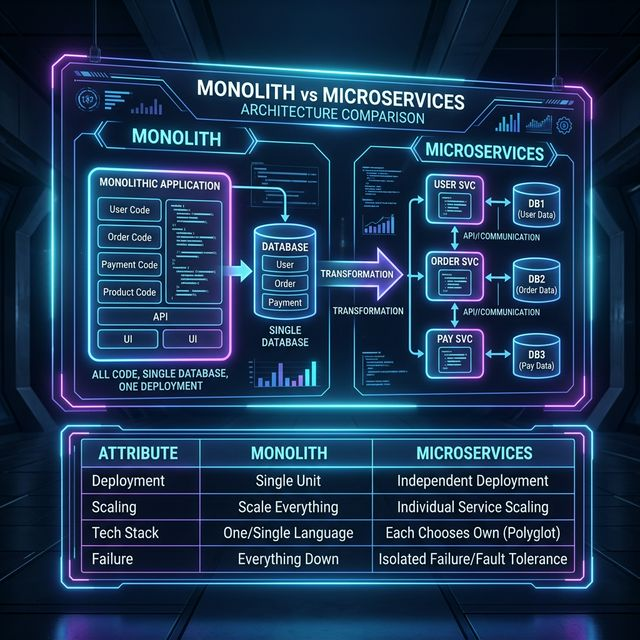

# 11: Microservices Architecture

<p align="center">
  
</p>

> 🧠 **The Feynman Hook:** A monolith is a Swiss Army knife — one tool that does everything, compact and easy to carry. But if the corkscrew breaks, the whole knife is useless. Microservices are a toolkit: each tool is specialized and independent. If the corkscrew breaks, everything else still works. The catch: carrying 12 separate tools requires a bag, organization, and the discipline to keep them all maintained — that overhead is why microservices are only the right choice for teams large enough to manage it.

## 🎯 What You'll Learn

> **After this chapter, you'll understand how to decompose a monolith into microservices, the patterns that make them resilient, and the trade-offs involved.**

---

## 1. Monolith vs Microservices

> **Feynman Insight:** A monolith deploys like a monolithic concrete building — if one room needs renovation, you have to shut the whole building. Microservices are modular buildings with separate foundations: you can renovate the kitchen without touching the bedroom. But connecting 20 separate buildings requires roads, signage, and infrastructure that a single building simply doesn't need.

<p align="center">
  
</p>

| Aspect | Monolith | Microservices |
| :--- | :--- | :--- |
| **Deployment** | One unit | Each service independently |
| **Scaling** | Scale everything | Scale individual services |
| **Tech Stack** | One language/framework | Each service chooses its own |
| **Complexity** | Simple initially | Distributed system complexity |
| **Team** | One team | Independent teams per service |
| **Failure** | Single failure = everything down | Isolated failures |

---

## 2. Service Decomposition Strategies

> **Feynman Insight:** Splitting a monolith is like separating a Swiss Army knife into individual tools. You can split by function (each blade type = one service), by team ownership (each engineer carries their own tool), or gradually (the Strangler Fig: wrap new vines around the old tree until the old tree is replaced without cutting it down).

| Strategy | How | Example |
| :--- | :--- | :--- |
| **By Business Domain** | One service per domain | UserService, OrderService, PaymentService |
| **By Subdomain (DDD)** | Bounded contexts | "Shipping" context separate from "Billing" |
| **Strangler Fig** | Gradually replace monolith pieces | Route new features to microservices |

---

## 3. Resilience Patterns

> **Feynman Insight:** The circuit breaker pattern is named after your home's electrical circuit breaker. When your payment service is overloaded, instead of letting every request pile up and timeout (overloading the wire), the circuit breaker trips: calls immediately "fail fast" (the switch flips open), protecting the overloaded service from further pressure while giving it time to recover.

### Circuit Breaker
```
CLOSED → calls pass through normally
  │ (failures exceed threshold)
  ▼
OPEN → all calls fail immediately (fast-fail)
  │ (timeout expires)
  ▼
HALF-OPEN → allow one test call
  │ (success → CLOSED, failure → OPEN)
```

### Other Patterns:
| Pattern | Purpose |
| :--- | :--- |
| **Retry with Backoff** | Retry failed calls with increasing delay |
| **Timeout** | Don't wait forever for a response |
| **Bulkhead** | Isolate failures to one service pool |
| **Fallback** | Return cached/default data on failure |

---

## 4. Service Communication

> **Feynman Insight:** Imagine a restaurant. Synchronous communication (REST/gRPC) is the waiter standing at the kitchen window waiting for your order. If the kitchen is slow, the waiter is blocked. Asynchronous communication (Message Queue) is the waiter dropping a ticket into the kitchen slot and going to serve other tables. The kitchen processes tickets whenever it's ready, without holding anyone up.

| Pattern | Type | Use Case |
| :--- | :--- | :--- |
| **REST/HTTP** | Synchronous | Simple request-response |
| **gRPC** | Synchronous | High-performance internal calls |
| **Message Queue** | Asynchronous | Decoupled, event-driven |
| **Event Bus** | Asynchronous | Pub/sub notifications |

---

## 5. Service Discovery

> **Feynman Insight:** Service discovery is like a company employee directory. New hires (services) register their desk location (IP/port). When you need to talk to someone, you consult the directory instead of memorising every person's location — because in a large company, people move desks (container restarts) constantly. Without the directory, inter-service communication would require hard-coded IP addresses that break on every deployment.

```
SERVICE REGISTRY (Consul, etcd):
  ┌──────────────────────┐
  │ UserService: 10.0.1.5│
  │ OrderService: 10.0.2.3│
  │ PayService: 10.0.3.7  │
  └──────────────────────┘
       ↑ register     ↓ discover
   [Services]      [API Gateway]
```

---

## 🤔 Reflection Questions

1. **"We should rewrite our monolith as microservices."** Your startup has a team of 5 engineers and 10,000 users. Is this the right move right now? What would you need to see in terms of team size, traffic, and pain points before recommending the migration?
<details>
<summary>💡 View Answer</summary>

No — this is premature. As Sam Newman argues in *Monolith to Microservices*, a startup with 5 engineers and 10K users should focus on product-market fit, not distributed systems complexity. Microservices add operational overhead (CI/CD per service, monitoring, distributed tracing, service discovery) that overwhelms small teams. Migrate when: 1) Team size exceeds ~15 engineers and deployment conflicts become frequent. 2) Specific components need independent scaling (e.g., the image processing service is CPU-heavy while the API is I/O-heavy). 3) Release velocity is bottlenecked by monolithic deployments. Start with a modular monolith — clean domain boundaries that can be extracted later.
</details>

2. **The circuit breaker for your payment service is OPEN, and all payment calls fail-fast.** But some payment providers are still healthy — only one is down. How would you make the circuit breaker more fine-grained without adding unmanageable complexity?
<details>
<summary>💡 View Answer</summary>

Use **per-provider circuit breakers** instead of a single circuit breaker for the entire payment service. Each payment provider (Stripe, PayPal, Adyen) gets its own circuit breaker instance. If Stripe is down, only the Stripe circuit opens — PayPal and Adyen continue processing normally. The payment service routes new requests to healthy providers. This is the **bulkhead pattern** applied at the integration level: isolating failures to the specific downstream dependency that's failing. As *Microservices: Up and Running* explains, circuit breakers should be scoped to the specific external dependency, not to the entire service.
</details>

3. **Each microservice owns its own database, but you need to join data from Users, Orders, and Products for a report.** How do you generate this report without violating the "no shared database" rule? What patterns help solve cross-service data queries?
<details>
<summary>💡 View Answer</summary>

Three approaches: 1) **CQRS with event streaming**: each service publishes domain events to Kafka. A dedicated reporting service consumes all events and builds a denormalized read model optimized for cross-domain queries (as described in the *CQRS Journey Guide*). 2) **API Composition**: a gateway service calls all three services' APIs and joins the data in application code — simple but slow for large datasets. 3) **Data Lake**: stream all events into a central analytics store (BigQuery, Snowflake) where analysts run arbitrary SQL joins. The CQRS approach is the most architecturally clean because each service remains autonomous while the report service independently materializes the view it needs.
</details>

4. **Your microservices use synchronous REST calls in a chain: A→B→C→D.** If D is slow, the latency cascades back through all services. How does this "distributed monolith" problem negate the benefits of microservices? What communication pattern would you recommend instead?
<details>
<summary>💡 View Answer</summary>

Synchronous chains recreate the monolith's coupling in distributed form — you get all the complexity of microservices with none of the resilience benefits. If D has a 2-second latency spike, A's response time is at least 2 seconds plus the overhead of B and C. Replace synchronous chains with **asynchronous event-driven communication**: A publishes an event to Kafka, B and C process it independently and in parallel, and D reacts when its prerequisites are met. As *Building Event-Driven Microservices* (Bellemare) explains, async communication decouples services temporally — Service A doesn't wait for D to finish, eliminating cascading latency entirely. Use synchronous calls only for operations that genuinely require an immediate response.
</details>

5. **Service discovery shows 20 instances of OrderService, but 3 are unhealthy and returning errors.** How does the service registry detect and remove unhealthy instances? What happens to in-flight requests during deregistration?
<details>
<summary>💡 View Answer</summary>

The service registry uses **health checks** — each instance periodically sends a heartbeat (e.g., HTTP GET `/health` every 10 seconds). If 3 consecutive health checks fail, the registry marks the instance as unhealthy and stops routing new requests to it. For in-flight requests already sent to unhealthy instances: the client-side load balancer (or service mesh sidecar) implements **retry with a different instance** — if the first attempt fails, it automatically retries on a healthy instance. During graceful deregistration, the instance first stops accepting new requests, completes in-flight requests (connection draining), then deregisters. This prevents abrupt connection termination.
</details>

---

## 📝 Key Interview Talking Points

- Start with a monolith; extract microservices when team/scale demands it
- Each service owns its own database (no shared DB!)
- Circuit breaker prevents cascading failures across services
- Use async messaging for decoupling; sync calls for real-time needs

---

[<< Previous: API Design](./10_API_Design_and_Gateway.md) | [Home: Curriculum Map](./README.md) | [Next: Data Pipelines >>](./12_Data_Processing_Pipelines.md)
