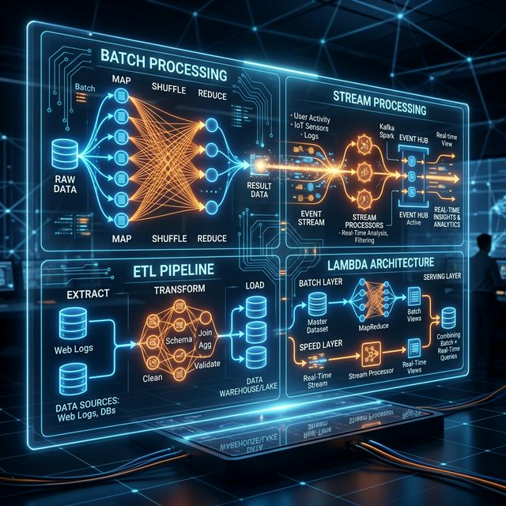

# 12: Data Processing Pipelines

<p align="center">
  
</p>

## 🎯 The Big Goal

> **After this chapter, you'll understand how to process massive datasets using batch and stream processing — MapReduce, Spark, Kafka Streams, and the Lambda Architecture.**

---

## 1. Batch vs Stream Processing

| Aspect | Batch Processing | Stream Processing |
| :--- | :--- | :--- |
| **Input** | Bounded dataset (finite) | Unbounded stream (infinite) |
| **Latency** | Minutes to hours | Milliseconds to seconds |
| **Examples** | Daily reports, ETL jobs | Real-time alerts, live dashboards |
| **Tools** | Hadoop, Spark, Hive | Kafka Streams, Flink, Spark Streaming |

```
BATCH:    [Data Lake] ──→ Process ALL data ──→ [Result]  (run nightly)
STREAM:   [Events] ──→ Process EACH event ──→ [Result]   (real-time)
```

---

## 2. MapReduce

The foundational batch processing model:

```
INPUT DATA           MAP PHASE              SHUFFLE           REDUCE PHASE
┌──────────┐    ┌─────────────────┐    ┌──────────┐    ┌─────────────────┐
│ Log file │    │ Extract key-val │    │ Group by │    │ Aggregate       │
│ 1 TB     │───→│ (url, 1)       │───→│ key      │───→│ (url, count)    │
│          │    │ (url, 1)       │    │          │    │                 │
└──────────┘    └─────────────────┘    └──────────┘    └─────────────────┘

Example: Count page views
MAP:     "/home" → 1, "/about" → 1, "/home" → 1
SHUFFLE: "/home" → [1, 1], "/about" → [1]
REDUCE:  "/home" → 2, "/about" → 1
```

---

## 3. ETL (Extract-Transform-Load)

```
EXTRACT          TRANSFORM              LOAD
┌──────┐        ┌──────────────┐       ┌──────────────┐
│ APIs │───┐    │ Clean        │       │ Data         │
│ DBs  │───┤───→│ Validate     │──────→│ Warehouse    │
│ Files│───┘    │ Aggregate    │       │ (BigQuery,   │
│ Logs │        │ Join         │       │  Redshift)   │
└──────┘        └──────────────┘       └──────────────┘
```

---

## 4. Stream Processing Concepts

| Concept | Description |
| :--- | :--- |
| **Event** | An immutable fact that happened (e.g., "user clicked button") |
| **Window** | Group events by time (tumbling, sliding, session) |
| **Watermark** | Track event-time progress to handle late arrivals |
| **State** | Maintain running counts, averages, etc. |

### Windowing Types:
```
TUMBLING (Fixed):     [0-5min][5-10min][10-15min]  (no overlap)
SLIDING:              [0-5min]
                       [2-7min]
                        [4-9min]                   (overlap)
SESSION:              [───user active───][gap][───active───]
```

---

## 5. Lambda Architecture

Combines batch and stream for completeness AND speed:

```
                    ┌─── BATCH LAYER ──── [Master Dataset] ──→ Batch Views
RAW DATA ───────────┤
                    └─── SPEED LAYER ──── [Real-time] ──→ Real-time Views
                                                              │
                    SERVING LAYER ←── Query: Merge(Batch + Real-time)
```

| Layer | Purpose | Tool |
| :--- | :--- | :--- |
| **Batch** | Complete, accurate results (slow) | Hadoop, Spark |
| **Speed** | Approximate, real-time results (fast) | Kafka Streams, Flink |
| **Serving** | Merge both for queries | Druid, Elasticsearch |

---

## 📝 Key Interview Talking Points

- Batch for daily analytics; stream for real-time monitoring
- MapReduce is conceptually important but Spark has largely replaced it
- Lambda architecture is complex — consider **Kappa** (stream-only) as an alternative
- ETL pipelines are the backbone of data warehousing

---

[<< Previous: Microservices](./11_Microservices_Architecture.md) | [Home: Curriculum Map](./README.md) | [Next: Architectural Patterns >>](./13_Architectural_Patterns.md)
