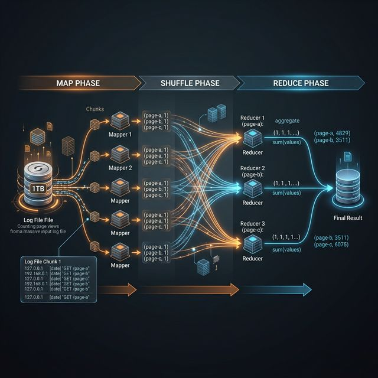
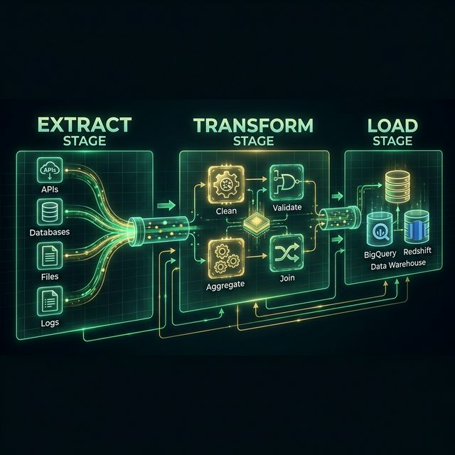

# 12: Data Processing Pipelines

<p align="center">
  
</p>

## 🎯 The Big Goal

> **After this chapter, you'll understand how to process massive datasets using batch and stream processing — MapReduce, Spark, Kafka Streams, and the Lambda Architecture.**

---

## 1. Batch vs Stream Processing

| Aspect | Batch Processing | Stream Processing |
| :--- | :--- | :--- |
| **Input** | Bounded dataset (finite) | Unbounded stream (infinite) |
| **Latency** | Minutes to hours | Milliseconds to seconds |
| **Examples** | Daily reports, ETL jobs | Real-time alerts, live dashboards |
| **Tools** | Hadoop, Spark, Hive | Kafka Streams, Flink, Spark Streaming |

```
BATCH:    [Data Lake] ──→ Process ALL data ──→ [Result]  (run nightly)
STREAM:   [Events] ──→ Process EACH event ──→ [Result]   (real-time)
```

---

## 2. MapReduce

The foundational batch processing model:

<p align="center">
  
</p>

---

## 3. ETL (Extract-Transform-Load)

<p align="center">
  
</p>

---

## 4. Stream Processing Concepts

| Concept | Description |
| :--- | :--- |
| **Event** | An immutable fact that happened (e.g., "user clicked button") |
| **Window** | Group events by time (tumbling, sliding, session) |
| **Watermark** | Track event-time progress to handle late arrivals |
| **State** | Maintain running counts, averages, etc. |

### Windowing Types:
```
TUMBLING (Fixed):     [0-5min][5-10min][10-15min]  (no overlap)
SLIDING:              [0-5min]
                       [2-7min]
                        [4-9min]                   (overlap)
SESSION:              [───user active───][gap][───active───]
```

---

## 5. Lambda Architecture

Combines batch and stream for completeness AND speed:

```
                    ┌─── BATCH LAYER ──── [Master Dataset] ──→ Batch Views
RAW DATA ───────────┤
                    └─── SPEED LAYER ──── [Real-time] ──→ Real-time Views
                                                              │
                    SERVING LAYER ←── Query: Merge(Batch + Real-time)
```

| Layer | Purpose | Tool |
| :--- | :--- | :--- |
| **Batch** | Complete, accurate results (slow) | Hadoop, Spark |
| **Speed** | Approximate, real-time results (fast) | Kafka Streams, Flink |
| **Serving** | Merge both for queries | Druid, Elasticsearch |

---

## 🤔 Reflection Questions

1. **Your batch ETL pipeline runs nightly, but the business now wants "near-real-time" dashboards updated every 5 minutes.** Can you just run the batch job more frequently, or do you need a fundamentally different architecture? What are the costs of each approach?
<details>
<summary>💡 View Answer</summary>

Running the batch job every 5 minutes is called **micro-batching** — technically possible but wasteful. Each run has fixed overhead (job scheduling, cluster spin-up, full table scans) regardless of data volume, so frequent runs multiply that overhead dramatically. A fundamentally different architecture — **stream processing** (Kafka Streams, Flink) — processes each event as it arrives with sub-second latency and zero scheduling overhead. As *Making Sense of Stream Processing* (Confluent) argues, streaming is not "faster batch" — it's a different paradigm where the pipeline is always running and data flows through continuously.
</details>

2. **MapReduce is conceptually elegant, but Spark has largely replaced it.** What specific limitations of MapReduce made Spark necessary? Think about iterative algorithms like machine learning — why does writing intermediate results to disk kill performance?
<details>
<summary>💡 View Answer</summary>

MapReduce writes all intermediate results to HDFS (disk) between every Map and Reduce step. For iterative algorithms like gradient descent (which may run 100+ iterations), this means 100+ full disk write/read cycles for the entire dataset. Spark solves this with **Resilient Distributed Datasets (RDDs)** that keep intermediate results in memory across iterations. A machine learning algorithm that takes hours in MapReduce can complete in minutes in Spark. As Kleppmann notes in DDIA, Spark's in-memory computation model is a fundamental architectural shift, not just an optimization — it transforms the cost model of iterative data processing.
</details>

3. **Your streaming pipeline processes credit card transactions in real-time, but an event arrives 30 seconds late** due to mobile network delays. The 1-minute window already closed. How do watermarks and late-arrival policies handle this? Is it acceptable to miss some events?
<details>
<summary>💡 View Answer</summary>

A **watermark** is the system's estimate of how far behind real-time the data might be. If the watermark allows 45 seconds of lateness, the 30-second-late event is still accepted and included in the correct window. If the event arrives after the watermark has advanced past the window, it can be: 1) **Dropped** (fastest, acceptable for non-critical analytics). 2) **Sent to a side output** for separate processing. 3) **Trigger a window re-computation** (most correct, but expensive). For fraud detection, missing a late transaction is unacceptable — you'd use a generous watermark. For dashboard counts, minor inaccuracy from late drops is typically fine. As *Mastering Kafka Streams* explains, the trade-off is always latency vs. completeness.
</details>

4. **Lambda Architecture maintains two separate pipelines (batch + speed) that must produce the same results.** Why is this operationally painful? How does Kappa Architecture (stream-only) simplify things, and what does it sacrifice?
<details>
<summary>💡 View Answer</summary>

Lambda Architecture is painful because you maintain **two completely separate codebases** (batch in Spark, speed in Storm/Flink) that must produce identical results — any logic change must be implemented and tested in both. Debugging discrepancies between the two layers is a nightmare. **Kappa Architecture** (proposed by Jay Kreps, co-creator of Kafka) eliminates the batch layer entirely: everything is a stream. To recompute historical data, you simply replay the Kafka log through the streaming pipeline. The sacrifice: some complex analytics (like training ML models on petabytes) are still more natural as batch jobs. As *Making Sense of Stream Processing* argues, Kappa works when your event log is your source of truth.
</details>

5. **Your ETL pipeline silently corrupts data** — a transformation step trims leading zeros from ZIP codes, turning "01234" into "1234". The bug isn't caught for 3 months. How would you design data validation and quality checks to catch such issues early?
<details>
<summary>💡 View Answer</summary>

Implement **data quality gates** at each pipeline stage: 1) **Schema validation**: enforce Avro/Protobuf schemas that define ZIP codes as strings (not integers), catching type coercion bugs at ingestion. 2) **Statistical anomaly detection**: monitor the distribution of ZIP code lengths — a sudden spike in 4-digit codes triggers an alert. 3) **Golden dataset tests**: maintain a small, curated test dataset with known-correct outputs. Run every pipeline change against it in CI before deployment. 4) **Data lineage tracking**: record which transformation touched each field, enabling fast root-cause analysis. As *Building Evolutionary Architectures* recommends, treat data quality checks as **fitness functions** — automated architectural tests that run continuously.
</details>

---

## 📝 Key Interview Talking Points

- Batch for daily analytics; stream for real-time monitoring
- MapReduce is conceptually important but Spark has largely replaced it
- Lambda architecture is complex — consider **Kappa** (stream-only) as an alternative
- ETL pipelines are the backbone of data warehousing

---

[<< Previous: Microservices](./11_Microservices_Architecture.md) | [Home: Curriculum Map](./README.md) | [Next: Architectural Patterns >>](./13_Architectural_Patterns.md)
