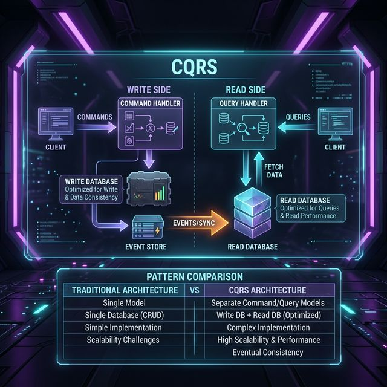

# 13: Architectural Patterns

<p align="center">
  
</p>

## 🎯 The Big Goal

> **After this chapter, you'll know the major software architecture patterns — monolith, microservices, serverless, event-driven, CQRS — and when to use each one.**

---

## 1. Architecture Styles Overview

```
┌────────────────┬─────────────────┬──────────────────┐
│   MONOLITH     │  MICROSERVICES  │   SERVERLESS     │
├────────────────┼─────────────────┼──────────────────┤
│ Single deploy  │ Many services   │ Functions (FaaS) │
│ Single DB      │ Service per DB  │ No servers       │
│ Simple ops     │ Complex ops     │ Pay per call     │
│ Scale all      │ Scale each      │ Auto-scale       │
├────────────────┼─────────────────┼──────────────────┤
│ Startups       │ Scale-ups       │ Event handlers   │
│ MVPs           │ Large teams     │ Periodic tasks   │
└────────────────┴─────────────────┴──────────────────┘
```

---

## 2. Event-Driven Architecture

```
Event Producer ──→ [Event Bus / Broker] ──→ Event Consumer A
                                        ──→ Event Consumer B
                                        ──→ Event Consumer C
```

| Component | Role |
| :--- | :--- |
| **Event Producer** | Emits events when something happens |
| **Event Bus** | Routes events (Kafka, RabbitMQ, SNS) |
| **Event Consumer** | Reacts to events independently |

### Benefits:
- Loose coupling between services
- Easy to add new consumers
- Natural audit log (events = history)

---

## 3. CQRS (Command Query Responsibility Segregation)

Separate the **write model** from the **read model**:

<p align="center">
  
</p>

| Aspect | Traditional | CQRS |
| :--- | :--- | :--- |
| **Model** | Single model for reads + writes | Separate models |
| **DB** | One database | Write DB + Read DB (optimized differently) |
| **Complexity** | Simple | Complex but scalable |
| **Best For** | Simple CRUD | Read-heavy with complex queries |

---

## 4. Event Sourcing

Instead of storing **current state**, store the **sequence of events** that led to it:

```
Traditional:  Account { balance: $750 }

Event Sourced:
  Event 1: AccountCreated { amount: $0 }
  Event 2: MoneyDeposited { amount: $1000 }
  Event 3: MoneyWithdrawn { amount: $250 }
  ──────────────────────────────────────
  Current State: $0 + $1000 - $250 = $750
```

| Pros | Cons |
| :--- | :--- |
| Complete audit trail | Increased storage |
| Can replay events | Eventual consistency |
| Time-travel debugging | Complex to implement |

---

## 5. The C4 Model

A hierarchical way to visualize architecture at four zoom levels:

```
Level 1: SYSTEM CONTEXT     "How does our system fit in the world?"
         └── Users, external systems, your system as a box

Level 2: CONTAINER          "What are the major tech building blocks?"
         └── Web app, API, database, message queue

Level 3: COMPONENT          "What's inside each container?"
         └── Controllers, services, repositories

Level 4: CODE               "What's inside each component?"
         └── Classes, interfaces, methods
```

---

## 🤔 Reflection Questions

1. **CQRS separates read and write models, but now you have two data stores that must stay in sync.** What happens when the event that updates the read model is delayed by 5 seconds? How do you explain to users why the data they just saved doesn't appear immediately?
<details>
<summary>💡 View Answer</summary>

This is the fundamental trade-off of CQRS: **eventual consistency**. The write succeeds immediately, but the read model lags behind by the event propagation delay. Handle it with the **Read-Your-Own-Writes** pattern: after a write, the client-side UI optimistically displays the saved data locally without waiting for the read model to update. Subsequent reads from other users will see the update once the event propagates. As the *CQRS Journey Guide* recommends, set user expectations by distinguishing between "your data is saved" (write confirmed) and "your data is visible to all" (read model updated). For critical flows, the write API can return the created entity directly, bypassing the read model entirely.
</details>

2. **Event sourcing stores every event forever, and your system generates 10 million events per day.** After a year, replaying all events to rebuild state takes hours. What strategies (snapshots, compaction) help, and what trade-offs do they introduce?
<details>
<summary>💡 View Answer</summary>

**Snapshots** are the primary solution: periodically save the current aggregate state (e.g., every 1000 events). To rebuild, load the latest snapshot and replay only events after it — reducing a 3.6 billion event replay to perhaps 1000 events. **Log compaction** (as used by Kafka) retains only the latest event per key, eliminating superseded updates. Trade-offs: snapshots add storage and complexity (you must version the snapshot schema as your domain evolves). Compaction loses the full history — you can't audit what a user's address was 6 months ago. As DDIA notes, the choice depends on whether you need full audit trails (keep everything + snapshots) or just current state (compaction).
</details>

3. **Your team wants to use serverless (Lambda/Cloud Functions) for a REST API that handles 50K requests per second.** Would cold starts be a problem? At what scale does serverless become more expensive than dedicated servers?
<details>
<summary>💡 View Answer</summary>

At 50K req/s, cold starts are minimal because the provider keeps instances warm under sustained load. The real problem is **cost**: serverless pricing is per-invocation + compute-time. At 50K req/s (4.3 billion requests/month), serverless costs can be 3–10x higher than equivalent EC2/ECS capacity running 24/7. The crossover point is typically around **sustained load above 30% utilization** — if your servers would be busy more than 30% of the time on average, dedicated servers are cheaper. Serverless excels for **spiky, unpredictable workloads** (0 to 10K req/s bursts) where you'd otherwise pay for idle capacity. As *Fundamentals of Software Architecture* explains, serverless trades higher per-unit cost for zero idle cost.
</details>

4. **The C4 model describes architecture at 4 zoom levels, but your team disagrees on where to draw the boundaries** between "containers" and "components." How do you decide what counts as a separate container vs. a component within one? Why does this distinction matter?
<details>
<summary>💡 View Answer</summary>

As Simon Brown defines in *The C4 Model*, a **container** is separately deployable (its own process, database, or application) — it can be independently started, stopped, and scaled. A **component** is a grouping of related functionality *within* a single container (e.g., the AuthModule inside the Java backend). The distinction matters for operational clarity: if you can't deploy or scale it independently, it's a component, not a container. If two pieces always deploy together and share a process, they're components in the same container. The test is simple: "Can I replace or restart this thing without touching anything else?" If yes, it's a container.
</details>

5. **A monolith, microservices, and event-driven architecture each have different debugging experiences.** Compare what happens when a bug causes incorrect data: how do you trace the issue in each architecture? Which one gives you the best "time-travel debugging" capability?
<details>
<summary>💡 View Answer</summary>

In a **monolith**, debugging is straightforward: set a breakpoint, step through the code — all logic is in one process. In **microservices**, you need distributed tracing (Jaeger/Zipkin) to follow a request across services — the bug might be in Service C but manifest in Service A's response. In **event-driven architecture**, events are immutable and stored permanently. You can replay the exact sequence of events that led to the bug, reproducing it deterministically — this is **time-travel debugging**, and it's the strongest debugging capability of the three. As *Building Event-Driven Microservices* explains, the event log is an audit trail that makes any past system state reconstructable.
</details>

---

## 📝 Key Interview Talking Points

- Start monolith → extract microservices as needed
- CQRS shines when reads and writes have very different requirements
- Event sourcing + CQRS is a powerful combination for financial/audit systems
- Use the C4 model to communicate architecture clearly at any zoom level

---

[<< Previous: Data Pipelines](./12_Data_Processing_Pipelines.md) | [Home: Curriculum Map](./README.md) | [Next: Security >>](./14_Security_and_Authentication.md)
