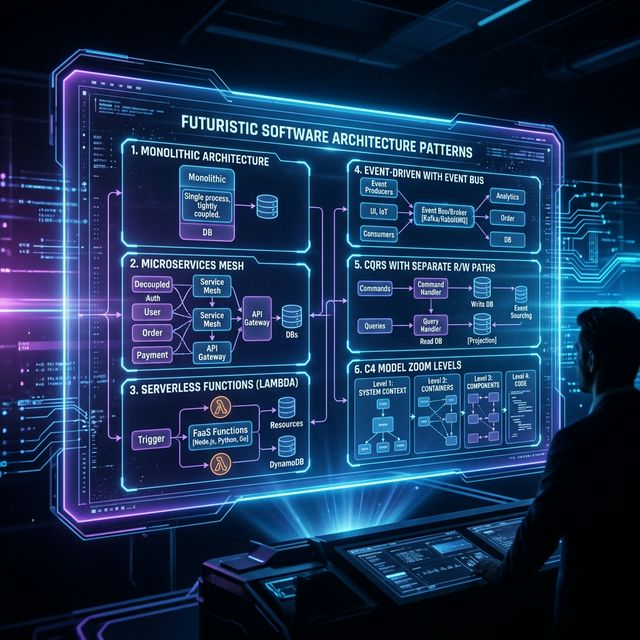

# 13: Architectural Patterns

<p align="center">
  
</p>

## 🎯 The Big Goal

> **After this chapter, you'll know the major software architecture patterns — monolith, microservices, serverless, event-driven, CQRS — and when to use each one.**

---

## 1. Architecture Styles Overview

```
┌────────────────┬─────────────────┬──────────────────┐
│   MONOLITH     │  MICROSERVICES  │   SERVERLESS     │
├────────────────┼─────────────────┼──────────────────┤
│ Single deploy  │ Many services   │ Functions (FaaS) │
│ Single DB      │ Service per DB  │ No servers       │
│ Simple ops     │ Complex ops     │ Pay per call     │
│ Scale all      │ Scale each      │ Auto-scale       │
├────────────────┼─────────────────┼──────────────────┤
│ Startups       │ Scale-ups       │ Event handlers   │
│ MVPs           │ Large teams     │ Periodic tasks   │
└────────────────┴─────────────────┴──────────────────┘
```

---

## 2. Event-Driven Architecture

```
Event Producer ──→ [Event Bus / Broker] ──→ Event Consumer A
                                        ──→ Event Consumer B
                                        ──→ Event Consumer C
```

| Component | Role |
| :--- | :--- |
| **Event Producer** | Emits events when something happens |
| **Event Bus** | Routes events (Kafka, RabbitMQ, SNS) |
| **Event Consumer** | Reacts to events independently |

### Benefits:
- Loose coupling between services
- Easy to add new consumers
- Natural audit log (events = history)

---

## 3. CQRS (Command Query Responsibility Segregation)

Separate the **write model** from the **read model**:

```
                WRITE SIDE                    READ SIDE
Client ──→ [Command Handler] ──→ Write DB   [Query Handler] ──→ Read DB ──→ Client
                │                                ▲
                └── Events ─────────────────────┘
                    (sync read models)
```

| Aspect | Traditional | CQRS |
| :--- | :--- | :--- |
| **Model** | Single model for reads + writes | Separate models |
| **DB** | One database | Write DB + Read DB (optimized differently) |
| **Complexity** | Simple | Complex but scalable |
| **Best For** | Simple CRUD | Read-heavy with complex queries |

---

## 4. Event Sourcing

Instead of storing **current state**, store the **sequence of events** that led to it:

```
Traditional:  Account { balance: $750 }

Event Sourced:
  Event 1: AccountCreated { amount: $0 }
  Event 2: MoneyDeposited { amount: $1000 }
  Event 3: MoneyWithdrawn { amount: $250 }
  ──────────────────────────────────────
  Current State: $0 + $1000 - $250 = $750
```

| Pros | Cons |
| :--- | :--- |
| Complete audit trail | Increased storage |
| Can replay events | Eventual consistency |
| Time-travel debugging | Complex to implement |

---

## 5. The C4 Model

A hierarchical way to visualize architecture at four zoom levels:

```
Level 1: SYSTEM CONTEXT     "How does our system fit in the world?"
         └── Users, external systems, your system as a box

Level 2: CONTAINER          "What are the major tech building blocks?"
         └── Web app, API, database, message queue

Level 3: COMPONENT          "What's inside each container?"
         └── Controllers, services, repositories

Level 4: CODE               "What's inside each component?"
         └── Classes, interfaces, methods
```

---

## 📝 Key Interview Talking Points

- Start monolith → extract microservices as needed
- CQRS shines when reads and writes have very different requirements
- Event sourcing + CQRS is a powerful combination for financial/audit systems
- Use the C4 model to communicate architecture clearly at any zoom level

---

[<< Previous: Data Pipelines](./12_Data_Processing_Pipelines.md) | [Home: Curriculum Map](./README.md) | [Next: Security >>](./14_Security_and_Authentication.md)
