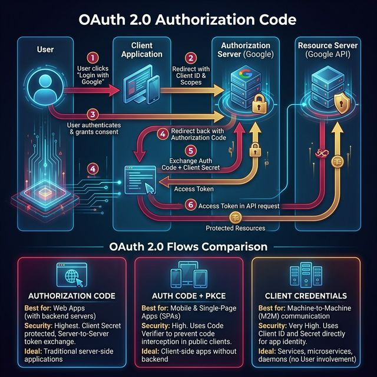

# 14: Security & Authentication

<p align="center">
  
</p>

> 🧠 **The Feynman Hook:** Security in systems is like a nightclub with a bouncer, a wristband system, and a safe. Authentication is the bouncer checking your ID at the door — proving who you are. Authorization is the wristband determining which areas you can access (VIP lounge vs general floor). Encryption is the safe — even if someone steals the cash, they can't use it without the combination. Getting any of these three wrong, and the whole system fails.

## 🎯 What You'll Learn

> **After this chapter, you'll understand how to secure distributed systems — OAuth 2.0, JWT, encryption, and API security best practices.**

---

## 1. Authentication vs Authorization

> **Feynman Insight:** Authentication is a passport check — it proves you are who you say you are. Authorization is the visa — it determines where you're allowed to go once your identity is confirmed. You can be authenticated ("Yes, this is Alice") but not authorized ("But Alice doesn't have admin access to this resource"). Both checks must happen independently.

| Concept | Question | Example |
| :--- | :--- | :--- |
| **Authentication** | "Who are you?" | Login with username/password |
| **Authorization** | "What can you do?" | Admin vs regular user permissions |

---

## 2. OAuth 2.0

The industry standard for **delegated authorization**:

<p align="center">
  
</p>

### OAuth 2.0 Flows:
| Flow | Use Case | Security |
| :--- | :--- | :--- |
| **Authorization Code** | Web apps with backend | Most secure |
| **Authorization Code + PKCE** | Mobile/SPA apps | Secure (no secret) |
| **Client Credentials** | Machine-to-machine | No user involved |
| **Implicit** (deprecated) | Old SPAs | ❌ Avoid |

---

## 3. JWT (JSON Web Token)

> **Feynman Insight:** A JWT is like a signed wristband at a theme park. You queue at the entrance (login), the staff check your ticket (credentials), and stamp your wrist with a special ink (JWT) that contains your permissions. Every ride (service) can validate the stamp instantly by checking its authenticity — no need to call the entrance booth for every ride. The stamp expires at park closing time (token expiry).

A self-contained token with three parts:

```
HEADER.PAYLOAD.SIGNATURE

Header:    { "alg": "RS256", "typ": "JWT" }
Payload:   { "sub": "user123", "name": "Alice", "role": "admin", "exp": 1699999 }
Signature: HMAC-SHA256(header + "." + payload, secret)
```

| Pros | Cons |
| :--- | :--- |
| Stateless (no server session) | Can't revoke without blocklist |
| Contains user info (no DB lookup) | Payload is base64, not encrypted |
| Works across services | Token size grows with claims |

---

## 4. Encryption

> **Feynman Insight:** Symmetric encryption is a shared padlock: both you and your friend have the same key. Fast to lock/unlock, but how do you share the key safely at first? Asymmetric encryption is a mailbox: anyone can put a letter in (encrypt with your public key), but only you have the key to open it (decrypt with your private key). TLS uses asymmetric encryption just to exchange a symmetric key — because once you've safely shared the key, symmetric is much faster for bulk data.

| Type | How | Use Case |
| :--- | :--- | :--- |
| **Symmetric** | Same key encrypts and decrypts (AES) | Data at rest, fast |
| **Asymmetric** | Public key encrypts, private key decrypts (RSA) | TLS, digital signatures |
| **Hashing** | One-way transformation (SHA-256, bcrypt) | Passwords, integrity |

```
SYMMETRIC:    Key A ──encrypt──→ ciphertext ──decrypt──→ plaintext (same Key A)
ASYMMETRIC:   Public Key ──encrypt──→ ciphertext ──decrypt──→ plaintext (Private Key)
HASHING:      "password123" ──hash──→ "$2b$12$..." (irreversible)
```

---

## 5. API Security Best Practices

> **Feynman Insight:** Securing an API is like securing a bank branch. HTTPS is the locked glass door (no eavesdropping). Rate limiting is the security guard who limits how many times someone can try the ATM PIN. Input validation is the teller who refuses to process obviously fraudulent documents. WAF is the CCTV system that detects and blocks suspicious patterns. Each layer addresses a different attack vector — remove any one and you create a gap an attacker will find.

| Practice | Description |
| :--- | :--- |
| **HTTPS everywhere** | Encrypt all traffic with TLS |
| **Rate limiting** | Prevent brute force and DDoS |
| **Input validation** | Prevent SQL injection, XSS |
| **Authentication** | Verify identity on every request |
| **Authorization** | Check permissions for every resource |
| **CORS** | Control which domains can call your API |
| **WAF** | Web Application Firewall blocks attacks |
| **Secrets management** | Never hardcode keys (use Vault, AWS Secrets Manager) |

---

## 🤔 Reflection Questions

1. **Your JWT access token has a 1-hour expiry, but a user's account was compromised 5 minutes ago.** You need to revoke the token immediately, but JWTs are stateless — there's no server-side session to invalidate. What approaches exist, and how do they undermine the "stateless" benefit of JWT?
<details>
<summary>💡 View Answer</summary>

Three approaches: 1) **Token blocklist**: maintain a Redis set of revoked token IDs (jti). Every request checks this set before accepting the JWT. This works but reintroduces server-side state — partially defeating JWT's stateless advantage. 2) **Short-lived tokens**: reduce JWT expiry to 5 minutes and use refresh tokens. A compromised access token expires quickly. Revoke the refresh token to prevent renewal. 3) **Token versioning**: store a `token_version` per user in the database. Increment it on compromise. JWTs with an older version are rejected. All approaches trade some statelessness for security — the reality is that pure stateless JWT with no revocation mechanism is inherently insecure for sensitive applications.
</details>

2. **OAuth 2.0 is for authorization, not authentication.** Yet many apps use "Login with Google" via OAuth. What's the difference between OAuth and OpenID Connect? What could go wrong if you rely solely on OAuth for user identity?
<details>
<summary>💡 View Answer</summary>

**OAuth 2.0** grants access to resources ("this app can read your Google Drive files") but never tells the app *who the user is*. **OpenID Connect (OIDC)** is a layer on top of OAuth that adds an **ID Token** — a JWT containing the user's identity (email, name, subject ID). If you use raw OAuth without OIDC, you might receive an access token that grants access to a user's resources but doesn't prove the user's identity — an attacker could swap tokens. OIDC's ID token is cryptographically signed and contains the authenticated user's identity, making "Login with Google" secure. Always use OIDC for authentication, not raw OAuth.
</details>

3. **A developer stores API keys in a `.env` file committed to GitHub.** The repo is public. What is the blast radius of this mistake? What automated safeguards should be in place to prevent this from ever reaching production?
<details>
<summary>💡 View Answer</summary>

The blast radius is catastrophic: automated bots scan GitHub for API keys within seconds of a push. AWS keys can be used to spin up crypto-mining instances, Stripe keys can process fraudulent charges, and database credentials expose all customer data. Safeguards: 1) **Pre-commit hooks** (e.g., git-secrets, truffleHog) that scan for key patterns before allowing a commit. 2) **CI pipeline scanning** as a second layer. 3) **GitHub secret scanning** alerts. 4) **Secrets management** (HashiCorp Vault, AWS Secrets Manager) — keys should never exist in source code at all. 5) **Key rotation capability** — if a key leaks, you must be able to rotate it instantly without downtime. As *The Clean Coder* emphasizes, security is a professional responsibility, not an afterthought.
</details>

4. **Your system uses symmetric encryption (AES) for data at rest and asymmetric encryption (RSA) for data in transit.** Why not use asymmetric for everything? What makes symmetric encryption essential for large-scale data, despite needing to share the key securely?
<details>
<summary>💡 View Answer</summary>

Asymmetric encryption (RSA) is **1000x slower** than symmetric encryption (AES) because it involves computationally expensive mathematical operations (modular exponentiation). Encrypting 1TB of database backups with RSA would take hours; AES does it in minutes. The standard practice is a **hybrid approach**: use RSA to securely exchange a symmetric AES key (this is exactly what TLS does during the handshake), then use AES for the actual bulk data encryption. Symmetric encryption's only challenge — securely sharing the key — is elegantly solved by RSA. This is why TLS uses asymmetric for key exchange and symmetric for data transfer.
</details>

5. **Rate limiting protects against DDoS, but a sophisticated attacker uses 10,000 different IP addresses.** Per-IP rate limiting is useless. What other signals (user tokens, fingerprints, behavior patterns) could you use? When does "rate limiting" become "fraud detection"?
<details>
<summary>💡 View Answer</summary>

Beyond IP-based limiting: 1) **User/API-key based limiting** — rate limit by authenticated identity, not IP. 2) **Device fingerprinting** — TLS fingerprint (JA3), browser characteristics, screen resolution combinations. 3) **Behavioral analysis** — legitimate users browse, read, click; bots request at machine-speed with no pauses. 4) **CAPTCHA challenges** triggered by suspicious velocity. 5) **Geographic impossibility** — a user in London making requests from Tokyo 1 second later. Rate limiting becomes "fraud detection" when you're analyzing behavioral patterns over time rather than simple request counts. At that point, you're building an anomaly detection ML model, not a counter. As Alex Xu describes, large-scale systems like Cloudflare combine all these signals into a threat score.
</details>

---

## 📝 Key Interview Talking Points

- OAuth 2.0 is for **authorization** (not authentication) — use OpenID Connect for auth
- JWT is stateless but can't be revoked without a blocklist
- Always hash passwords with bcrypt/argon2 (never MD5/SHA-1)
- HTTPS is non-negotiable for any production system

---

[<< Previous: Architectural Patterns](./13_Architectural_Patterns.md) | [Home: Curriculum Map](./README.md) | [Next: Observability >>](./15_Observability_and_Reliability.md)
