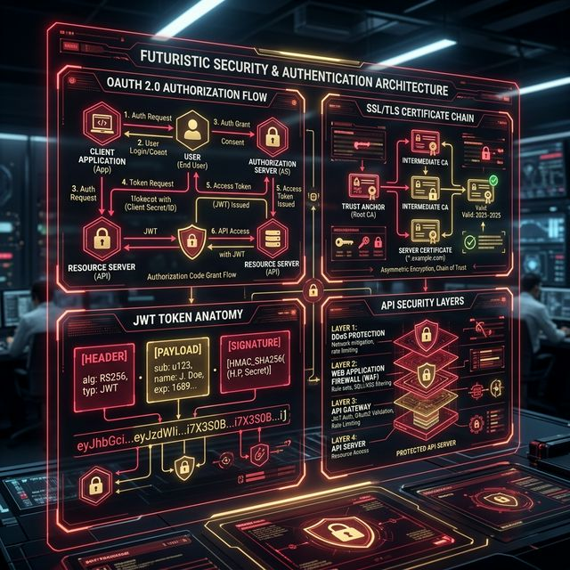

# 14: Security & Authentication

<p align="center">
  
</p>

## 🎯 The Big Goal

> **After this chapter, you'll understand how to secure distributed systems — OAuth 2.0, JWT, encryption, and API security best practices.**

---

## 1. Authentication vs Authorization

| Concept | Question | Example |
| :--- | :--- | :--- |
| **Authentication** | "Who are you?" | Login with username/password |
| **Authorization** | "What can you do?" | Admin vs regular user permissions |

---

## 2. OAuth 2.0

The industry standard for **delegated authorization**:

```
User ──→ Client App ──→ "Login with Google"
  │                         │
  │ 1. Redirect to Google   │
  │──────────────────────→  │
  │ 2. User grants consent  │
  │←──────────────────────  │
  │ 3. Auth code returned   │
  │         │               │
  │         └──→ 4. Exchange code for Access Token (server-to-server)
  │              5. Use Access Token to call Google APIs
```

### OAuth 2.0 Flows:
| Flow | Use Case | Security |
| :--- | :--- | :--- |
| **Authorization Code** | Web apps with backend | Most secure |
| **Authorization Code + PKCE** | Mobile/SPA apps | Secure (no secret) |
| **Client Credentials** | Machine-to-machine | No user involved |
| **Implicit** (deprecated) | Old SPAs | ❌ Avoid |

---

## 3. JWT (JSON Web Token)

A self-contained token with three parts:

```
HEADER.PAYLOAD.SIGNATURE

Header:    { "alg": "RS256", "typ": "JWT" }
Payload:   { "sub": "user123", "name": "Alice", "role": "admin", "exp": 1699999 }
Signature: HMAC-SHA256(header + "." + payload, secret)
```

| Pros | Cons |
| :--- | :--- |
| Stateless (no server session) | Can't revoke without blocklist |
| Contains user info (no DB lookup) | Payload is base64, not encrypted |
| Works across services | Token size grows with claims |

---

## 4. Encryption

| Type | How | Use Case |
| :--- | :--- | :--- |
| **Symmetric** | Same key encrypts and decrypts (AES) | Data at rest, fast |
| **Asymmetric** | Public key encrypts, private key decrypts (RSA) | TLS, digital signatures |
| **Hashing** | One-way transformation (SHA-256, bcrypt) | Passwords, integrity |

```
SYMMETRIC:    Key A ──encrypt──→ ciphertext ──decrypt──→ plaintext (same Key A)
ASYMMETRIC:   Public Key ──encrypt──→ ciphertext ──decrypt──→ plaintext (Private Key)
HASHING:      "password123" ──hash──→ "$2b$12$..." (irreversible)
```

---

## 5. API Security Best Practices

| Practice | Description |
| :--- | :--- |
| **HTTPS everywhere** | Encrypt all traffic with TLS |
| **Rate limiting** | Prevent brute force and DDoS |
| **Input validation** | Prevent SQL injection, XSS |
| **Authentication** | Verify identity on every request |
| **Authorization** | Check permissions for every resource |
| **CORS** | Control which domains can call your API |
| **WAF** | Web Application Firewall blocks attacks |
| **Secrets management** | Never hardcode keys (use Vault, AWS Secrets Manager) |

---

## 📝 Key Interview Talking Points

- OAuth 2.0 is for **authorization** (not authentication) — use OpenID Connect for auth
- JWT is stateless but can't be revoked without a blocklist
- Always hash passwords with bcrypt/argon2 (never MD5/SHA-1)
- HTTPS is non-negotiable for any production system

---

[<< Previous: Architectural Patterns](./13_Architectural_Patterns.md) | [Home: Curriculum Map](./README.md) | [Next: Observability >>](./15_Observability_and_Reliability.md)
