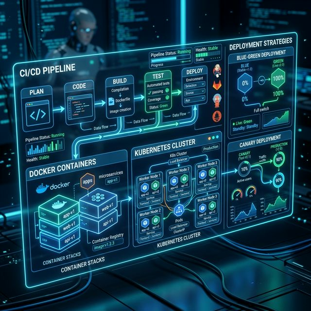

# 16: DevOps & Deployment

<p align="center">
  
</p>

## 🎯 The Big Goal

> **After this chapter, you'll understand CI/CD pipelines, containerization with Docker, orchestration with Kubernetes, and deployment strategies like blue-green and canary.**

---

## 1. CI/CD Pipeline

```
CODE ──→ BUILD ──→ TEST ──→ RELEASE ──→ DEPLOY ──→ MONITOR
  │        │        │         │          │           │
  │ Git    │ Compile │ Unit   │ Artifact │ Canary   │ Alerts
  │ push   │ Docker  │ Integr │ Registry │ Rolling  │ Metrics
  │        │ build   │ E2E    │          │ Blue-Grn │
```

| Stage | Purpose | Tools |
| :--- | :--- | :--- |
| **Source** | Code changes trigger pipeline | GitHub, GitLab |
| **Build** | Compile code, create artifacts | Maven, npm, Docker |
| **Test** | Automated tests | JUnit, pytest, Cypress |
| **Release** | Store built artifacts | Docker Registry, Nexus |
| **Deploy** | Push to production | ArgoCD, Spinnaker |
| **Monitor** | Verify health post-deploy | Prometheus, Grafana |

---

## 2. Docker

```
Dockerfile ──build──→ Image ──run──→ Container
                        │
                        └── Push to Registry (Docker Hub, ECR)
```

| Concept | Description |
| :--- | :--- |
| **Image** | Read-only template (OS + app + dependencies) |
| **Container** | Running instance of an image |
| **Dockerfile** | Recipe to build an image |
| **Registry** | Storage for images (Docker Hub, ECR, GCR) |
| **Volume** | Persistent data storage |
| **Network** | Communication between containers |

---

## 3. Kubernetes

```
┌─────────────── KUBERNETES CLUSTER ────────────────┐
│                                                    │
│  ┌──── Node 1 ────┐    ┌──── Node 2 ────┐        │
│  │ ┌─Pod─┐ ┌─Pod─┐│    │ ┌─Pod─┐ ┌─Pod─┐│        │
│  │ │App A│ │App B││    │ │App A│ │App C││        │
│  │ └─────┘ └─────┘│    │ └─────┘ └─────┘│        │
│  └─────────────────┘    └─────────────────┘        │
│                                                    │
│  Service ──→ Load balances across Pods             │
│  Ingress ──→ Routes external traffic               │
│  ConfigMap ──→ Configuration without rebuild       │
│  Secret ──→ Sensitive data (passwords, keys)       │
└────────────────────────────────────────────────────┘
```

| K8s Object | Purpose |
| :--- | :--- |
| **Pod** | Smallest unit (1+ containers) |
| **Deployment** | Manages Pod replicas + rolling updates |
| **Service** | Stable endpoint to access Pods |
| **Ingress** | HTTP routing from outside the cluster |
| **HPA** | Horizontal Pod Autoscaler |

---

## 4. Deployment Strategies

| Strategy | How | Risk | Rollback |
| :--- | :--- | :--- | :--- |
| **Rolling** | Replace instances one by one | Low | Slow |
| **Blue-Green** | Run old + new, switch traffic | Medium | Instant (switch back) |
| **Canary** | Send 5% traffic to new, then increase | Low | Instant |
| **A/B Testing** | Route by user segment | Low | Instant |

```
BLUE-GREEN:
  [Blue v1.0] ← 100% traffic
  [Green v2.0] ← 0% traffic (testing)
  ── switch ──
  [Blue v1.0] ← 0% (standby)
  [Green v2.0] ← 100% traffic ✅

CANARY:
  [v1.0] ← 95% traffic
  [v2.0] ← 5% traffic (canary)
  ── if healthy ──
  [v1.0] ← 0%
  [v2.0] ← 100% traffic ✅
```

---

## 📝 Key Interview Talking Points

- CI/CD automates the path from code commit to production
- Docker provides consistent environments; K8s provides orchestration
- Canary deployments minimize risk by testing with real traffic
- Blue-green allows instant rollback by switching traffic

---

[<< Previous: Observability](./15_Observability_and_Reliability.md) | [Home: Curriculum Map](./README.md) | [Next: Design URL Shortener >>](./17_Design_URL_Shortener.md)
