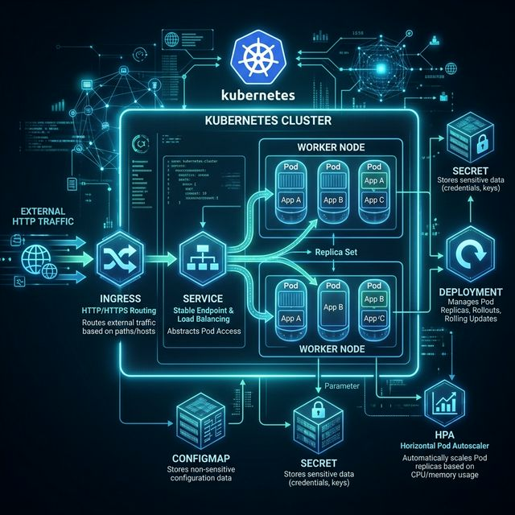

# 16: DevOps & Deployment

<p align="center">
  
</p>

> 🧠 **The Feynman Hook:** Before DevOps, deploying software was like building a car by hand — craftsmen assembled it slowly, tested it manually, and hoped it worked. CI/CD is the factory assembly line: every code change automatically triggers building, testing, and packaging — just like every car frame automatically goes through welding, painting, and quality control. Kubernetes is the logistics system that decides how many cars to produce, which factory to use, and automatically reroutes production if one factory breaks down.

## 🎯 What You'll Learn

> **After this chapter, you'll understand CI/CD pipelines, containerization with Docker, orchestration with Kubernetes, and deployment strategies like blue-green and canary.**

---

## 1. CI/CD Pipeline

> **Feynman Insight:** CI/CD is a factory assembly line for software. Raw material (code) enters at one end. Every station (build, test, release, deploy) automatically processes it and passes it to the next. If any station detects a defect, the line stops and alerts the team before the defective product reaches the customer. The goal: a developer commits code, and hours later (or minutes) it's in production without any human touching it.

```
CODE ──→ BUILD ──→ TEST ──→ RELEASE ──→ DEPLOY ──→ MONITOR
  │        │        │         │          │           │
  │ Git    │ Compile │ Unit   │ Artifact │ Canary   │ Alerts
  │ push   │ Docker  │ Integr │ Registry │ Rolling  │ Metrics
  │        │ build   │ E2E    │          │ Blue-Grn │
```

| Stage | Purpose | Tools |
| :--- | :--- | :--- |
| **Source** | Code changes trigger pipeline | GitHub, GitLab |
| **Build** | Compile code, create artifacts | Maven, npm, Docker |
| **Test** | Automated tests | JUnit, pytest, Cypress |
| **Release** | Store built artifacts | Docker Registry, Nexus |
| **Deploy** | Push to production | ArgoCD, Spinnaker |
| **Monitor** | Verify health post-deploy | Prometheus, Grafana |

---

## 2. Docker

> **Feynman Insight:** Before Docker, deploying an app was like moving house and hoping all your furniture would fit in the new house (the production server). Docker is a shipping container: you pack everything (app, runtime, dependencies, config) into a standard-sized container. It doesn't matter if the ship is AWS, Azure, or your laptop — the container is guaranteed to work identically on any ship that has a crane (Docker runtime).

```
Dockerfile ──build──→ Image ──run──→ Container
                        │
                        └── Push to Registry (Docker Hub, ECR)
```

| Concept | Description |
| :--- | :--- |
| **Image** | Read-only template (OS + app + dependencies) |
| **Container** | Running instance of an image |
| **Dockerfile** | Recipe to build an image |
| **Registry** | Storage for images (Docker Hub, ECR, GCR) |
| **Volume** | Persistent data storage |
| **Network** | Communication between containers |

---

## 3. Kubernetes

> **Feynman Insight:** Kubernetes is an airline dispatch system for containers. Without it, you'd manually decide which server (gate) runs which container (plane). With Kubernetes, you declare: "I need 10 copies of the payment service running." Kubernetes figures out which servers have space, deploys them, restarts any that crash, and automatically spins up more if traffic spikes — like an airline automatically assigning overflow passengers to new gates.

<p align="center">
  
</p>

| K8s Object | Purpose |
| :--- | :--- |
| **Pod** | Smallest unit (1+ containers) |
| **Deployment** | Manages Pod replicas + rolling updates |
| **Service** | Stable endpoint to access Pods |
| **Ingress** | HTTP routing from outside the cluster |
| **HPA** | Horizontal Pod Autoscaler |

---

## 4. Deployment Strategies

> **Feynman Insight:** Blue-green deployment is like an aircraft test pilot: you have a backup plane (Blue v1) and a test plane (Green v2). The test pilot flies the new plane while passengers stay on the backup. If the new plane checks out, all passengers switch. If it fails, the backup is still ready instantly. Canary deployment is the same idea but you let 5% of passengers try the new plane first while 95% stay safe on the old one.

| Strategy | How | Risk | Rollback |
| :--- | :--- | :--- | :--- |
| **Rolling** | Replace instances one by one | Low | Slow |
| **Blue-Green** | Run old + new, switch traffic | Medium | Instant (switch back) |
| **Canary** | Send 5% traffic to new, then increase | Low | Instant |
| **A/B Testing** | Route by user segment | Low | Instant |

```
BLUE-GREEN:
  [Blue v1.0] ← 100% traffic
  [Green v2.0] ← 0% traffic (testing)
  ── switch ──
  [Blue v1.0] ← 0% (standby)
  [Green v2.0] ← 100% traffic ✅

CANARY:
  [v1.0] ← 95% traffic
  [v2.0] ← 5% traffic (canary)
  ── if healthy ──
  [v1.0] ← 0%
  [v2.0] ← 100% traffic ✅
```

---

## 🤔 Reflection Questions

1. **Your canary deployment sends 5% of traffic to the new version, and metrics look good.** But the 5% were all from the same region, and a bug only affects users in Europe. How would you design a canary that catches region-specific or user-segment-specific bugs?
<details>
<summary>💡 View Answer</summary>

Design a **stratified canary** that samples traffic proportionally from each region, device type, and user tier. Instead of randomly routing 5% of global traffic, route 5% from *each region* (5% of US traffic, 5% of EU traffic, 5% of APAC traffic). Additionally, use **feature flags** with user-segment targeting to expose the new code to a representative cross-section. Monitor canary metrics *per-region* — if EU error rates spike while US is fine, the canary catches the bug. This approach is more complex to implement but dramatically increases the canary's ability to detect segment-specific issues.
</details>

2. **Docker "works on my machine" is the slogan, but your container runs fine locally and crashes in production.** What differences between local and production environments (OS, network, memory limits, secrets) could cause this? How does your Dockerfile design prevent it?
<details>
<summary>💡 View Answer</summary>

Common causes: 1) **Memory limits** — production Kubernetes pods have resource limits (512MB); locally Docker defaults to unlimited. The app OOM-kills in production. 2) **Secrets** — `.env` files exist locally but production uses vault-injected secrets. A missing `DB_PASSWORD` crashes the app. 3) **Network** — locally all services are on `localhost`; production requires DNS-based service discovery. 4) **Base image differences** — `FROM node:latest` gives different OS versions over time. Prevention: use **multi-stage builds** with pinned base image versions, set explicit memory/CPU limits in `docker-compose.yml` to mirror production, and never bake secrets into images — always inject them at runtime.
</details>

3. **Kubernetes HPA auto-scales your pods based on CPU usage.** But your app is I/O-bound, not CPU-bound — CPU stays at 10% while users experience timeouts. What custom metrics would you use for scaling, and how does this change your monitoring strategy?
<details>
<summary>💡 View Answer</summary>

For I/O-bound applications, scale on **custom metrics**: 1) **Request queue depth** — if requests waiting in the queue exceed a threshold, scale up. 2) **p99 response latency** — if latency crosses an SLO threshold, add pods. 3) **Active connection count** — proxy metrics from Envoy/Nginx. 4) **Kafka consumer lag** — if a consumer falls behind, add more consumer instances. Kubernetes supports custom metrics via the **Metrics Server + Prometheus Adapter**, which feeds custom metrics into HPA. This fundamentally changes monitoring: you must instrument these application-level metrics, not just rely on infrastructure metrics like CPU/memory.
</details>

4. **Blue-green deployment gives instant rollback, but it requires running two full copies of your infrastructure.** For a system with 200 pods, that's 400 pods during deployment. How would you justify this cost, or what alternative strategy would you use?
<details>
<summary>💡 View Answer</summary>

Justify blue-green when **rollback speed is critical** and the cost is acceptable (e.g., financial trading platforms where a bad deployment costs millions per minute). For cost-sensitive systems, use **rolling deployments**: update pods incrementally (e.g., 10 at a time), so at peak you run ~210 pods, not 400. Even cheaper: **canary deployments** with automatic rollback — run only 5-10 extra pods. The trade-off is rollback speed: blue-green switches traffic instantly (DNS/load balancer flip), while rolling deployments take minutes to roll back by redeploying the old version. A pragmatic middle ground is a **small blue-green** targeting just the most critical services, with rolling deployments for everything else.
</details>

5. **Your CI pipeline takes 45 minutes to run all tests.** Developers start skipping the pipeline and pushing directly. How would you balance test coverage with developer velocity? What techniques (parallelization, test selection, caching) would you apply?
<details>
<summary>💡 View Answer</summary>

1) **Parallelization**: split tests across 10 CI runners — 45 minutes becomes ~5 minutes. 2) **Test selection**: only run tests affected by the changed files (using coverage maps or dependency analysis). A change to `UserService.java` doesn't need to run `PaymentService` tests. 3) **Caching**: cache dependency downloads (npm, Maven) and Docker layers between runs. 4) **Test pyramid enforcement**: most tests should be fast unit tests (milliseconds); integration and E2E tests run only on merge to main, not on every push. 5) **Mandatory pipeline**: block merges if the pipeline hasn't passed — never allow direct pushes to main. Make the pipeline fast enough that skipping it isn't tempting. Target: under 10 minutes for PR pipelines.
</details>

---

## 📝 Key Interview Talking Points

- CI/CD automates the path from code commit to production
- Docker provides consistent environments; K8s provides orchestration
- Canary deployments minimize risk by testing with real traffic
- Blue-green allows instant rollback by switching traffic

---

[<< Previous: Observability](./15_Observability_and_Reliability.md) | [Home: Curriculum Map](./README.md) | [Next: Design URL Shortener >>](./17_Design_URL_Shortener.md)
