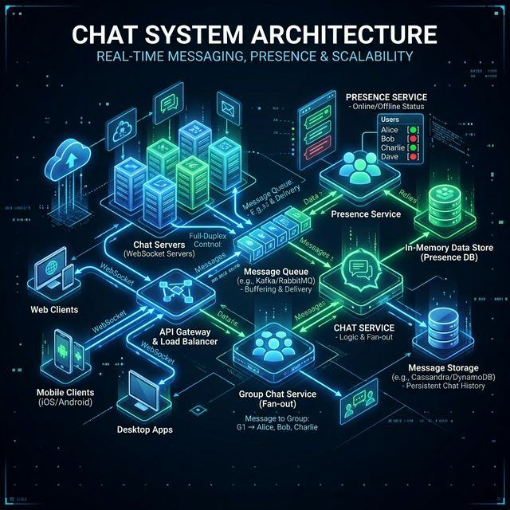
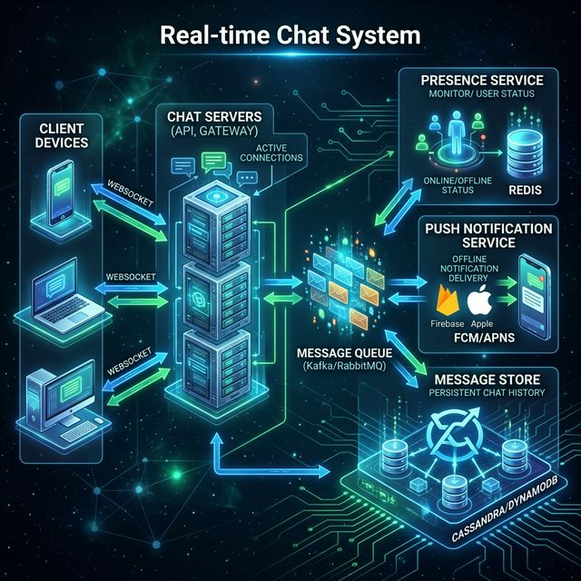

# 18: Design a Chat System

<p align="center">
  
</p>

> 🧠 **The Feynman Hook:** A chat system is a real-time dispatch network operating at internet scale. Unlike email (where you send a letter and wait days), a chat system is more like a two-way radio: when you press send, the other person hears it in under a second, even if they're on the other side of the planet. Building this requires an entirely different communication model (WebSockets instead of HTTP), an entirely different storage engine (Cassandra instead of SQL), and a presence system that tracks 50 million simultaneous radio operators.

## 🎯 What You'll Learn

> **Design a real-time messaging system like WhatsApp or Facebook Messenger — handling 1-on-1 chat, group chat, presence, and message delivery guarantees.**

---

## 1. Requirements

> **Feynman Insight:** The non-functional requirements here are unusually demanding: 50 million concurrent users, sub-100ms latency, and exactly-once delivery. These three constraints together eliminate HTTP polling (too slow), standard SQL databases (can't handle write throughput), and traditional message queues (don't guarantee exactly-once). Each requirement eliminates categories of solutions before you've designed a single component.

| Functional | Non-Functional |
| :--- | :--- |
| 1-on-1 messaging | Low latency (< 100ms) |
| Group chat (up to 500 members) | High availability |
| Online/offline status | Message ordering guaranteed |
| Read receipts | Exactly-once delivery |
| Push notifications for offline users | Support 50M concurrent users |
| Message history | End-to-end encryption |

---

## 2. High-Level Architecture

<p align="center">
  
</p>

---

## 3. WebSocket Connection

> **Feynman Insight:** HTTP is one-way: you ask, the server answers, the connection closes. Like sending a letter and waiting for a reply letter. WebSocket transforms this into a telephone call: one setup handshake (the HTTP upgrade), and then a permanent open line where either party can speak at any time. This permanent connection is what makes sub-100ms chat possible — there's no new connection overhead per message.

```
HTTP Upgrade (one-time):
  Client ──GET /ws──→ Server
  Server ──101 Switching Protocols──→ Client

Then: Full-duplex, persistent connection
  Client ◄──────── messages ────────► Server
```

| Protocol | Direction | Use Case |
| :--- | :--- | :--- |
| **WebSocket** | Bi-directional | Real-time chat |
| **HTTP** | Client → Server | Profile updates, history |
| **Push Notification** | Server → Client (offline) | FCM/APNs when app is closed |

### 🔧 Deep Dive: Why not Long Polling or SSE?
*   **Long Polling:** The client opens an HTTP connection and holds it open until the server has new data. **Flaw:** High HTTP overhead. Every message requires establishing a new TCP connection and sending full HTTP headers. For millions of users, this wastes massive bandwidth.
*   **Server-Sent Events (SSE):** A persistent connection where the server pushes data. **Flaw:** It is strictly unidirectional (Server → Client). The client still needs a separate HTTP call to send messages.
*   **WebSockets:** After the initial HTTP handshake, it degrades into a raw, persistent, full-duplex TCP stream. Negligible overhead (a few bytes per frame) makes it the only viable choice for massive-scale chat systems in both directions.

---

## 4. Message Flow

### 1-on-1 Chat:
```
1. Alice sends message via WebSocket → Chat Server A
2. Chat Server A stores message in DB (status: SENT)
3. Chat Server A checks: Is Bob online?
   a. YES → Find Bob's Chat Server B → forward via message queue → deliver
   b. NO → Store for later + push notification
4. Bob receives → acknowledge → update status: DELIVERED
5. Bob reads → update status: READ → notify Alice
```

### Group Chat:
```
Alice sends to Group (100 members):
  1. Message stored once in DB
  2. Fan-out to 100 members:
     - Online members: deliver via WebSocket
     - Offline members: push notification
```

---

## 5. Message Storage

> **Feynman Insight:** Chat message storage is like a newspaper archive: chronological, append-only, and read mostly by channel (newspaper edition) rather than by searching for individual articles. Cassandra is the perfect fit: partition key = channel_id (put all messages in the same conversation on the same node), clustering key = message_id (sorted by time within the partition). Each query is "give me the last 50 messages for conversation X" — lightning fast on Cassandra, terrifyingly slow on a traditional SQL database.

```
┌──────────────────────────────────────────────┐
│ messages                                      │
├──────────────────────────────────────────────┤
│ message_id    BIGINT (Snowflake ID)          │
│ channel_id    UUID  (conversation/group)     │
│ sender_id     UUID                           │
│ content       TEXT (encrypted)               │
│ type          ENUM (text, image, video)      │
│ status        ENUM (sent, delivered, read)   │
│ created_at    TIMESTAMP                      │
└──────────────────────────────────────────────┘
```

**Database Choice:** Cassandra or HBase — optimized for write-heavy, time-series data with partition key = channel_id.

### 🔧 Deep Dive: End-to-End Encryption (E2EE) Architecture
In modern systems, the `content` field in the database is pure encrypted gibberish. Utilizing algorithms like the **Signal Protocol (Double Ratchet)**, the encryption keys rotate on *every single message*. 
**Crucial Architectural Impact:** Because the Chat Server only routes opaque ciphertexts, it fundamentally breaks server-side search. If a user wants to search their chat history for the word "hello", the server cannot execute a SQL `LIKE` query. The client app must download the ciphertexts, decrypt them locally on the device, and maintain a local embedded database (like SQLite) to perform the search entirely offline.

### 🔧 Deep Dive: Message Ordering and Distributed IDs
You cannot rely on `created_at` timestamps to order messages correctly! Server clocks across a data center can drift by milliseconds (NTP synchronization is not perfect). If two users send a message at the exact same time, relying on the local server clock will scramble the order.
**The Solution:** Use a distributed ID generator like **Twitter Snowflake**. It generates 64-bit integers where the first 41 bits represent a timestamp, ensuring IDs are universally sortable over time, with the remaining bits handling data-center, machine, and sequence IDs to prevent collisions. Your `message_id` becomes your absolute source of chronological truth.

---

## 6. Presence (Online Status)

> **Feynman Insight:** Online presence tracking is like a lighthouse beacon. Every 10 seconds, a connected user sends a heartbeat: "I'm still here." Redis stores this with a 30-second TTL. If the heartbeat stops (user lost connection), the lighthouse goes dark 30 seconds later — the system marks them offline. The 30-second window is deliberate: brief network blips don't cause false "offline" status, only genuine disconnections do.

```
User connects:    → Set status ONLINE in Redis (TTL: 30s)
Heartbeat:        → Refresh TTL every 10s
Disconnect:       → TTL expires → status OFFLINE
```

| Approach | How | Trade-off |
| :--- | :--- | :--- |
| **Heartbeat** | Client pings every 10s | Simple, slight delay |
| **Connection tracking** | Track WebSocket connections | Accurate, more complex |

---

## 🤔 Reflection Questions

1. **Your chat system uses WebSockets, but a user switches from WiFi to cellular mid-conversation.** The WebSocket connection drops and reconnects on a different server. How do you ensure messages sent during the switch are not lost, and the user sees them in order?
<details>
<summary>💡 View Answer</summary>

Each message gets a **monotonically increasing sequence number** per conversation. When the client reconnects (potentially to a different server), it sends its last-seen sequence number. The server queries the message store for all messages with a higher sequence number and delivers them. Messages are never lost because they are **persisted to the database before delivery** — the WebSocket is just a notification channel, not the source of truth. As Alex Xu's chat system design explains, the WebSocket layer pushes real-time notifications, but the client always reconciles by fetching from the persistent store on reconnect.
</details>

2. **A group chat has 10,000 members.** If you fan out a single message to all members' feeds, that's 10,000 writes per message. How does this "group chat bomb" problem scale differently than 1-on-1 chat? What architectural changes are needed for large groups?
<details>
<summary>💡 View Answer</summary>

For large groups, **fan-out-on-write is impractical** — 100 messages/minute × 10,000 members = 1 million writes/minute per group. Switch to **fan-out-on-read**: store the message once (in the group's message table), and when a member opens the group, they read from the group's timeline directly. Only push a lightweight notification ("new message in Group X") via WebSocket — don't copy the full message to each user's inbox. This is the same hybrid approach used for celebrity posts in news feed design. As Alex Xu notes, the threshold for switching from fan-out-on-write to fan-out-on-read is typically around 500–1000 members.
</details>

3. **End-to-end encryption means the server cannot read messages.** But users want to search their message history. How can you implement server-side search over encrypted messages? Is this even feasible, or must search be client-side only?
<details>
<summary>💡 View Answer</summary>

With true E2E encryption, server-side full-text search is **not feasible** without compromising the encryption model. The practical approaches: 1) **Client-side search**: download and decrypt messages locally, then search in memory or a local database (SQLite). This is what Signal does. 2) **Searchable encryption** (e.g., symmetric searchable encryption schemes) — an active research area that allows keyword search over encrypted data, but with significant performance limitations and metadata leakage. 3) **Hybrid**: encrypt messages E2E but allow users to opt-in to server-side search by sharing a search index key — the user knowingly trades privacy for convenience. For maximum security, client-side search is the only correct answer.
</details>

4. **Presence (online/offline) uses Redis with a 30-second TTL heartbeat.** But a user closes their laptop without gracefully disconnecting. For 30 seconds, they appear "online" to everyone. Is this acceptable? How would you design a faster detection mechanism?
<details>
<summary>💡 View Answer</summary>

30 seconds of stale presence is generally acceptable for most chat apps — WhatsApp and Telegram tolerate similar delays. For faster detection: 1) **WebSocket close event** — if the TCP connection drops (detected by the server's socket layer), immediately mark the user offline without waiting for the TTL. 2) **Shorter heartbeats** (5 seconds) reduce the stale window but increase Redis write load by 6x. 3) **Lazy presence**: don't proactively broadcast presence changes to all contacts. Only resolve presence when a user explicitly opens a chat — query Redis on-demand. This dramatically reduces presence update traffic while appearing instantaneous to the user.
</details>

5. **Read receipts require notifying the sender when each recipient reads a message.** In a group of 500 people, this creates 500 notification events per message read. How would you design this without overwhelming the system? Would you aggregate or throttle receipts?
<details>
<summary>💡 View Answer</summary>

**Aggregate and batch** read receipts: instead of sending 500 individual "User X read message 123" events, collect receipts over a 2-second window and send a single batch update: "Message 123: read by 47 members." Display the count in the UI rather than individual names. For large groups (>100 members), most apps (WhatsApp, Telegram) show only a count or disable individual read receipts entirely — showing "Read by 312" is sufficient. For the sender's detail view, fetch individual read timestamps lazily (on-demand) from the database rather than pushing them in real-time. This reduces 500 events to ~1 aggregated event per message.
</details>

---

## 📝 Key Interview Talking Points

- WebSocket for real-time; push notifications for offline users
- Message ordering via time-sorted IDs (Snowflake ID or ULID)
- Fan-out for small groups; message queue for large groups
- Presence uses Redis with TTL-based heartbeats

---

[<< Previous: URL Shortener](./17_Design_URL_Shortener.md) | [Home: Curriculum Map](./README.md) | [Next: Design News Feed >>](./19_Design_News_Feed.md)
