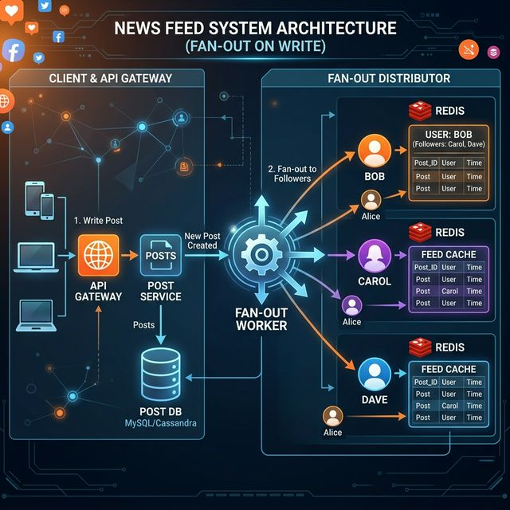

# 19: Design a News Feed

<p align="center">
  
</p>

## 🎯 The Big Goal

> **Design a social media news feed like Twitter or Facebook — where users see posts from people they follow, ranked by relevance.**

---

## 1. Requirements

| Functional | Non-Functional |
| :--- | :--- |
| User publishes a post | Feed loads in < 200ms |
| User sees feed of followed users' posts | Support 500M users, 1B posts/day |
| Feed is ranked (not just chronological) | Highly available |
| Support images, videos, text | Eventually consistent (slight delay OK) |

---

## 2. Two Core Approaches

### Fan-Out on Write (Push Model)
```
Alice posts → Pre-compute feed for all 1000 followers
  1. Alice creates post → stored in DB
  2. Worker looks up Alice's followers: [Bob, Carol, Dave, ...]
  3. Worker writes post_id to each follower's feed cache
  4. When Bob opens app → read from pre-built feed cache → instant!
```

### Fan-Out on Read (Pull Model)
```
Bob opens app → Compute feed on-the-fly
  1. Bob opens app → "Give me my feed"
  2. Server queries: Who does Bob follow? [Alice, Eve, Frank, ...]
  3. Server fetches recent posts from each followed user
  4. Server merges, ranks, returns → slower but always fresh
```

| Approach | Pros | Cons | Best For |
| :--- | :--- | :--- | :--- |
| **Fan-out Write** | Fast reads (pre-computed) | Celebrity problem (millions of writes) | Most users |
| **Fan-out Read** | No wasted writes | Slow reads (compute on request) | Celebrities |

> 💡 **Hybrid Approach (Twitter):** Fan-out on write for normal users; fan-out on read for celebrities (>1M followers).

---

## 3. Architecture

<p align="center">
  
</p>

---

## 4. Feed Ranking

Instead of pure chronological order, rank by **engagement signals**:

```
Score = w₁(recency) + w₂(likes) + w₃(comments) + w₄(shares)
        + w₅(user_affinity) + w₆(content_type) - w₇(already_seen)
```

| Signal | Weight | Description |
| :--- | :--- | :--- |
| **Recency** | High | Newer posts rank higher |
| **Engagement** | High | Posts with many likes/comments |
| **Affinity** | Medium | How much Bob interacts with Alice |
| **Content Type** | Medium | Videos > images > text (varies) |
| **Diversity** | Low | Avoid too many posts from one person |

---

## 5. Storage Design

| Data | Storage | Reason |
| :--- | :--- | :--- |
| **Posts** | PostgreSQL / MySQL | Relational, ACID for writes |
| **Feed Cache** | Redis (sorted sets) | Pre-computed, fast reads |
| **Social Graph** | Graph DB or adjacency table | Who follows whom |
| **Media** | Object Storage (S3) + CDN | Images, videos |

### 🔧 Deep Dive: Traversing the Social Graph
Storing "who follows who" in a traditional relational database (PostgreSQL) using an adjacency list (`follower_id, followee_id`) works at small scale. But what if you need to suggest "Friends of Friends of Friends" to build the feed? In SQL, that requires an exponentially slow self-JOIN.
**The Solution:** Use a **Graph Database** (like Neo4j or Amazon Neptune). They use a concept called *Index-Free Adjacency*, meaning every node physically stores direct memory pointers to its neighbors in RAM. Traversing a network of 1 million connections to find mutual friends drops from seconds in SQL down to milliseconds in a Graph database.

### 🔧 Deep Dive: The Redis Feed Cache
How do you actually store a feed in memory so it loads in <200ms? Use **Redis Sorted Sets**.
*   **Key:** `feed:user:123`
*   **Value:** `post_id`
*   **Score:** The ranking score (or simply the Unix timestamp for chronological feeds).
When you need to render the feed, you call `ZREVRANGE feed:user:123 0 20` to get the top 20 most relevant posts in `O(log(N) + M)` time. Because the values are just `post_ids`, the memory footprint is extremely small, allowing you to cache thousands of posts per user.

### 🔧 Deep Dive: The Cache Stampede (Thundering Herd)
What happens when a massive celebrity (e.g., Elon Musk with 150M followers) makes a post? If you use "Fan-out on Read," 10 million active users query the database simultaneously when their cache is empty, instantly crashing your database.
**Mitigation:** 
1.  **Mutex Locks:** Protect the database lookup. Only the *very first* request is allowed to query the database to build the celebrity's timeline. The other 9,999,999 requests must wait a few milliseconds for the first thread to populate the Redis cache.
2.  **Probabilistic Early Expiration:** Instead of letting the cache naturally expire and trigger a stampede, workers detect "hot" keys and asynchronously re-populate the cache *before* it expires in the background.

---

## 🤔 Reflection Questions

1. **A celebrity with 50 million followers posts an update.** Fan-out on write would create 50 million cache entries. Fan-out on read would make every follower wait. How does the hybrid approach handle this, and where exactly do you draw the line between "normal" and "celebrity"?
<details>
<summary>💡 View Answer</summary>

The **hybrid approach** uses fan-out-on-write for normal users (pre-compute feeds into follower caches) and fan-out-on-read for celebrities (fetch their posts at read time and merge into the timeline). The threshold is typically based on follower count — users with >10,000 followers are treated as "celebrities." When a normal user opens their feed, the system loads pre-computed entries from their cache AND fetches recent posts from followed celebrities, merging them in real-time. As Alex Xu's news feed design details, Twitter/X uses exactly this hybrid model because fan-out-on-write for 50M followers would take minutes and consume massive storage, while fan-out-on-read for all users would make every feed load slow.
</details>

2. **Your ranking algorithm optimizes for engagement (likes, comments, shares), and the feed is filled with controversial content** because controversy drives engagement. How do you balance algorithmic ranking with responsible content curation? Should "engagement" even be the primary ranking signal?
<details>
<summary>💡 View Answer</summary>

No — engagement alone is a dangerous primary signal because it conflates attention with value. Balance it with: 1) **Content quality signals** — fact-check scores, source credibility, original content vs. reshares. 2) **User satisfaction surveys** — periodically ask users "Was this feed valuable?" and train the algorithm on satisfaction, not just clicks. 3) **Diversity injection** — algorithmically ensure the feed contains content from varied topics and viewpoints, not just the most polarizing. 4) **Demotion signals** — reduce reach of content flagged as misleading regardless of engagement. This is an architectural decision, not just a product one: the ranking pipeline must support multiple weighted signals, not a single engagement score.
</details>

3. **A user follows 5,000 accounts, and their feed cache has room for only 500 posts.** How do you decide which 500 posts to pre-compute? What happens when the user scrolls past those 500 — do you switch from push to pull seamlessly?
<details>
<summary>💡 View Answer</summary>

Pre-compute the **top 500 ranked posts** using affinity scores (how often the user interacts with each account), recency, and predicted engagement. When the user scrolls past the pre-computed 500, the system seamlessly switches to **on-demand fetching**: query the timeline database for older posts, rank them in real-time, and paginate using cursor-based pagination. The user doesn't notice the switch — the initial load is instant (cache), and subsequent pages have a slight delay (database query). This is the "waterfall" pattern: fast cache for the head, database for the tail. Pre-computation focuses on the posts most likely to be seen (the top of the feed).
</details>

4. **Two users in the same household see completely different feeds.** How does feed personalization create "filter bubbles"? Should you intentionally inject diverse or opposing viewpoints? What are the ethical implications for a system designer?
<details>
<summary>💡 View Answer</summary>

Personalization creates filter bubbles by reinforcing existing preferences — the algorithm shows you what you've liked before, narrowing your worldview over time. As a system designer, you face an ethical trade-off: maximum personalization maximizes engagement but can radicalize users. Responsible approaches: 1) **Serendipity injection** — intentionally include 10-20% of content outside the user's usual interests. 2) **Transparency** — let users see *why* each post appears ("Because you follow X" / "Trending in your area"). 3) **User control** — provide explicit knobs for "show me more diverse content." The architectural implication is that the ranking pipeline must support content diversity as a first-class optimization objective alongside engagement.
</details>

5. **Your feed shows a post from 2 hours ago at the top because it has high engagement, but the user already saw it.** How do you prevent "stale" but popular content from dominating the feed? What signals indicate that a user has already consumed a piece of content?
<details>
<summary>💡 View Answer</summary>

Track **impression history** per user: record which post IDs have been rendered on the user's screen (via client-side tracking beacons). When ranking the feed, demote or exclude posts the user has already seen. Additional staleness signals: 1) **Time decay** — reduce a post's score exponentially as it ages, regardless of engagement. 2) **Scroll-past detection** — if the user scrolled past a post without interacting, it's been "consumed." 3) **Session boundaries** — posts shown in the previous session get lower priority. Store impression history in a compact structure (Bloom filter per user) that allows O(1) "has this user seen this post?" lookups without storing every post ID explicitly.
</details>

---

## 📝 Key Interview Talking Points

- Always mention the **hybrid fan-out approach** (push for normal, pull for celebrities)
- Feed ranking uses ML in production (not just simple scoring)
- Redis sorted sets are ideal for ordered feed caches
- Discuss the trade-off: fast reads (pre-computed) vs fresh data (on-demand)

---

[<< Previous: Chat System](./18_Design_Chat_System.md) | [Home: Curriculum Map](./README.md) | [Next: Design Video Platform >>](./20_Design_Video_Platform.md)
