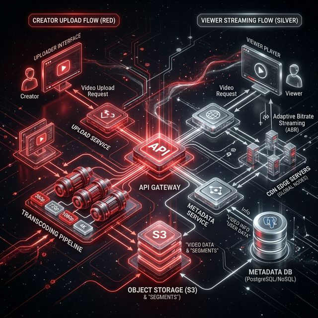
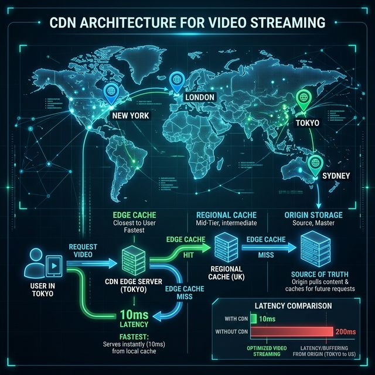
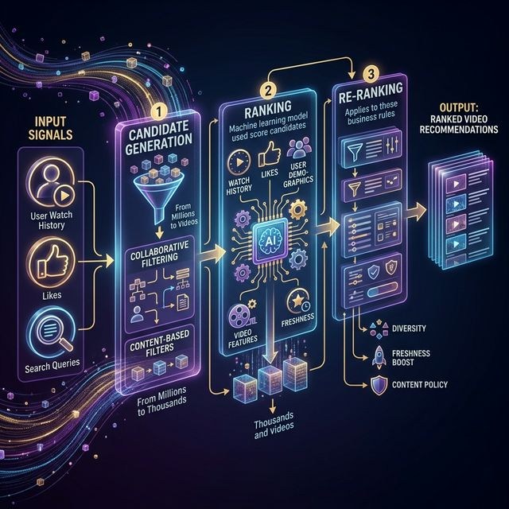

# 20: Design a Video Platform

<p align="center">
  
</p>

## 🎯 The Big Goal

> **Design a video streaming platform like YouTube — handling video upload, transcoding, storage, CDN delivery, and recommendations at massive scale.**

---

## 1. Requirements

| Functional | Non-Functional |
| :--- | :--- |
| Upload videos (up to 1GB) | Support 1B daily views |
| Stream videos (adaptive quality) | Low startup latency (< 2s) |
| Search videos by title/tags | 99.99% availability |
| Recommendations | Global reach via CDN |
| Like, comment, subscribe | Handle 100K+ concurrent uploads |

---

## 2. High-Level Architecture

<p align="center">
  
</p>

---

## 3. Video Upload Pipeline

```
1. Client uploads video → pre-signed URL to S3
2. Upload completes → S3 event triggers transcoding
3. Transcoding Service:
   - 240p, 360p, 480p, 720p, 1080p, 4K
   - Codecs: H.264 (compatibility), H.265 (efficiency)
   - Generate thumbnails at multiple timestamps
4. Store transcoded files in S3
5. Update metadata DB: video is READY
6. Push to CDN edge servers
```

### Why Pre-signed URLs?
```
Traditional:  Client → App Server → S3       (server bottleneck)
Pre-signed:   Client → S3 directly           (scale unlimited)
              App Server only generates the signed URL
```

---

## 4. Video Streaming (Adaptive Bitrate)

```
Player checks bandwidth continuously:
  Fast internet → Stream 1080p
  Bandwidth drops → Switch to 480p seamlessly
  Bandwidth recovers → Switch back to 1080p

Protocol: HLS (HTTP Live Streaming) or DASH
  - Video split into 2-10 second segments
  - Manifest file lists all segments at each quality level
  - Player downloads segments progressively
```

| Protocol | Developed By | Format |
| :--- | :--- | :--- |
| **HLS** | Apple | `.m3u8` manifest + `.ts` segments |
| **DASH** | MPEG | `.mpd` manifest + `.m4s` segments |

---

## 5. Storage and CDN Strategy

| Data | Storage | Reason |
| :--- | :--- | :--- |
| **Raw video** | S3 (cold storage) | Backup, rarely accessed |
| **Transcoded video** | S3 + CDN | Served to users globally |
| **Thumbnails** | S3 + CDN | Small, very frequently accessed |
| **Metadata** | PostgreSQL | Video title, tags, creator info |
| **View counts** | Redis → PostgreSQL | Real-time counter, periodic flush |

### CDN Architecture:

<p align="center">
  
</p>

---

## 6. Recommendations Engine

<p align="center">
  
</p>

| Technique | How | Example |
| :--- | :--- | :--- |
| **Collaborative Filtering** | "Users like you watched X" | Netflix |
| **Content-Based** | Similar tags, genres, creators | YouTube sidebar |
| **Hybrid** | Combine both + trending | YouTube homepage |

---

## 📝 Key Interview Talking Points

- Pre-signed URLs for client-direct upload (don't bottleneck through app servers)
- Transcode to multiple qualities asynchronously via message queue
- HLS/DASH with adaptive bitrate for smooth playback
- CDN is critical — 80%+ of video traffic served from edge cache
- Separate hot (frequently watched) and cold (old/rarely watched) storage

---

[<< Previous: News Feed](./19_Design_News_Feed.md) | [Home: Curriculum Map](./README.md)
