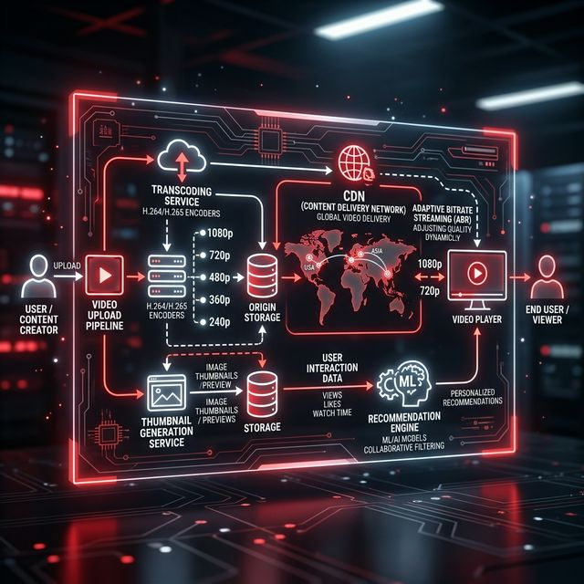

# 20: Design a Video Platform

<p align="center">
  
</p>

## 🎯 The Big Goal

> **Design a video streaming platform like YouTube — handling video upload, transcoding, storage, CDN delivery, and recommendations at massive scale.**

---

## 1. Requirements

| Functional | Non-Functional |
| :--- | :--- |
| Upload videos (up to 1GB) | Support 1B daily views |
| Stream videos (adaptive quality) | Low startup latency (< 2s) |
| Search videos by title/tags | 99.99% availability |
| Recommendations | Global reach via CDN |
| Like, comment, subscribe | Handle 100K+ concurrent uploads |

---

## 2. High-Level Architecture

<p align="center">
  
</p>

---

## 3. Video Upload Pipeline

```
1. Client uploads video → pre-signed URL to S3
2. Upload completes → S3 event triggers transcoding
3. Transcoding Service:
   - 240p, 360p, 480p, 720p, 1080p, 4K
   - Codecs: H.264 (compatibility), H.265 (efficiency)
   - Generate thumbnails at multiple timestamps
4. Store transcoded files in S3
5. Update metadata DB: video is READY
6. Push to CDN edge servers
```

### 🔧 Deep Dive: The Transcoding DAG (Directed Acyclic Graph)
Transcoding is not just running an `ffmpeg` script. Modern platforms treat transcoding as a distributed graph of microservices. 
1.  **Split:** The 4K source video is split into 10-second chunks.
2.  **Parallelize:** If a video is 10 minutes long, it has 60 chunks. We spin up 60 Docker containers, each transcoding its chunk into 5 different resolutions simultaneously.
3.  **Merge:** A final worker stitches the transcoded chunks back together. 
What used to take hours on a single machine now takes minutes across a distributed worker pool orchestrated by systems like Netflix's Conductor or AWS Step Functions.

### Why Pre-signed URLs?
```
Traditional:  Client → App Server → S3       (server bottleneck)
Pre-signed:   Client → S3 directly           (scale unlimited)
              App Server only generates the signed URL
```

---

## 4. Video Streaming (Adaptive Bitrate)

```
Player checks bandwidth continuously:
  Fast internet → Stream 1080p
  Bandwidth drops → Switch to 480p seamlessly
  Bandwidth recovers → Switch back to 1080p

Protocol: HLS (HTTP Live Streaming) or DASH
  - Video split into 2-10 second segments
  - Manifest file lists all segments at each quality level
  - Player downloads segments progressively
```

| Protocol | Developed By | Format |
| :--- | :--- | :--- |
| **HLS** | Apple | `.m3u8` manifest + `.ts` segments |
| **DASH** | MPEG | `.mpd` manifest + `.m4s` segments |

### 🔧 Deep Dive: Audio/Video Synchronization (PTS)
When we chunk a 4K video into 10-second segments across DASH/HLS, how do we guarantee the audio and video stay perfectly lip-synced on the client's screen, especially if network packets drop or buffer?
Inside the container format (like MPEG-TS), every single frame is encoded with a **Presentation Time Stamp (PTS)** clock reference. Even if the video and audio chunks are fetched asynchronously from different CDN servers, the client's media player uses the PTS hardware clocks to perfectly align the temporal timeline before painting pixels to the glass.

### 🔧 Deep Dive: Buffer-Based Approach (BBA)
How does the player know when to switch quality? Older algorithms measured raw network throughput, but network speed fluctuates wildly, causing the player to panic and drop quality constantly. 
Modern players use the **Buffer-Based Approach (BBA)**. The algorithm ignores the network speed and looks *only* at the local video buffer:
*   If the buffer is **< 5 seconds**, we are starving -> Switch to 360p immediately.
*   If the buffer is **growing (> 20 seconds)**, we have excess capacity -> Upgrade to 1080p.
This produces a vastly smoother viewing experience without rapid oscillation.

---

## 5. Storage and CDN Strategy

| Data | Storage | Reason |
| :--- | :--- | :--- |
| **Raw video** | S3 (cold storage) | Backup, rarely accessed |
| **Transcoded video** | S3 + CDN | Served to users globally |
| **Thumbnails** | S3 + CDN | Small, very frequently accessed |
| **Metadata** | PostgreSQL | Video title, tags, creator info |
| **View counts** | Redis → PostgreSQL | Real-time counter, periodic flush |

### CDN Architecture:

<p align="center">
  
</p>

---

## 6. Recommendations Engine

<p align="center">
  
</p>

| Technique | How | Example |
| :--- | :--- | :--- |
| **Collaborative Filtering** | "Users like you watched X" | Netflix |
| **Content-Based** | Similar tags, genres, creators | YouTube sidebar |
| **Hybrid** | Combine both + trending | YouTube homepage |

---

## 🤔 Reflection Questions

1. **A creator uploads a 4K video that takes 2 hours to transcode into all quality levels.** During those 2 hours, the video is "processing" and can't be watched. How would you design the pipeline to let viewers start watching with *at least* one quality while transcoding continues in the background?
<details>
<summary>💡 View Answer</summary>

Use a **priority-based transcoding pipeline**: transcode the lowest quality first (360p takes ~5 minutes for a typical video), then 720p, then 1080p, and finally 4K. As soon as the first quality level is ready, mark the video as "watchable" and serve it via adaptive bitrate streaming with only 360p available. As higher qualities complete, add them to the manifest file (HLS/DASH) dynamically. The player automatically detects new quality levels and offers them to the viewer. As Alex Xu's YouTube design explains, this is how real video platforms work — you often notice only low quality is available immediately after upload, with HD appearing minutes later.
</details>

2. **80% of your videos are watched fewer than 10 times, but they're still stored on expensive CDN edge servers.** How would you design a "hot/cold" storage strategy that keeps popular videos close to users while saving costs on long-tail content? What's the risk of a cold video suddenly going viral?
<details>
<summary>💡 View Answer</summary>

Implement a **tiered storage architecture**: 1) **Hot tier** (CDN edge + SSD origin): videos with >100 views/day are cached at edge locations globally. 2) **Warm tier** (standard S3): videos with 10-100 views/day are stored in origin servers but not pushed to CDN edges — cached on-demand at the first edge request. 3) **Cold tier** (S3 Glacier/archive): videos with <10 views/month are moved to cheap deep storage. The risk of a cold video going viral: the first viewers experience higher latency (origin fetch + CDN cache population), but within seconds the CDN caches the content at the edge. To mitigate: monitor trending signals (social media shares) and proactively pre-warm the CDN before the traffic spike hits.
</details>

3. **Adaptive bitrate streaming switches quality based on bandwidth, but a user on a train experiences rapid bandwidth fluctuations.** The player oscillates between 240p and 1080p every few seconds, causing a terrible experience. How would you smooth these transitions?
<details>
<summary>💡 View Answer</summary>

Apply **hysteresis** to quality switching: require bandwidth to be stable above a threshold for N seconds (e.g., 10 seconds) before upgrading quality, but downgrade immediately when bandwidth drops. This creates an asymmetric switching policy — slow to upgrade, fast to downgrade — preventing rapid oscillation. Additionally, increase the **buffer target** for unstable connections: if the player maintains 30 seconds of buffered video (instead of the default 10), brief bandwidth dips are completely absorbed by the buffer without any quality change. Modern ABR algorithms (like BBA — Buffer-Based Approach) use buffer level as the primary signal rather than raw bandwidth measurements.
</details>

4. **Your recommendation engine creates a "rabbit hole" effect** — users keep watching increasingly extreme content because the algorithm optimizes for watch time. How do you design a recommendation system that balances user engagement with platform responsibility?
<details>
<summary>💡 View Answer</summary>

1) **Diversify recommendations**: ensure each recommendation batch includes content from different categories, preventing narrow rabbit holes. 2) **User satisfaction modeling**: train on explicit signals ("Was this recommendation helpful?") rather than just watch time — a user might watch a disturbing video to completion out of shock, not satisfaction. 3) **Break notifications**: after N consecutive videos, suggest a break ("You've been watching for 2 hours"). 4) **Quality scoring**: boost authoritative sources and penalize content flagged for misinformation regardless of watch-time performance. Architecturally, this means the recommendation pipeline must support multi-objective optimization, not just a single "maximize watch time" objective function.
</details>

5. **Pre-signed URLs allow clients to upload directly to S3, bypassing your servers.** But what if someone uploads malicious content, malware, or a 100GB file? How do you validate uploads when your server never sees the file during the upload process?
<details>
<summary>💡 View Answer</summary>

1) **Pre-signed URL constraints**: when generating the pre-signed URL, set a maximum `Content-Length` (e.g., 10GB) and allowed `Content-Type` (video/*). S3 rejects uploads that violate these constraints. 2) **Post-upload validation**: configure an S3 event notification (or Lambda trigger) that fires when the upload completes. This trigger invokes a validation pipeline that: checks the actual file type (magic bytes, not just extension), scans for malware (ClamAV), and verifies the video is playable (FFprobe). 3) **Quarantine bucket**: upload to a "pending" bucket. Only after validation passes, move the file to the "approved" bucket and begin transcoding. Malicious or oversized files are deleted from quarantine automatically.
</details>

---

## 📝 Key Interview Talking Points

- Pre-signed URLs for client-direct upload (don't bottleneck through app servers)
- Transcode to multiple qualities asynchronously via message queue
- HLS/DASH with adaptive bitrate for smooth playback
- CDN is critical — 80%+ of video traffic served from edge cache
- Separate hot (frequently watched) and cold (old/rarely watched) storage

---

[<< Previous: News Feed](./19_Design_News_Feed.md) | [Home: Curriculum Map](./README.md)
