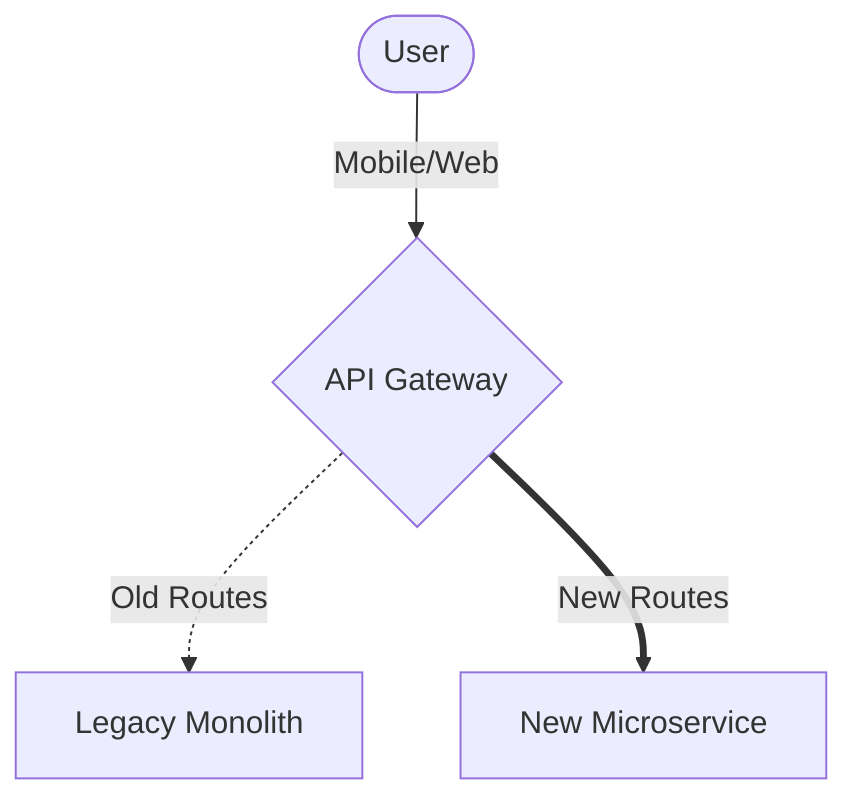
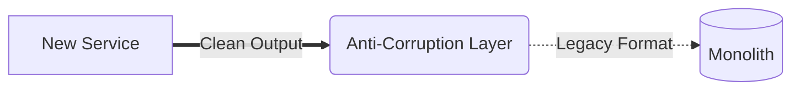

# 21: Monolith to Microservices

  

## 🎯 The Big Goal

> **After this chapter, you will know how to safely break down massive legacy systems into smaller, scalable microservices.**

Decomposing a monolith is not a quick rewrite. It is a slow, careful evolution.

A pure "big bang" rewrite almost always fails. You must safely extract features, route traffic carefully, and define clear boundaries.

---

## 1. 🏗️ Domain-Driven Design (DDD)

You cannot just cut code randomly. Architects use **Domain-Driven Design (DDD)** to find logical boundaries.

* 🗣️ **Ubiquitous Language**: Different teams use words differently. An `Account` means billing history to the Finance team. But it means a username and password to the Security team.
* 📦 **Bounded Context**: A strict boundary where a specific data model makes sense. A microservice should map directly to one Bounded Context.

---

## 2. 🌿 The Strangler Fig Pattern

Do not replace the old system overnight. Instead, strangle it slowly. 

You build the new system AROUND the old system. Slowly, the new system takes over. Eventually, the old system dies.

1. **Step 1: The Facade (API Gateway)**
   Put an API Gateway in front of your monolith. All traffic hits the gateway first.
2. **Step 2: Isolate Features**
   Build a new microservice for a specific feature. Hook it up to the gateway.
3. **Step 3: Route Traffic**
   Tell the API Gateway to route traffic to the new microservice instead of the monolith.

---

## 3. 🛡️ Anti-Corruption Layers (ACL)

Sometimes, your shiny new microservice needs to talk to the ugly old monolith. 

Don't let legacy data structures pollute your new code!

* Put an **Anti-Corruption Layer (ACL)** between them.
* It acts as a translator.
* It translates modern JSON into whatever legacy format the monolith expects.

---

## 4. 🗄️ Distributing the Database

Splitting the code is easy. Splitting the database is hard.

### Strategy A: Shared Database (Anti-Pattern)
* Both the new microservice and the old monolith read the same tables.
* ⚠️ **Warning**: This causes tight coupling. A schema change breaks everything.

### Strategy B: Database per Service (Best Practice)
* The new microservice gets its own dedicated database.
* The monolith cannot read it directly. It must ask the microservice for data via an API.
* ✅ **Result**: Total independence and scalability.

---

## 🤔 Reflection Questions

1. **Why is the "Big Bang" rewrite considered dangerous?** What risks do you face when throwing away a monolith all at once?
2. **How does an API Gateway act as the enabler for the Strangler Fig Pattern?** What happens if the gateway goes down?

---

## 📝 Key Interview Talking Points

*   **DDD and Bounded Contexts**: Understanding business boundaries is step one. Never split by technical function (like "all UI code" vs "all DB code").
*   **Strangler Fig Pattern**: Emphasize incremental migration. Route traffic slowly using an API Gateway.
*   **Database per Service**: Always mention the golden rule of microservices. Databases should not be shared.
*   **Anti-Corruption Layers**: Show you know how to safely integrate modern architectures with legacy codebases.

---

[Home: System Design Curriculum](./README.md) | [Next: Event-Driven Microservices >>](./22_Event_Driven_Microservices.md)
