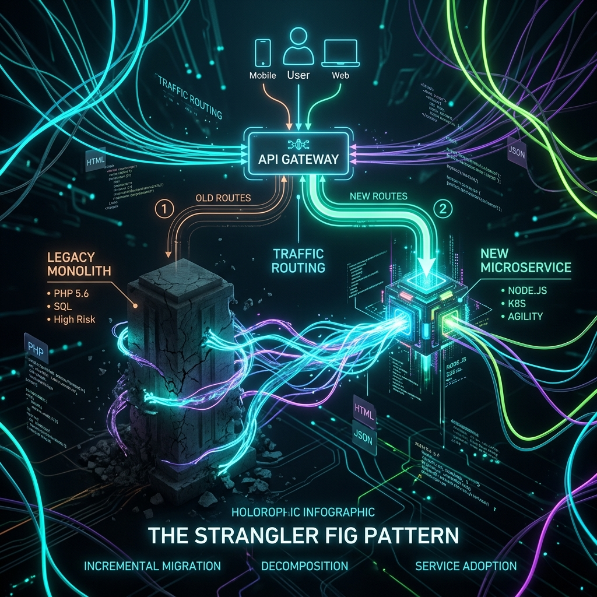
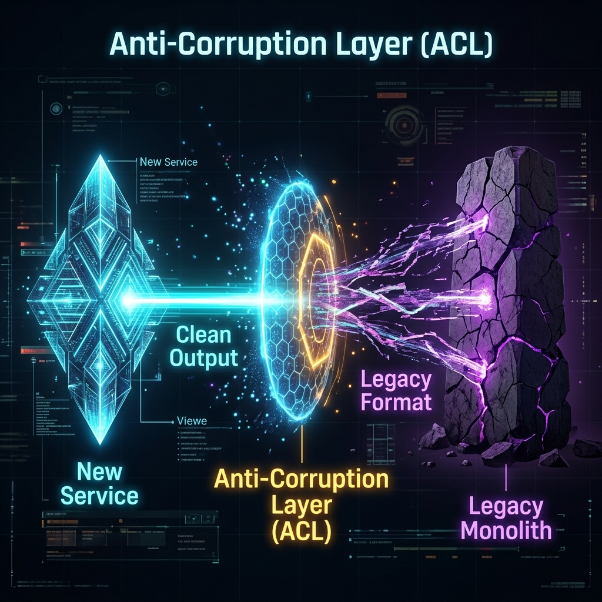

# 21: Monolith to Microservices

  

> 🧠 **The Feynman Hook:** Migrating a monolith to microservices is like renovating a skyscraper while tenants are still living in it. You can't close the building for 2 years (Big Bang rewrite). Instead, you renovate one floor at a time: block off floor 12, rebuild it, open it, then move to floor 13. The tenants (users) never notice the renovation because the building never closes. This is the Strangler Fig pattern — and it's the only safe way to migrate large production systems.

## 🎯 What You'll Learn

> **After this chapter, you will know how to safely break down massive legacy systems into smaller, scalable microservices.**

Decomposing a monolith is not a quick rewrite. It is a slow, careful evolution.

A pure "big bang" rewrite almost always fails. You must safely extract features, route traffic carefully, and define clear boundaries.

---

## 1. 🏗️ Domain-Driven Design (DDD)

> **Feynman Insight:** In a hospital, "patient" means different things to different departments. To the billing team, a patient is an invoice. To surgery, a patient is a procedure schedule. To pharmacy, a patient is a prescription list. These are separate Bounded Contexts: each department has its own model of "patient" that only makes sense within their domain. Forcing everyone to share one universal "patient" model creates a model that serves no one well.

You cannot just cut code randomly. Architects use **Domain-Driven Design (DDD)** to find logical boundaries.

* 🗣️ **Ubiquitous Language**: Different teams use words differently. An `Account` means billing history to the Finance team. But it means a username and password to the Security team.
* 📦 **Bounded Context**: A strict boundary where a specific data model makes sense. A microservice should map directly to one Bounded Context.

---

## 2. 🌿 The Strangler Fig Pattern

> **Feynman Insight:** A strangler fig tree grows around a host tree in the rainforest. The fig wraps the host gradually — not cutting it down, not killing it overnight — until eventually the original tree has been completely replaced without ever falling over. Your API Gateway is the fig: it wraps the monolith, and each new microservice quietly takes over one more route. One day, the monolith routes list is empty and it can be decommissioned.

Do not replace the old system overnight. Instead, strangle it slowly. 

You build the new system AROUND the old system. Slowly, the new system takes over. Eventually, the old system dies.

1. **Step 1: The Facade (API Gateway)**
   Put an API Gateway in front of your monolith. All traffic hits the gateway first.
2. **Step 2: Isolate Features**
   Build a new microservice for a specific feature. Hook it up to the gateway.
3. **Step 3: Route Traffic**
   Tell the API Gateway to route traffic to the new microservice instead of the monolith.

  

---

## 3. 🛡️ Anti-Corruption Layers (ACL)

> **Feynman Insight:** An ACL is a diplomatic translator at the United Nations. The new microservice speaks modern JSON; the old monolith speaks 1998 XML with its own proprietary field names. Without the ACL, the new service would have to learn to "speak legacy" — importing its data structures and coupling itself to the old system's oddities. The ACL translates at the boundary so the new service stays clean.

Sometimes, your shiny new microservice needs to talk to the ugly old monolith. 

Don't let legacy data structures pollute your new code!

* Put an **Anti-Corruption Layer (ACL)** between them.
* It acts as a translator.
* It translates modern JSON into whatever legacy format the monolith expects.

  

---

## 4. 🗄️ Distributing the Database

> **Feynman Insight:** A shared database between a monolith and a new microservice is like two businesses sharing one bank account. It seems convenient at first, but if one business changes the account format (schema change), it breaks the other's accounting. Database-per-service is two separate bank accounts with one business calling the other's public API to transfer funds. More conversations required, but total independence.

Splitting the code is easy. Splitting the database is hard.

### Strategy A: Shared Database (Anti-Pattern)
* Both the new microservice and the old monolith read the same tables.
* ⚠️ **Warning**: This causes tight coupling. A schema change breaks everything.

### Strategy B: Database per Service (Best Practice)
* The new microservice gets its own dedicated database.
* The monolith cannot read it directly. It must ask the microservice for data via an API.
* ✅ **Result**: Total independence and scalability.

---

## 🤔 Reflection Questions

1. **Why is the "Big Bang" rewrite considered dangerous?** What risks do you face when throwing away a monolith all at once?

💡 View Answer

As Sam Newman explains in *Monolith to Microservices*, a Big Bang rewrite attempts to replace a massive, battle-tested system in one deployment. The risks are enormous: 1) **Feature parity takes years** — the old system has thousands of edge cases baked in over time. 2) **No safe rollback** — if the new system fails in production, you can't revert to the old one because data formats and schemas have diverged. 3) **Business starvation** — the team spends years rewriting instead of delivering new features. The Strangler Fig Pattern avoids all of this by migrating incrementally.

2. **How does an API Gateway act as the enabler for the Strangler Fig Pattern?** What happens if the gateway goes down?

💡 View Answer

The API Gateway is the single entry point that routes traffic: old endpoints go to the monolith, new endpoints go to the microservice. This routing-level control enables incremental migration — you can move one endpoint at a time without the client knowing. If the gateway goes down, **everything goes down** — it becomes a Single Point of Failure. To prevent this, the gateway must be stateless, horizontally scaled behind a load balancer, and deployed across multiple availability zones. As *Mastering API Architecture* emphasizes, the gateway must be the thinnest, most resilient layer in your entire stack.

---

## 📝 Key Interview Talking Points

*   **DDD and Bounded Contexts**: Understanding business boundaries is step one. Never split by technical function (like "all UI code" vs "all DB code").
*   **Strangler Fig Pattern**: Emphasize incremental migration. Route traffic slowly using an API Gateway.
*   **Database per Service**: Always mention the golden rule of microservices. Databases should not be shared.
*   **Anti-Corruption Layers**: Show you know how to safely integrate modern architectures with legacy codebases.

---

[Home: System Design Curriculum](./README.md) | [Next: Event-Driven Microservices >>](./22_Event_Driven_Microservices.md)
