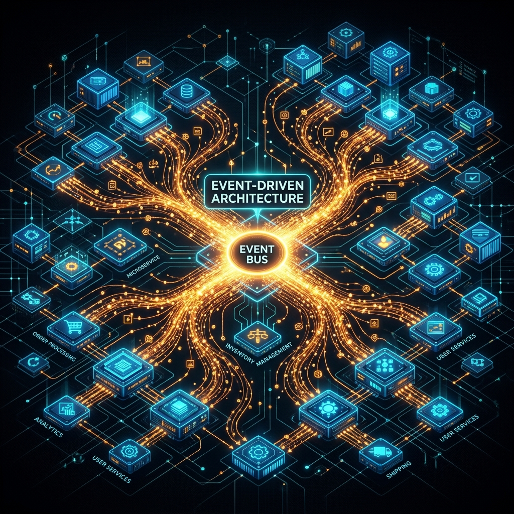
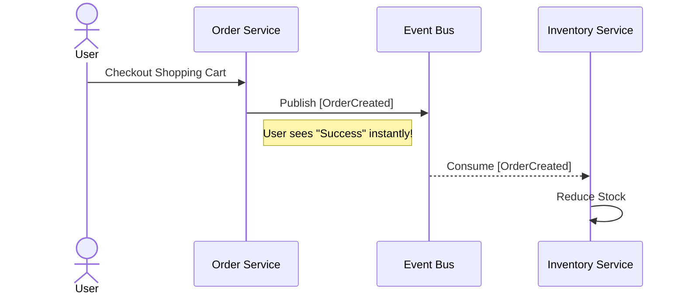

# 22: Event-Driven Microservices Architectures

  

> 🧠 **The Feynman Hook:** Synchronous service calls are like a chain of dominos: if one falls the wrong way, the whole chain breaks. Event-driven architecture is like a breaking-news newsroom: the reporter (producer) shouts the headline (event) into the bullpen, and every desk that cares about that story (consumer) picks it up independently. The reporter doesn't wait for the photo editor to finish before moving on — they publish, and the newsroom self-organises. This decoupling is what makes systems resilient at scale.

## 🎯 What You'll Learn

> **After this chapter, you will confidently design complex data streams using events. You will understand how microservices communicate safely and asynchronously.**

Synchronous communication (like direct HTTP calls) can slow down large systems. If one service fails, the whole request fails. 

Event-Driven Architecture (EDA) solves this. Services broadcast "events" (things that happened) and move on.

---

## 1. 🎼 Orchestration vs Choreography

> **Feynman Insight:** Orchestration is an air traffic controller telling each plane exactly when to take off, land, and which runway to use. There's one person in charge — clear status visibility, but one human is a bottleneck. Choreography is a flash mob: no central coordinator, each dancer knows the routine and performs their part when the music starts. Beautiful at scale, but if one dancer goes wrong, debugging is hard because no one is "in charge."

How do you manage complex workflows across many microservices? You have two choices.

### 💂 Orchestration (The Conductor)
One central service controls everything. It tells other services what to do.

*   ✅ **Pros**: Easy to track the workflow status. Centralized error handling.
*   ❌ **Cons**: The orchestrator becomes a single point of failure and a bottleneck.

### 🩰 Choreography (The Dancers)
There is no central boss. Each service listens for events and reacts independently.

*   ✅ **Pros**: Highly decoupled. Very fast and scalable.
*   ❌ **Cons**: Harder to track the overall flow. You need good monitoring.

---

## 2. 📬 Broker-centric vs Log-centric Messaging

> **Feynman Insight:** A broker-centric queue (RabbitMQ) is a smart post office that reads addresses and routes packages. Once delivered, the package is destroyed. A log-centric queue (Kafka) is an immutable diary: every event is written in order, and readers can look back at any page at any time. Multiple readers can read the same page independently. Choose the post office for routing tasks; choose the diary when you need a replayable history.

When you send events, where do they go? They sit in a queue waiting to be read.

### 🐰 Broker-Centric (e.g., RabbitMQ)
*   Think of it like a smart post office.
*   The broker actively routes messages to the right consumer.
*   Once read, the message is deleted.
*   **Best for**: Task queues and point-to-point routing.

### 🪵 Log-Centric (e.g., Apache Kafka)
*   Think of it like an immutable ledger or diary.
*   Events are written strictly in order.
*   Consumers pull events at their own pace.
*   Events are kept for a long time (even after being read).
*   **Best for**: Massive data pipelines and event sourcing.

---

## 3. 🧩 Dealing with Eventual Consistency

> **Feynman Insight:** Eventual consistency is like a bank cheque. You deposit a cheque on Monday; the bank tells you it's accepted. But the money doesn't actually appear in your account until Wednesday after clearing. For two days, your balance is "wrong" — but eventually it becomes correct. This is fine for most situations. It is NOT fine if you withdraw cash on Tuesday expecting the deposit to already be there.

Because events happen asynchronously, data is not updated instantly everywhere.

This introduces **Eventual Consistency**.

1. The User buys an item. The `OrderService` saves the order locally.
2. The `OrderService` publishes an `[OrderCreated]` event.
3. The `InventoryService` eventually receives the event.
4. The `InventoryService` updates the stock count.

For a brief second, the Inventory count is "wrong". But it eventually becomes consistent.

---

## 🤔 Reflection Questions

1. **What happens if a service goes down during Choreography?** Are the events lost, or do they wait patiently intelligently in the queue?

💡 View Answer

If the service goes down, the events are **not lost** — they wait safely in the message broker (Kafka, RabbitMQ). The broker retains messages until a consumer acknowledges them. When the service comes back up, it resumes consuming from where it left off (Kafka tracks the consumer's offset). This is the key advantage of event-driven choreography: temporal decoupling. As *Building Event-Driven Microservices* (Bellemare) explains, the broker acts as a buffer that absorbs failures, allowing services to process events at their own pace without data loss.

2. **Why is Eventual Consistency acceptable for dropping a "Like" on a photo, but unacceptable for a bank transaction?**

💡 View Answer

A "Like" has zero financial impact — if it takes 2 seconds for the like count to update for other users, nobody is harmed. The worst case is a brief stale count. A bank transaction directly affects money: if a withdrawal is processed with a stale balance (eventual consistency), the account could overdraw, causing real financial loss. As Kleppmann explains in DDIA, the choice between consistency models must be driven by the **business impact of stale data**. Social interactions tolerate staleness; financial operations require strong consistency because incorrect state has legal and monetary consequences.

---

## 📝 Key Interview Talking Points

*   **Asynchronous Processing**: Explain that event-driven systems prevent cascading failures. If service B is down, service A can still publish events.
*   **Decoupling**: Choreography is preferred for high-scale microservices because it eliminates tight coupling.
*   **Kafka vs RabbitMQ**: Know when to use a dumb pipe with smart endpoints (Kafka) versus a smart pipe with dumb endpoints (RabbitMQ).
*   **Eventual Consistency**: Be ready to discuss how to design UIs that handle delayed data gracefully.

---

[<< Previous: Monolith to Microservices](./21_Monolith_to_Microservices.md) | [Home: System Design Curriculum](./README.md) | [Next: CQRS and Event Sourcing >>](./23_CQRS_and_Event_Sourcing.md)
