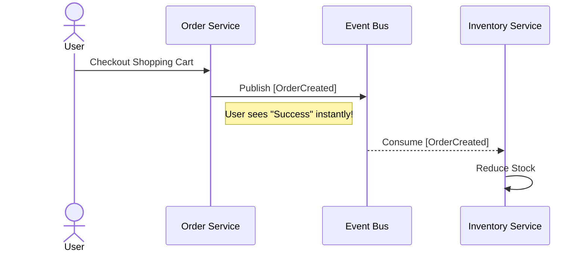

# 22: Event-Driven Microservices Architectures

  

## 🎯 The Big Goal

> **After this chapter, you will confidently design complex data streams using events. You will understand how microservices communicate safely and asynchronously.**

Synchronous communication (like direct HTTP calls) can slow down large systems. If one service fails, the whole request fails. 

Event-Driven Architecture (EDA) solves this. Services broadcast "events" (things that happened) and move on.

---

## 1. 🎼 Orchestration vs Choreography

How do you manage complex workflows across many microservices? You have two choices.

### 💂 Orchestration (The Conductor)
One central service controls everything. It tells other services what to do.

*   ✅ **Pros**: Easy to track the workflow status. Centralized error handling.
*   ❌ **Cons**: The orchestrator becomes a single point of failure and a bottleneck.

### 🩰 Choreography (The Dancers)
There is no central boss. Each service listens for events and reacts independently.

*   ✅ **Pros**: Highly decoupled. Very fast and scalable.
*   ❌ **Cons**: Harder to track the overall flow. You need good monitoring.

---

## 2. 📬 Broker-centric vs Log-centric Messaging

When you send events, where do they go? They sit in a queue waiting to be read.

### 🐰 Broker-Centric (e.g., RabbitMQ)
*   Think of it like a smart post office.
*   The broker actively routes messages to the right consumer.
*   Once read, the message is deleted.
*   **Best for**: Task queues and point-to-point routing.

### 🪵 Log-Centric (e.g., Apache Kafka)
*   Think of it like an immutable ledger or diary.
*   Events are written strictly in order.
*   Consumers pull events at their own pace.
*   Events are kept for a long time (even after being read).
*   **Best for**: Massive data pipelines and event sourcing.

---

## 3. 🧩 Dealing with Eventual Consistency

Because events happen asynchronously, data is not updated instantly everywhere.

This introduces **Eventual Consistency**.

1. The User buys an item. The `OrderService` saves the order locally.
2. The `OrderService` publishes an `[OrderCreated]` event.
3. The `InventoryService` eventually receives the event.
4. The `InventoryService` updates the stock count.

For a brief second, the Inventory count is "wrong". But it eventually becomes consistent.

---

## 🤔 Reflection Questions

1. **What happens if a service goes down during Choreography?** Are the events lost, or do they wait patiently intelligently in the queue?
2. **Why is Eventual Consistency acceptable for dropping a "Like" on a photo, but unacceptable for a bank transaction?**

---

## 📝 Key Interview Talking Points

*   **Asynchronous Processing**: Explain that event-driven systems prevent cascading failures. If service B is down, service A can still publish events.
*   **Decoupling**: Choreography is preferred for high-scale microservices because it eliminates tight coupling.
*   **Kafka vs RabbitMQ**: Know when to use a dumb pipe with smart endpoints (Kafka) versus a smart pipe with dumb endpoints (RabbitMQ).
*   **Eventual Consistency**: Be ready to discuss how to design UIs that handle delayed data gracefully.

---

[<< Previous: Monolith to Microservices](./21_Monolith_to_Microservices.md) | [Home: System Design Curriculum](./README.md) | [Next: CQRS and Event Sourcing >>](./23_CQRS_and_Event_Sourcing.md)
