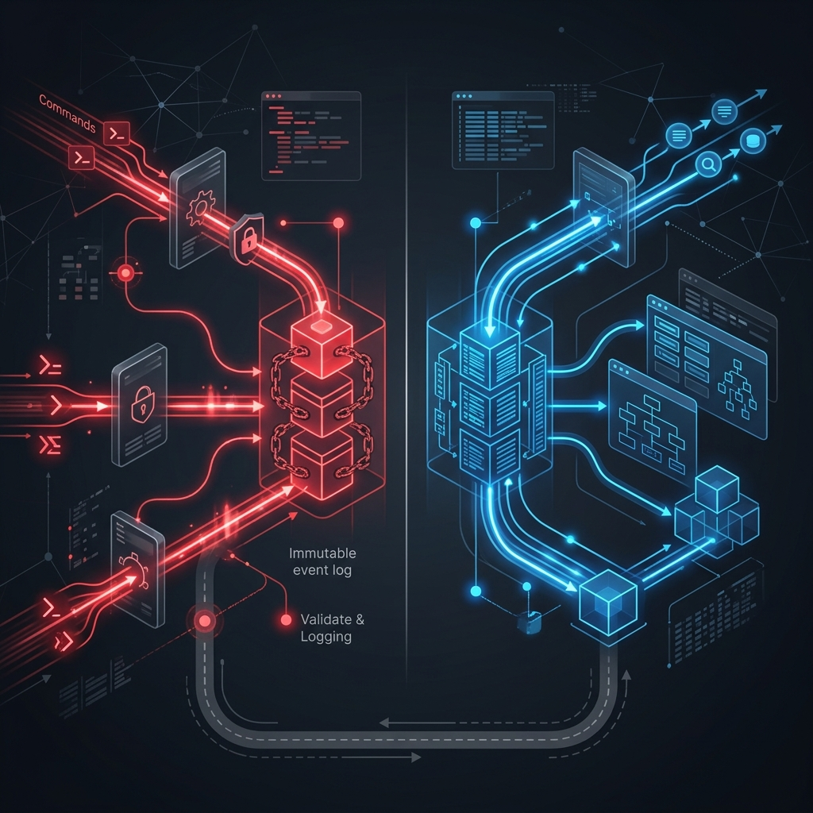

# 23: CQRS & Event Sourcing

  

> 🧠 **The Feynman Hook:** In a hospital, doctors write patient notes in one format (clinical, precise, abbreviated) and nurses display patient information in a completely different format (clear, visual, prioritised). Using the same document for both would be a disaster. CQRS is the architectural principle that writes data in its most correct form and reads data in its most useful form — with a translation layer between. Event Sourcing takes this further: instead of storing the current state, you store every single medical decision ever made, and derive the patient's current status by replaying them.

## 🎯 What You'll Learn

> **After this chapter, you will understand how to fundamentally redesign data flows. You will learn to cleanly separate read traffic from write traffic for extreme performance.**

Traditional databases use the exact same data model for reading and writing (CRUD). But in highly scaled systems, querying data differently than you write it is the secret to ultimate speed.

---

## 1. 🔀 Command Query Responsibility Segregation (CQRS)

> **Feynman Insight:** Think of a restaurant kitchen. The order pad (Command side) is optimised for writing: fast, structured, validated. The menu board (Query side) is optimised for reading: large, visual, denormalized so guests can scan it instantly. The chef (sync event) connects them: when an order is cooked, the board updates. They are the same truth expressed in different formats for different audiences.

**CQRS** splits the system into two entirely separate sides.

### 🔴 Commands (Writes)
*   **Purpose**: Update data, process business logic, and change state.
*   **Optimization**: Built for high throughput and validation.
*   **Model**: Highly normalized tables.

### 🔵 Queries (Reads)
*   **Purpose**: Fetch data to show to the user as fast as possible.
*   **Optimization**: Built for lightning-fast reads. No complex joins.
*   **Model**: Pre-calculated Views or highly denormalized documents (like Elasticsearch).

*How do they sync?* When a Command updates the write database, it publishes an event. The read side listens to that event and updates its customized views.

---

## 2. 📜 Event Sourcing

> **Feynman Insight:** A traditional database stores the current score on the scoreboard: 3-1. Event Sourcing stores the entire match recording: Minute 12: Goal by Alice. Minute 34: Goal by Bob. Minute 67: Red card. Minute 81: Goal by Carol. The final score (3-1) is computed by replaying the match. You can fast-forward to any minute and see the exact score at that point — this is time-travel debugging. You can try alternative rule-sets against the same game log. You lose nothing because nothing is ever overwritten.

Usually, databases only store the **current** state. (e.g., Balance = $100). If you change the balance, the old value is lost forever.

**Event Sourcing** changes this completely. 

### 1. State is Derived
Instead of storing the current state, you store a continuous, unchangeable log of **every event that ever happened.**
*   `[Deposited $150]`
*   `[Withdrew $50]`

To get the current balance, you simply replay the events from the beginning summing the totals.

### 2. The Immutable Ledger
The event log can never be changed or deleted. It acts as the ultimate single source of truth.

### 📈 Why is this powerful?
*   **Audit Trails**: You literally have a perfect history of every action.
*   **Time Travel**: You can reproduce the exact state of the system at any given timestamp.
*   **Rebuilding Views**: If you need a new type of dashboard, you can build it from scratch by just replaying the entire history of events.

---

## 🤔 Reflection Questions

1. **What happens if the Read database goes down in a CQRS system?** Can users still submit orders? How does separating concerns improve availability?

💡 View Answer

Yes — users can still submit orders because the **Write side is completely independent** of the Read side. Orders are accepted by the write database, and events are queued for the read model. When the read database recovers, it replays the queued events and catches up. This is the core availability benefit of CQRS: a read-side failure doesn't block writes, and a write-side failure doesn't block reads (the read model serves stale but available data). As the *CQRS Journey Guide* explains, separating read and write concerns means each side can fail, scale, and recover independently.

2. **Replaying 10 million events to calculate a bank balance is slow.** How can you optimize Event Sourcing to avoid replaying the entire log every single time? (Hint: Snapshots).

💡 View Answer

Create **periodic snapshots** of the aggregate state. For example, every 1,000 events, save the current bank balance as a snapshot: "Balance = $5,432.10 at Event #50,000." To calculate the current balance, load the latest snapshot and replay only the events *after* it (e.g., events 50,001 to 50,047 — just 47 events instead of 50,047). This reduces rebuild time from minutes to milliseconds. As Kleppmann notes in DDIA, this is analogous to database checkpoints — periodically materializing state so you don't replay the entire WAL on every recovery.

---

## 📝 Key Interview Talking Points

*   **Asymmetric Scaling**: CQRS allows you to scale reads and writes independently. If you have 100x more reads than writes, just add more read replicas.
*   **Eventual Consistency**: Acknowledge that the Read side in CQRS will always be slightly behind the Write side. 
*   **Single Source of Truth**: In Event Sourcing, the Event Store is the definitive truth. The Read views are basically just caches.
*   **Complexity**: CQRS and Event Sourcing add immense operational complexity. Mention that it should only be used for core business domains where tracing history is critical.

---

[<< Previous: Event-Driven Microservices](./22_Event_Driven_Microservices.md) | [Home: System Design Curriculum](./README.md) | [Next: Micro-Frontends >>](./24_Micro_Frontends_Web_Architecture.md)
